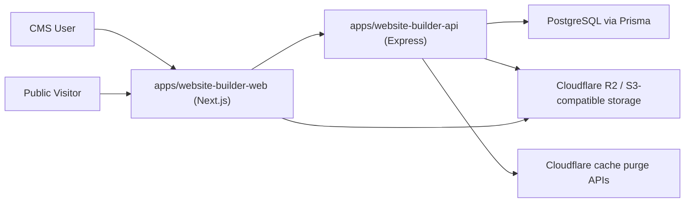

# AGENTS.md — Comprehensive Agent + Technical Architecture Handbook
# Project Aurora Monorepo

This file is the primary technical source-of-truth for AI agents and contributors working in this repository.

If this file and code ever disagree, code is authoritative for the current runtime, and this file must be updated in the same change.

---

## 0) How to Use This File

Use this document in two modes.

- Mode A: Understand system behavior (architecture, flows, responsibilities, constraints)
- Mode B: Execute safe changes (playbooks, checklists, extension patterns)

All agents must read:

1. `## 2) Non-Negotiables`
2. `## 3) Mandatory Documentation Rule`
3. `## 7) Auth and Password Back-and-Forth`
4. `## 8) Tenant and Instance Isolation`
5. `## 19) Change Playbooks`

before editing code.

---

## 1) Project Mission

This platform is a multi-tenant SaaS booking + website-builder system.

At runtime, users:

- register and authenticate
- create organizations (tenants)
- create websites (instances)
- design website pages with reusable theme sections
- publish static manifests to object storage
- route domains/subdomains to live sites
- accept public bookings and inquiries

---

## 2) Non-Negotiables

Every change must preserve all five pillars.

1. Data isolation: no cross-tenant or cross-instance leakage.
2. Auth safety: no regressions in password/token/security behavior.
3. Route boundary integrity: `/auth`, `/cms`, `/web`, `/api/device-check` must remain semantically separate.
4. Publish correctness: builder -> manifest -> artifact storage -> routing index must remain coherent.
5. Backward compatibility: legacy aliases still in active use must not be removed accidentally.

---

## 3) Mandatory Documentation Rule

This is enforced for all agent and human changes.

If you modify behavior, contracts, architecture, migrations, environment configuration, security logic, or workflows, you must update this file in the same task/PR.

Minimum required doc update:

1. Update the relevant section(s) in this file.
2. Add a dated entry to `## 23) Change Log` with:
   - what changed
   - impacted modules/files
   - migration/rollout implications

A code change without required doc updates is incomplete.

---

## 4) High-Level Runtime Topology



Core idea:

1. CMS controls draft state and authoring UX.
2. API owns business rules, auth, permissions, tenant/instance enforcement.
3. DB stores source-of-truth records.
4. Publish generates immutable website artifacts in R2.
5. Routing index maps hostnames to active website manifests.

---

## 5) Runtime Component Map

### 5.1 Active apps

- `apps/website-builder-api`: primary Express API runtime.
- `apps/website-builder-web`: primary Next.js CMS app + API/web/published proxy layer.

### 5.2 Core packages

- `packages/database`: Prisma schema/client + scoping utilities.
- `packages/auth`: JWT/password/auth service layer.
- `packages/core`: shared constants, logger, types, error codes.
- `packages/themes`: theme React components and registry.
- `packages/types`, `packages/ui`, `packages/config`: shared workspace libs.

### 5.3 Auxiliary/legacy

- (Removed) `packages/api` (`@project-aurora/api-legacy`), `packages/booking`, `packages/auth-ui`, `mock-builder/`, `apps/themes/theme-default`, and `apps/super-admin` were deleted as obsolete/legacy scaffolding. The live API/booking/auth/theme logic lives in `apps/website-builder-api`, `packages/themes`, and `packages/auth`.

Do not shift runtime behavior into legacy modules unless explicitly planned.

---

## 6) Request Lifecycle by Namespace

### 6.1 `/auth/*`

Used for registration/login/session lifecycle.

- Public: register/login/refresh/forgot-password/reset-password
- Authenticated: logout/me/switch-tenant

### 6.2 `/cms/*`

Authenticated operational APIs for tenants/staff/superadmin.

Middleware chain baseline:

1. `requireAuth`
2. tenant-level routes: `requireTenant`
3. instance-level routes: `requireInstance`
4. permission and/or superadmin guards where needed

### 6.3 `/web/*`

Public website APIs for published/preview traffic.

- Host-based resolution via `resolvePublicWebContext`
- Then `requireTenant` and `requireInstance`
- Exposes public services/products lists + booking/inquiry creation

### 6.4 `/api/device-check`

Public anti-fraud endpoint with IP-based rate limiting.

---

## 7) Auth and Password Back-and-Forth

This section documents exact credential/token data flow.

### 7.1 Register flow (`POST /auth/register`)

1. CMS sends `email`, `password`, `fullName`, `whatsappNumber`.
2. API validates password policy.
3. API hashes password via bcrypt (`SALT_ROUNDS = 12`).
4. DB persists `users.password_hash` (never plaintext).
5. API returns access token and sets refresh token cookie.
6. Initial token may be session-level (no tenant context yet).

### 7.2 Login flow (`POST /auth/login`)

1. API loads user by email.
2. Compares plaintext password with bcrypt hash.
3. Loads active tenant memberships + permissions.
4. Issues token pair:
   - tenant-scoped token if exactly one tenant
   - session-level token otherwise
5. Stores hashed refresh token in DB (`refresh_tokens.token_hash`).

### 7.3 Refresh flow (`POST /auth/refresh`)

1. Reads refresh token from request body or `refreshToken` HttpOnly cookie.
2. Verifies JWT refresh signature/expiry.
3. Finds hashed token in DB and ensures not revoked.
4. Revokes old refresh token record.
5. Issues new access+refresh tokens.
6. Persists new hashed refresh token.

### 7.4 Logout flow (`POST /auth/logout`)

- Revokes all active refresh tokens for user.
- Clears `refreshToken` cookie.

### 7.5 Forgot/reset password

- `POST /auth/forgot-password`
  - creates reset token row with 1-hour expiry
  - response does not reveal whether account exists
  - reset link currently logged in development (email provider pending)
- `POST /auth/reset-password`
  - validates token (exists, not used, not expired)
  - validates new password rules
  - writes new bcrypt hash and marks token used

### 7.6 Token storage boundaries

- Access token:
  - in response body
  - CMS stores in browser cookie `accessToken` (JS-readable)
  - sent as Bearer token in `Authorization`
- Refresh token:
  - stored as HttpOnly cookie `refreshToken`
  - DB stores hash only (SHA-256)

### 7.7 Security invariants

1. Never log plaintext passwords.
2. Never persist plaintext passwords.
3. Preserve refresh rotation + revocation semantics.
4. Keep forgot-password response generic.
5. Treat reset-token logic as high-risk; require regression tests for changes.

---

## 8) Tenant and Instance Isolation

### 8.1 Context objects on request

`apps/website-builder-api` augments request with:

- `req.auth`: user/role/permission context
- `req.tenant`: resolved tenant
- `req.instance`: resolved instance
- `req.user`: raw JWT payload

### 8.2 Context sources

- `X-Tenant-ID` header
- `X-Instance-ID` header
- routed-host resolution for `/web` traffic

### 8.3 Important implementation detail

`packages/database` includes AsyncLocalStorage scoping helpers (`setTenantContext`), but active `apps/website-builder-api` runtime currently relies heavily on explicit `where: { tenantId, instanceId }` clauses in controllers/services.

Until active middleware wraps all requests with tenant context, explicit scoping in queries remains mandatory.

### 8.4 Isolation rules

1. Never trust tenant/instance IDs from request body.
2. Always derive tenant/instance from middleware context.
3. Every read/write for scoped models must include tenant and/or instance guards.
4. Every update/delete must verify scoped existence before mutation.

---

## 9) Functional Capability Map (Big Picture)

### 9.1 Identity and onboarding

- register, login, refresh, logout, forgot/reset password
- create tenant workspace
- create initial website instance
- switch active tenant context

### 9.2 Tenant and staff operations

- roles and role-permission mapping
- staff invitation/update/removal
- tenant profile and deactivation
- permission-based route enforcement

### 9.3 Website builder and content authoring

- page CRUD + sort ordering
- section CRUD + order + schema-driven content editing
- per-section appearance overrides (`styles_jsonb`) for local background/text color control
- CMS product catalog CRUD (name/description/image/price/currency/active/sort)
- product section themes (`product/v1`..`product/v6`) with public catalog auto-fill
- CMS blog post CRUD with draft/publish state and slug uniqueness per instance
- rich-text blog authoring in CMS uses a Word-style TipTap editor component with a fixed formatting toolbar and inline drag-drop/paste image insertion support in body content
- blog post metadata supports featured image + per-post SEO payload persisted in `seo_jsonb`
- blog SEO authoring panel now includes an `Auto Fill SEO` helper that maps title/content into Meta + OG text fields (`metaTitle`, `metaDescription`, `ogTitle`, `ogDescription`) using the first 100 characters of content body for descriptions, and supports direct OG image upload/preview in-editor
- blog SEO authoring now supports optional auto-sync mode for Meta/OG title+description while editing blog title/body:
  - on initial blog editor load, empty Meta/OG title+description fields are auto-seeded from blog title + content body (first 100 characters) without overwriting existing SEO values
  - sync continues to run on user edits to title/body
  - manual edits to individual Meta/OG title/description fields disable sync for that field until `Auto Fill SEO` or sync re-enable
- blog edit action panel now tracks unsaved changes, warns on browser/tab leave, and supports optional 5-second autosave while keeping manual save available
- blog autosave scheduling is change-driven (save 5 seconds after new unsaved edits) and no longer retries every 5 seconds when there are no new edits
- CMS image uploads use a same-origin proxy fallback (`/api/uploads/proxy`) when direct browser PUT to presigned R2 URLs is blocked by CORS
- theme catalog browsing and selection
- template preview and apply
- website settings (tokens/features/header/footer)
- website settings custom code injection for published-site HTML:
  - `head`: rendered inside the published document `<head>` (verification meta tags, analytics bootstrap, ad/publisher tags)
  - `bodyTop`: rendered from the root document body slot immediately after `<body>` on public-host requests; CMS preview paths render it at the top of preview page content
  - `bodyBottom`: rendered from the root document body slot immediately before `</body>` on public-host requests; CMS preview paths render it after preview page content even when the selected page has no visible theme footer section
  - CMS runtime normalizes pasted wrappers like `<head>...</head>` or `<body>...</body>` down to inner fragments before render so pasted snippets can still publish cleanly
<<<<<<< HEAD

=======
- dedicated CMS Website Settings page (`/dashboard/website-settings`) owns Head HTML, Body HTML, and Footer HTML editing for `instance.settingsJsonb.customCode`, including warnings when meta tags are placed in body/footer slots
>>>>>>> bb6daa2 (Add dedicated website settings page)
- shared layout synchronization (`header/v1`, `footer/v1`)

### 9.4 Website publishing

- publish readiness checks
- versioned publish records
- manifest generation + artifact upload
- publish history and rollback
- manual cache purge
- publish and rollback cache invalidation now purges both host-level cache and explicit SEO/LLM artifact URLs (`/sitemap.xml`, `/sitemap-pages.xml`, `/sitemap-blog.xml`, `/sitemap-posts.xml`, `/sitemap-misc.xml`, `/blog-sitemap.xml`, `/blog-locations.kml`, `/llms.txt`, `/llms-full.txt`, `/robots.txt`)
- published blog post mutations (create/update/unpublish while published) also trigger fail-open SEO/LLM artifact cache invalidation for the instance hosts

### 9.5 Domain routing and delivery

- primary full domain from subdomain + site domain
- provider-agnostic `domain_routes` mapping
- legacy custom-domain endpoints (compatibility)
- custom domain connection checks via nameserver validation
- routing-index rebuild and host lookup
- CMS middleware host rewrite for preview/live serving

### 9.6 Booking operations

- CMS-side booking management and stats
- public booking creation via `/web/bookings`
- customer auto-upsert from booking/inquiry payloads

### 9.7 Catalog and plans

- global industries/features/themes/page templates
- plan-based limits (pages/domains/services/bookings/themes/templates)
- billing requests and superadmin charge approval

### 9.8 Fraud, referrals, and risk

- device fingerprint risk scoring
- referral proof and claim evaluation
- referral rewards/points workflows
- superadmin referral review endpoints

---

## 10) API Endpoint Map (Operational)

### 10.1 Auth namespace (`/auth`)

- `POST /register`
- `POST /login`
- `POST /refresh`
- `POST /forgot-password`
- `POST /reset-password`
- `POST /logout`
- `GET /me`
- `POST /switch-tenant`

### 10.2 CMS namespace (`/cms`)

Base auth required for all CMS routes.

Tenant-level:

- tenant CRUD
- superadmin dashboard/custom-domains/runtime logs/routing-index rebuild
- superadmin billing and referrals workflows
- catalog read + superadmin writes
- referrals routes

Tenant-scoped:

- instance CRUD
- domain-route upsert/remove
- legacy custom-domain aliases
- billing summary/usage and owner actions
- roles/permissions/staff
- feedback endpoints

Instance-scoped:

- customers/services/products/blogs/bookings/inquiries
- pages + sections + apply-template
- feature toggles
- media upload presign/complete
- builder settings/publish/readiness/history/rollback/cache purge

### 10.3 Web namespace (`/web`)

- `GET /sites/:subdomain`
- `GET /services`
- `GET /services/:id`
- `GET /products`
- `GET /products/:id`
- `GET /blogs`
- `GET /blogs/:slug`
- `POST /bookings`
- `POST /inquiries`

### 10.4 Device check

- `POST /api/device-check`

---

## 11) Controller Function Index

This section is a direct map of core function entry points.

### 11.1 Auth and tenancy

- `AuthController`: `register`, `login`, `switchTenant`, `refresh`, `me`, `logout`, `forgotPassword`, `resetPassword`
- `TenantsController`: `list`, `create`, `getById`, `update`, `deactivate`
- `InstancesController`: `list`, `create`, `getById`, `update`, `upsertDomainRoute`, `updateCustomDomainLegacy`, `removeDomainRoute`, `removeCustomDomainLegacy`, `getCustomDomainStatusLegacy`, `getCustomDomainSetupLegacy`, `checkCustomDomainConnection`, `deactivate`

### 11.2 Access control and team

- `RolesController`: `list`, `create`, `getById`, `update`, `delete`
- `PermissionsController`: `list`
- `StaffController`: `list`, `create`, `getById`, `update`, `remove`

### 11.3 Core operational modules

- `CustomersController`: `list`, `getById`, `create`, `update`, `delete`, `search`
- `ServicesController`: `listCms`, `listPublic`, `getById`, `create`, `update`, `delete`, `reorder`
- `ProductsController`: `listCms`, `listPublic`, `getById`, `create`, `update`, `delete`, `reorder`
- `BlogsController`: `listCms`, `listPublic`, `getById`, `getBySlugPublic`, `create`, `update`, `delete`
- `BookingsController`: `list`, `getById`, `create`, `confirm`, `cancel`, `complete`, `calendar`, `getStats`
- `InquiriesController`: `list`, `getById`, `create`, `update`, `updateStatus`, `delete`
- `FeedbackController`: `listRatings`, `createRating`, `listSuggestions`, `createSuggestion`, `listSuperAdmin`

### 11.4 Builder and catalog

- `PagesController`: `list`, `create`, `getById`, `update`, `delete`, `reorder`, `applyTemplate`
- `SectionsController`: `listByPage`, `create`, `update`, `delete`, `reorder`
- `BuilderController`: `getPageManifest`, `getSettings`, `updateSettings`, `publishReadiness`, `publish`, `purgeCache`, `publishHistory`, `rollback`
- `FeatureTogglesController`: `list`, `upsert`, `bulkUpdate`, `delete`
- `MediaController`: `presign`, `complete`
- `CatalogController`: `list/create/update/delete` for industries/features/themes + `assignFeatures`, `getIndustryFeatures`, `getIndustryThemes`
- `PageTemplatesController`: `list`

### 11.5 Superadmin and platform ops

- `SuperAdminController`: `dashboardSummary`, `listTenants`, `getTenantDetails`, `listTenantStaff`, `updateTenantStatus`, `listCustomDomainRequests`, `markCustomDomainRequestConnected`
- `SuperAdminBillingController`: `listCharges`, `confirmCharge`, `rejectCharge`
- `SuperAdminReferralsController`: `listClaims`, `approveClaim`, `blockClaim`, `approveEnterpriseReward`, `rejectEnterpriseReward`
- `SuperAdminLogsController`: `runtimeLogs`
- `RoutingIndexController`: `rebuild`

### 11.6 Public and anti-fraud

- `PublicSitesController`: `getPublishedBySubdomain`
- `DeviceCheckController`: `check`
- `ReferralsController`: `getMyReferral`, `claim`

---

## 12) Builder, Theme, and Template Architecture

### 12.1 Theme component system

Code-level theme components are React modules in:

- `packages/themes/src/components/<feature>/vN.tsx`
- Template-specific packs may also colocate multiple section implementations in a dedicated directory such as `packages/themes/src/components/<template-pack>/`, as long as `packages/themes/src/registry.ts` continues to export the existing `feature/vN` component keys used by the catalog, builder, preview, and publish flows.

Registry mapping is in:

- `packages/themes/src/registry.ts`
- Registry runtime now includes version-key fallback behavior: unknown `feature/vN` keys resolve to the latest registered component for that feature.
- Registry lookup now normalizes incoming keys (trim/case/slash-spacing), strips hidden/control characters, normalizes slash variants, and supports common feature aliases (for example `products/v6` -> `product/v6`) before resolution.
- Blog section components now include concrete implementations for `blog/v1`, `blog/v2`, `blog/v3`, and `blog/v15` (Train of Thought editorial lane); registry fallback aliases continue to cover `blog/v4`..`blog/v14`.
- Blog list card navigation behavior is full-card clickable for `blog/v1`, `blog/v2`, `blog/v3`, and `blog/v15`; users can open posts by clicking anywhere on a card instead of only a nested `Read More` link.
- Blog detail components include `blog-post-detail/v1` and editorial `blog-post-detail/v2`; preview runtime resolves these from any published page carrying a detail section (`blog-post-detail/vN`) with `/blog` preference and legacy `blog-layout` compatibility fallback.

Database theme records (`themes`) store:

- `component_key` (e.g., `hero/v3`)
- `schema_jsonb` for dynamic editor forms
- `default_styles_jsonb` baseline style payload
- `access_rank` for plan restrictions

### 12.2 Page template model

`page_templates.sections_jsonb` is an ordered list of:

- `themeComponentKey`
- `defaultContent`
- `defaultStyles`

Current templates are inserted through migrations (not baseline seed script):

- `packages/database/prisma/migrations/20260331113000_add_five_templates/migration.sql`
- `packages/database/prisma/migrations/20260407120000_add_five_new_page_templates/migration.sql`
- `packages/database/prisma/migrations/20260407133000_seed_theme_pack_versions_and_backfill_templates/migration.sql`
- `packages/database/prisma/migrations/20260407190000_rebuild_template_catalog_with_12_section_variants/migration.sql`
- `packages/database/prisma/migrations/20260407201000_compensate_template_catalog_rebuild/migration.sql`
- `packages/database/prisma/migrations/20260407214500_redesign_acquisition_shop_template/migration.sql`
- `packages/database/prisma/migrations/20260407223000_redesign_fusion_growth_template/migration.sql`
- `packages/database/prisma/migrations/20260408093000_sync_fusion_growth_builder_editability/migration.sql`
- `packages/database/prisma/migrations/20260408183000_add_harmozi_vsl_template/migration.sql`
- `packages/database/prisma/migrations/20260417164000_add_blog_focused_page_templates/migration.sql`
- `packages/database/prisma/migrations/20260417173000_refocus_blog_templates_blog_only/migration.sql`
- `packages/database/prisma/migrations/20260417204000_add_full_blog_ready_templates/migration.sql`
- `packages/database/prisma/migrations/20260418081000_hide_legacy_blog_templates_from_catalog/migration.sql`
- `packages/database/prisma/migrations/20260418102000_redesign_train_of_thought_v15/migration.sql`
- `packages/database/prisma/migrations/20260421153000_train_of_thought_nav_links_about_contact_pages/migration.sql`

Theme/feature catalog bootstrap is migration-driven:

- `packages/database/prisma/migrations/20260331120000_seed_builder_feature_theme_catalog/migration.sql`
- `packages/database/prisma/migrations/20260406190000_add_product_feature_section_themes/migration.sql`
- `packages/database/prisma/migrations/20260407202000_seed_section_theme_versions_to_v12/migration.sql`
- `packages/database/prisma/migrations/20260417101000_add_blog_feature_section_themes/migration.sql`
- `packages/database/prisma/migrations/20260417204000_add_full_blog_ready_templates/migration.sql` (adds `feature-blog-post-detail` and `blog-post-detail/v1`)
- `packages/database/prisma/migrations/20260418102000_redesign_train_of_thought_v15/migration.sql` (adds editorial lane themes `header/hero/blog/about/contact/footer v15` and `blog-post-detail/v2`)

Product theme components now include:

- `product/v1` through `product/v6`
- shared fallback+catalog mapping utility in `packages/themes/src/components/product/shared.ts`
- public product fetch hook in `packages/themes/src/components/shared/public-web.ts`

Blog data/theme integration now includes:

- blog persistence model `blog_posts` (Prisma `BlogPost`) with scoped unique slug `(instanceId, slug)`
- CMS/blog API routes under `/cms/blogs` with permission gates `blogs.view/create/update/delete`
- public blog APIs under `/web/blogs` and `/web/blogs/:slug`
- public blog data hooks in `packages/themes/src/components/shared/public-web.ts` (`fetchPublicBlogs`, `usePublicBlogs`, `fetchPublicBlogBySlug`)
- blog detail theme catalog support via `feature-blog-post-detail` with `blog-post-detail/v1` and `blog-post-detail/v2`

### 12.3 Template apply algorithm (`PagesController.applyTemplate`)

1. Load page + selected template.
2. Parse template `sections_jsonb`.
3. Resolve `themeComponentKey` -> active `themes` rows.
4. Attempt feature-level fallback if exact component key missing.
5. Preserve existing page header/footer content when present by default, or replace them with template defaults when `replaceSharedLayoutContent=true`.
6. Delete existing page sections.
7. Recreate ordered sections.

### 12.4 Shared layout synchronization

Current global layout sync logic targets:

- `header/v1`
- `footer/v1`

When these sections are changed, sync propagates across instance pages and removes duplicates.

### 12.5 Builder UI flow

`apps/website-builder-web/app/dashboard/builder/page.tsx` orchestrates:

- page list selection
- section selection and editor panel
- schema-driven form editing with autosave
- theme picker and template picker modals
- builder still includes its website-level settings inspector for theme, metadata, and custom-code edits from inside the builder workspace
- dashboard sidebar includes a dedicated `Website Settings` entry that routes to `/dashboard/website-settings`, a separate CMS page focused on published-site Head/Body/Footer HTML snippets
- blog-ready full-template guardrails: selecting `template-2026-editorial-pulse` applies the template to `home` (`/`) first (to satisfy page-creation guardrails on fresh instances), ensures dedicated `/about`, `/contact`, and `/blog` pages exist, and normalizes stacks to:
  - `home: header/v15->hero/v15->blog/v15->footer/v15`
  - `about: header/v15->about/v15->footer/v15`
  - `contact: header/v15->contact/v15->footer/v15`
  - `blog: header/v15->blog/v15->footer/v15`
- template picker surfacing is constrained to the active curated set and no longer surfaces legacy blog-only template IDs (`template-2026-blog-authority-hub`, `template-2026-editorial-conversion-desk`)
- page slug compatibility normalization: API accepts optional leading-slash non-home inputs (for example `/blog`) and persists canonical non-home slugs without the leading slash (`blog`)
- builder page list now hides legacy `blog-layout` slugs to keep authoring UX focused on `/blog` architecture.
- publish/readiness/history actions

---

## 13) Publish, Artifact, and Rollback Pipeline

### 13.1 Publish (`POST /cms/builder/publish`)

1. Validate instance existence and plan readiness.
2. Load pages + enabled sections + settings.
3. Compute next publish version.
4. Write `publish_records` row (`status: published`).
5. Mark pages as published.
6. Upload artifacts to object storage.
7. Rebuild routing index (fail-open).
8. Purge cache (fail-open).

### 13.2 Artifact keys (R2/S3-compatible)

- Versioned manifest:
  - `sites/{instanceId}/v{version}/manifest.json`
- Current pointer:
  - `sites/{instanceId}/current.json`
- Routing index pointer:
  - `routing-index/current.json`
- Routing index version file:
  - `routing-index/v-<timestamp>.json`

### 13.3 Rollback (`POST /cms/builder/rollback`)

1. Find target version in `publish_records`.
2. Mark current published rows as `draft`.
3. Mark target as `published`.
4. Re-upload target manifest to current pointer.
5. Rebuild routing index and purge caches (fail-open).

### 13.4 Manual purge (`POST /cms/builder/purge-cache`)

- Computes host targets from subdomain/fullDomain/customDomain.
- Calls Cloudflare host + SEO/LLM file purge with fail-closed behavior for manual endpoint.

---

## 14) Domain, Subdomain, and Custom Domain Architecture

### 14.1 Domain fields in `instances`

- `subdomain`: unique tenant website slug
- `fullDomain`: `{subdomain}.{SITE_DOMAIN}` primary host
- `customDomain`: optional primary custom host
- hostname/SSL status and activation timestamps for custom-domain lifecycle

### 14.2 Domain routes

`domain_routes` table supports provider-agnostic host mapping:

- `host` (unique)
- `instance_id`
- `active`
- `is_primary`

### 14.3 Custom domain flow

1. Upsert route with `host` via `/cms/instances/:id/domain-route`.
2. `PlanPolicyService.assertCanAttachCustomDomain` enforces limits.
3. If primary route, instance custom-domain fields are updated.
4. Optional connection check endpoint validates nameservers.
5. Status fields updated to `active`/`pending` accordingly.

### 14.4 Nameserver checks

`checkCustomDomainNameservers()` compares live DNS NS records with required list (`CUSTOM_DOMAIN_REQUIRED_NAMESERVERS`), with timeout controls.

### 14.5 Routing index rebuild

`RoutingIndexService.rebuildAndPublish()`:

- scans active instances + active domain routes
- applies source precedence (`domainRoute` > `legacyCustomDomain` > `fullDomain`)
- publishes versioned index and pointer
- optionally purges Cloudflare caches

### 14.6 Request-time host resolution

For public `/web` traffic:

1. CMS proxy injects `X-Routed-Host` and optional `X-Web-Proxy-Secret`.
2. API `resolvePublicWebContext` validates trust model.
3. Routing index lookup resolves tenant/instance.
4. Middleware injects headers for downstream tenant/instance resolvers.

For CMS host rewrites:

- CMS middleware can rewrite non-platform hosts to `/preview/{subdomain}` based on routing index.

---

## 15) Public Rendering and Preview Model

### 15.1 Preview runtime

`/preview/[subdomain]` loads routing pointer/index and then published manifest through same-origin `/published/*` proxy paths.

### 15.2 Public APIs

Published pages call `/web/*` through CMS web proxy route handlers.

### 15.3 Section rendering

`SectionRenderer` resolves `componentKey` using theme registry, applies defensive key normalization + feature-version fallback at render time, and evaluates optional SDUI conditions for non-editor contexts.

- Host-routed published pages render publisher custom HTML from `settings.customCode` at three document-level insertion points:
  - `customCode.head` inside `<head>`
  - `customCode.bodyTop` immediately after `<body>`
  - `customCode.bodyBottom` immediately before `</body>`

### 15.4 Blog preview + SEO

- Blog index preview route: `/preview/[subdomain]/blog`
- Blog detail preview route: `/preview/[subdomain]/blog/[slug]`
- CMS blog list view (`/dashboard/blogs`) includes a per-row `Preview` action that opens `/preview/{activeInstanceSubdomain}/blog/{slug}` inside an in-app popup window (iframe modal); the action is disabled when no active instance subdomain is available or the post is still draft.
- Metadata is resolved per post with canonical/OG/Twitter values from post `seoJsonb` and page-level SEO fallback.
- Blog detail rendering resolves the first published page carrying a `blog-post-detail/vN` section (preferring `/blog` when present), passes `context.blogPost` to its sections, and falls back to built-in title + full `contentHtml` rendering when no detail-layout section is available.
- Blog markdown export route is available at `/preview/[subdomain]/blog/[slug].md` and returns text/markdown generated from published post content.
- Blog index rendering prefers a published `/blog` page when present; if absent, runtime serves a built-in fallback list from published blog records so `/blog` remains available.
- Published-site sitemap primary output is a sitemap index at `/sitemap.xml` that references split child files:
  - `/sitemap-pages.xml` for canonical published page URLs (for example `/`, `/about`) with `changefreq`/`priority` signals
  - `/sitemap-blog.xml` for blog archive/index URL (`/blog`) when blog surface is present (`blog/vN` or `blog-post-detail/vN`) or published blog records exist
  - `/sitemap-posts.xml` for individual blog post URLs (`/blog/:slug`) with image sitemap metadata derived from post featured images (when published posts exist)
  - `/sitemap-misc.xml` for utility SEO artifacts such as `/blog-locations.kml`
- Legacy `blog-layout` page slugs are excluded from indexed sitemap/LLM page URL output.
- Compatibility endpoints remain available:
  - `/blog-sitemap.xml` (legacy combined blog URL set)
- LLM discovery artifact is available at `/llms.txt` and includes:
  - canonical origin + sitemap references
  - published canonical page links
  - blog index + blog post links when blog surface or published blog records are present
- Full-content AI artifact is available at `/llms-full.txt` and includes:
  - complete published blog post content in markdown-like text
  - per-post URL + published-date metadata blocks for ingestion workflows
- Blog SEO artifact responses are cached to the next daily rollover window (00:00 UTC), then regenerated.
- SEO/blog preview routes now request fresh manifest/index lookups (`bypassCache=true`) to reduce post-publish stale-window behavior for `/blog` and sitemap/llms artifacts.
- Publish/rollback/manual purge and published blog mutations trigger API-side cache invalidation to refresh sitemap/LLM artifacts immediately across primary/custom hosts.

---

## 16) Data Model (Critical Tables)

### 16.1 Identity and access

- `users`
- `tenants`
- `user_tenants`
- `roles`, `permissions`, `role_permissions`
- `refresh_tokens`, `password_reset_tokens`

### 16.2 Website and content

- `instances`
- `domain_routes`
- `pages`
- `page_sections`
- `products`
- `themes`
- `page_templates`
- `publish_records`
- `media_assets`
- `feature_toggles`

### 16.3 Commercial and growth

- `plan_catalogs`, `tenant_subscriptions`, `billing_charges`, credit ledgers
- referral/fraud/device fingerprint tables

---

## 17) Environment Variables Reference (Operational)

### 17.0 Single Source of Truth (canonical variable names)

Every concern has ONE canonical variable name. Set it once per service. Legacy
alias names are still read by the runtime as silent fallbacks, but new
deployments should set only the canonical name. Central resolvers live in
`apps/website-builder-web/lib/env.ts` and `apps/website-builder-api/src/lib/env.ts`.

| Concern | Canonical var | Legacy aliases (fallbacks only) |
| --- | --- | --- |
| API origin | `WEBSITE_BUILDER_API_URL` | `NEXT_PUBLIC_WEBSITE_BUILDER_API_URL`, `NEXT_PUBLIC_API_URL`, `API_BASE_URL` |
| CMS/web origin | `WEBSITE_BUILDER_WEB_URL` | `CMS_URL`, `NEXT_PUBLIC_CMS_URL` |
| Root domain | `SITE_DOMAIN` | `NEXT_PUBLIC_SITE_DOMAIN` (auto-derived for client) |
| Published-sites base | `PUBLISHED_SITES_BASE_URL` | `NEXT_PUBLIC_PUBLISHED_SITES_BASE_URL` |
| Routing-index URL | `ROUTING_INDEX_CURRENT_URL` | `NEXT_PUBLIC_ROUTING_INDEX_CURRENT_URL` |
| Routing-index TTL | `ROUTING_INDEX_CACHE_TTL_MS` | `NEXT_PUBLIC_ROUTING_INDEX_CACHE_TTL_MS` |
| Platform host bypass | `PLATFORM_HOST_BYPASS` | `NEXT_PUBLIC_PLATFORM_HOST_BYPASS` |
| Web proxy secret | `WEB_PROXY_SHARED_SECRET` | — |

Note: `NEXT_PUBLIC_SITE_DOMAIN` is generated at build time from `SITE_DOMAIN`
(see `apps/website-builder-web/next.config.mjs`), so operators set `SITE_DOMAIN`
once and the browser receives it automatically. All other `NEXT_PUBLIC_*` twins
for server-only values have been removed from code — they are no longer needed.

### 17.1 Core runtime

- `NODE_ENV`, `PORT`
- `WEBSITE_BUILDER_API_URL` (API origin), `WEBSITE_BUILDER_WEB_URL` (CMS origin)
- `CORS_ORIGIN`, `SITE_DOMAIN`

### 17.2 Auth and cookies

- `JWT_SECRET`, `JWT_REFRESH_SECRET`
- `JWT_ACCESS_TOKEN_EXPIRY`, `JWT_REFRESH_TOKEN_EXPIRY`
- `COOKIE_DOMAIN`

### 17.3 Storage and routing index

- `R2_ENDPOINT`, `R2_ACCOUNT_ID`, `R2_ACCESS_KEY_ID`, `R2_SECRET_ACCESS_KEY`, `R2_BUCKET_NAME`
- `R2_PUBLIC_URL`, `PUBLISHED_SITES_BASE_URL`
- `ROUTING_INDEX_CURRENT_URL`, `ROUTING_INDEX_CACHE_TTL_MS`, `ROUTING_INDEX_REBUILD_TIMEOUT_MS`
- `NEXT_PUBLIC_MANIFEST_CACHE_TTL_MS`

### 17.4 Domain and proxy trust

- `WEB_PROXY_SHARED_SECRET`
- `CUSTOM_DOMAIN_REQUIRED_NAMESERVERS`
- `CUSTOM_DOMAIN_DNS_LOOKUP_TIMEOUT_MS`

### 17.5 Cloudflare and notifications

- `CLOUDFLARE_API_TOKEN`, `CLOUDFLARE_ZONE_ID`, `CLOUDFLARE_API_TIMEOUT_MS`
- `DISCORD_WEBHOOK_URL` and aliases (`DISCORD_WEBHOOK_ENDPOINT`, `DISCORD_WEBHOOK`, `WEBHOOK_URL`, `WEBHOOK_ENDPOINT`)
- `DISCORD_WEBHOOK_TIMEOUT_MS`

### 17.6 Fraud/referrals

- `NEXT_PUBLIC_FINGERPRINT_ENABLED`, `FINGERPRINT_ENABLED`, `FINGERPRINT_MODE`
- `DEVICE_CHECK_RATE_LIMIT_PER_MIN`, `IPINFO_TOKEN`
- `REFERRAL_PROOF_TTL_MINUTES`

### 17.7 Analytics (GA4)

- `GA4_SERVICE_ACCOUNT_JSON` — server-side GA4 Data API service-account JSON (canonical, API runtime only). Read by `apps/website-builder-api/src/lib/env.ts` (`ga4ServiceAccountJson()`). The service account must be granted Viewer access to each GA4 property referenced by `settingsJsonb.analytics.ga4PropertyId`.
- Per-site GA4 identifiers are stored in `Instance.settingsJsonb.analytics`:
  - `ga4MeasurementId` (e.g. `G-XXXXXXX`) — injected as the gtag collection script on the published site (`app/layout.tsx`) and persisted into the published manifest `analytics.ga4MeasurementId`.
  - `ga4PropertyId` (numeric) — used by the dashboard proxy (`GET /cms/analytics/summary`) to query the GA4 Data API.

---

## 18) Validation, Error Model, and Security Surfaces

### 18.1 Validation

- Zod schemas in `apps/website-builder-api/src/validators/*`
- Request validation via `validate` middleware

### 18.2 Error model

Unified error shape:

```json
{
  "success": false,
  "error": {
    "code": "SOME_CODE",
    "message": "Human readable message",
    "field": "optionalField",
    "details": [{ "field": "x", "message": "y" }]
  }
}
```

### 18.3 Security surfaces to treat as high-risk

1. Auth/password/reset flows
2. Tenant/instance scoping logic
3. Public `/web` routed-host trust model
4. Publish artifact and routing-index generation
5. Billing, referral, and superadmin mutation routes

---

## 19) Change Playbooks (How To Add Functionality Safely)

### 19.1 Add a new theme component

1. Create component file: `packages/themes/src/components/<feature>/vN.tsx`
   Alternative: colocate a template-specific pack in `packages/themes/src/components/<template-pack>/` and keep registry keys stable.
2. Register key in `packages/themes/src/registry.ts`
3. Add/ensure DB `themes` record with matching `component_key`, schema, styles
4. Optionally add preview mapping in `ThemePicker`
5. Validate builder add-section and published rendering
6. Update this file + change log

### 19.2 Add a new page template

1. Insert template row in migration into `page_templates` (`sections_jsonb` ordered)
2. Ensure each `themeComponentKey` maps to active theme catalog entries
3. Verify full-screen preview via `/builder-preview/{templateId}`
4. Verify `PagesController.applyTemplate` creates expected sections
5. Update this file + change log

### 19.3 Add new builder capability

1. Add route + validator + controller logic in `apps/website-builder-api`
2. Integrate into `apps/website-builder-web/app/dashboard/builder/page.tsx`
3. Preserve tenant/instance header behavior from API client
4. Add tests for permission and scoped data behavior
5. Update this file + change log

### 19.4 Add custom-domain/domain-routing behavior

1. Update `InstancesController` domain-route methods
2. Update domain utilities (`utils/domain*`) and/or nameserver checks
3. Update routing-index service if host mapping semantics change
4. Verify CMS middleware preview rewrite and API web context resolution
5. Add route/controller tests + docs updates

### 19.5 Add new public `/web` endpoint

1. Add route under `apps/website-builder-api/src/routes/web/index.ts`
2. Keep endpoint public-safe and instance-scoped
3. Ensure host-based context resolution still applies
4. Do not introduce CMS auth requirements to public endpoints
5. Add tests for host/header context correctness

### 19.6 Add a new instance-scoped CMS content module (blog-style)

1. Add Prisma model + migration with explicit tenant/instance keys, scoped uniqueness, and list/sort indexes.
2. Add CMS controller/routes/validators with strict request scoping and module permissions.
3. Add matching `/web` read endpoints for published visibility and host-context middleware compatibility.
4. Add CMS authoring pages (list + detail), keeping editor internals wrapped for future library swaps.
5. Add theme registry/component integration, preview route metadata coverage, and sitemap inclusion.
6. Add API/CMS tests for validators, isolation, public visibility, and rendering metadata.
7. Update this file + changelog in the same change.

---

## 20) Testing and Verification Checklist

### 20.1 Baseline commands

- `pnpm build`
- `pnpm lint`
- `pnpm --filter @project-aurora/website-builder-api test`
- `pnpm --filter @project-aurora/website-builder-web test`

### 20.2 Scope-specific verification

- Auth changes: register/login/refresh/logout/reset lifecycle checks
- Tenant/instance changes: cross-tenant denial tests
- Builder/template changes: apply template + section CRUD + preview checks
- Publish/domain changes: publish -> routing index -> preview/custom host checks
- Billing/referral changes: permission and status transition tests

If tests are skipped, explicitly record why and residual risk.

---

## 21) Agent Execution Protocol

### 21.1 Before coding

1. Read affected sections of this file.
2. Identify which boundaries are impacted: auth, tenant scope, publish, domains.
3. Identify migration and environment implications.

### 21.2 During coding

1. Keep changes surgical and scoped.
2. Preserve existing API error shape and validation style.
3. Preserve compatibility endpoints unless removal is explicitly planned.

### 21.3 After coding

1. Run targeted verification/tests.
2. Update this handbook for changed behavior.
3. Add dated change-log entry.

---

## 22) Future Architecture Roadmap

1. Fully wire active API request handling into `setTenantContext` to reduce reliance on manual scoping clauses.
2. Consider hashing password-reset tokens at rest (parity with refresh token storage model).
3. Revisit access-token browser storage strategy for stronger XSS resilience.
4. Gradually retire legacy custom-domain aliases after client migration is complete.
5. Expand observability around superadmin/billing/domain actions (structured logs + audit metadata).
6. Add deeper automated integration tests around routing-index rebuild and host-resolution edge cases.

---

## 23) Change Log

### 2026-07-11 (Page Template Visibility & Database Scoping Fixes)

- Added a self-healing check in `PageTemplatesController.list` (`apps/website-builder-api/src/controllers/page-templates.controller.ts`) that automatically updates curated template IDs to `isActive = true` in the database if they drift or are disabled during schema sync/seeding.
- Added `PageTemplate` and `CustomDomainAccountHistory` to the `TENANT_EXEMPT_MODELS` set in Prisma client (`packages/database/src/client.ts`) to prevent Prisma middleware from incorrectly appending non-existent `tenantId` columns to database queries when executed under a tenant context (e.g. during `applyTemplate`).
- Impacted modules/files:
  - `apps/website-builder-api/src/controllers/page-templates.controller.ts`
  - `packages/database/src/client.ts`
- Verification:
  - Built `@project-aurora/database` and `@project-aurora/website-builder-api` packages.
  - Ran vitest template application tests: `pages.controller.apply-template.test.ts`.
- Migration/rollout implications:
  - No manual database migrations or schema upgrades required; the API automatically heals database template visibility on startup/list query.

### 2026-07-11 (Landing Page: Animated Hero + Product Capability Section)

- Replaced the static `HeroIllustration` SVG on the public landing page (`apps/website-builder-web/app/page.tsx`) with an animated `AnimatedHero` component: a floating browser/builder mockup with a live build progress bar, shimmering section placeholders, ambient morphing blobs, and floating "New booking" / "Blog published" / "Live" cards (including a pulsing confirmed-booking indicator).
- Rewrote the hero eyebrow/headline/subcopy to describe what the product actually does (no-code website builder for booking businesses + SEO-ready blog + custom domains) instead of the previous internal billing/referrals framing.
- Added a new `#build` section ("Everything you need to launch a booking-ready website") with a 6-card `BUILD_HIGHLIGHTS` grid covering: online booking system, SEO-ready blog, theme-driven builder, one-click publish, custom domains, and multi-site management. Added a matching `Build` header nav link.
- Added reusable landing animation keyframes/utilities to `apps/website-builder-web/app/globals.css` (`be-float`, `be-float-slow`, `be-float-delayed`, `be-rise*`, `be-pulse-ring`, `be-shimmer`, `be-progress-bar`, `be-blob`) with a `prefers-reduced-motion` guard that disables them.
- Impacted modules/files:
  - `apps/website-builder-web/app/page.tsx`
  - `apps/website-builder-web/app/globals.css`
- Verification:
  - `pnpm --filter @project-aurora/website-builder-web exec tsc -p tsconfig.json --noEmit --incremental false`
- Migration/rollout implications:
  - No database migration required.
  - Visual/marketing-only change; redeploy the CMS runtime to see the updated landing hero and Build section.

### 2026-07-10 (Landing Hero Redesign: Modern Minimal)

- Redesigned the public landing hero (`apps/website-builder-web/app/page.tsx`) from a two-column split into a centered modern-minimal layout: eyebrow pill, large headline with red accent, supporting copy, primary/secondary CTAs, and a trust line, followed by a full-width product mockup.
- Recolored the `HeroIllustration` SVG from leftover lavender/purple tones (`#f4f2ff`, `#ebe8ff`, `#d8d4ff`, `#d5d0ff`, `#bcb6ff`, `#d7d2ff`, `#ece9ff`, `#e5e1ff`, `#f2f0ff`, `#f1eeff`, `#6a63ff`) to the red family (`#fff5f5`, `#fee2e2`, `#fecaca`, `#fca5a5`, `#fef2f2`) so it matches the global red rebrand.
- Kept dark-mode and red-accent behavior consistent with the rest of the landing page.
- Impacted modules/files:
  - `apps/website-builder-web/app/page.tsx`
- Migration/rollout implications:
  - No database migration required.
  - Visual-only change; redeploy the CMS runtime to see the updated landing hero.

### 2026-07-10 (Global Red Rebrand — Every Blue → Red)

- Superseded the earlier purple→blue pass: the entire project color system is now red.
- Replaced every blue value in the codebase with the red family, including the sky/cyan and indigo families, so the whole UI renders red.
- Brand primary `--be-primary` is now `#dc2626` (red-600) in:
  - `apps/website-builder-web/app/globals.css`
  - `apps/website-builder-web/app/layout.tsx`
  - `apps/website-builder-web/contexts/theme-context.tsx`
- Hex mappings applied repo-wide (shade-for-shade onto the red palette), e.g.:
  - `#2563eb` → `#dc2626`, `#1d4ed8` → `#b91c1c`, `#1e3a8a` → `#7f1d1d`
  - `#3b82f6` → `#ef4444`, `#eff6ff` → `#fef2f2`, `#93c5fd` → `#fca5a5`
  - `#0ea5e9` (sky) → `#ef4444`, `#0284c7` → `#b91c1c`, `#0369a1` → `#991b1b`
  - `#6366f1`/`#4f46e5` (indigo) → `#ef4444`/`#dc2626`
- Tailwind class prefixes `blue-*`, `sky-*`, `indigo-*` rewritten to `red-*` across all dashboard/onboarding/builder/theme components.
- Auth UI brand `--brand-primary` is now `#ef4444` in `packages/auth-ui/styles.css`.
- Theme template seed defaults and `tone`/`color` tokens previously set to blue were rewritten to red in theme components and Prisma seed migrations.
- Webflow-style utility classes (`text-color-blue`, `background-color-blue`) rewritten to `text-color-red`/`background-color-red` in Harmozi VSL theme components.
- Impacted modules/files: all CMS/API/theme source touched by the blue pass, plus Prisma seed migrations and `packages/auth-ui/styles.css`.
- Migration/rollout implications:
  - No schema migration required.
  - Existing published sites keep their stored `tokens.primary`; only default/fallback values and new installs now use red.
  - Restart/redeploy CMS and API runtimes so updated brand colors and compiled CSS take effect.

### 2026-07-10 (Global Purple → Blue Rebrand)

- Replaced the global purple brand/primary color with blue across the entire codebase.
- Brand primary `--be-primary` changed from `#5048e5` to `#2563eb` in:
  - `apps/website-builder-web/app/globals.css`
  - `apps/website-builder-web/app/layout.tsx`
  - `apps/website-builder-web/contexts/theme-context.tsx`
- Updated all CMS UI chrome purple hex values (`#5048e5`, `#433bcf`, `#4b43d8`, `#2f2a8c`, `#6366f1`) to blue equivalents (`#2563eb`, `#1d4ed8`, `#1e3a8a`, `#3b82f6`) across dashboard/onboarding/builder components.
- Updated auth UI brand color `--brand-primary` from `#6366f1` to `#3b82f6` in `packages/auth-ui/styles.css`.
- Updated theme template seed defaults and component-level purple fallbacks (`#6f39f6`, `#8b5cf6`, `#7c3aed`, `tone: purple`) to blue in theme components and Prisma seed migrations.
- Renamed purple utility/Webflow classes (`text-color-purple`, `background-color-purple`) and Tailwind `purple-*` classes to blue in Harmozi VSL theme components and dashboard staff/bookings pages.
- Impacted modules/files:
  - `apps/website-builder-web/app/globals.css`
  - `apps/website-builder-web/app/layout.tsx`
  - `apps/website-builder-web/contexts/theme-context.tsx`
  - `packages/auth-ui/styles.css`
  - `packages/themes/src/components/harmozi-vsl-v1/*`
  - `apps/website-builder-web/app/dashboard/staff/page.tsx`
  - `apps/website-builder-web/app/dashboard/bookings/[id]/page.tsx`
  - `packages/database/prisma/migrations/*` (template seed color defaults)
  - `apps/website-builder-api/src/services/discord-webhook.service.ts`
- Migration/rollout implications:
  - No schema migration required.
  - Existing published sites keep their stored `tokens.primary`; only default/fallback values and new installs now use blue.
  - Restart/redeploy CMS and API runtimes so updated brand colors and compiled CSS take effect.

### 2026-04-30 (Dedicated Website Settings Page + Root Custom Body Slots)

- Moved the tenant-facing `Website Settings` sidebar destination from the builder query-panel shortcut to a real CMS route at `/dashboard/website-settings`.
- Added a dedicated Website Settings page for published-site custom code:
  - `Head HTML` persists to `settingsJsonb.customCode.head`
  - `Body HTML` persists to `settingsJsonb.customCode.bodyTop`
  - `Footer HTML` persists to `settingsJsonb.customCode.bodyBottom`
  - Body/Footer fields warn when users place `<meta>` tags outside Head HTML.
- Public-host rendering now injects custom `bodyTop` and `bodyBottom` snippets from `apps/website-builder-web/app/layout.tsx` root body slots, while CMS preview pages keep page-level fallback rendering and skip duplicates on public-host rewrites.
- CMS middleware now preserves the original published hostname in `X-Routed-Host`/`X-Forwarded-Host` when rewriting public hosts into `/preview/:subdomain`, and preview/page/SEO artifact routes resolve this routed host before falling back to `Host`.
- CMS middleware also carries the original published hostname through an internal `__be_routed_host` rewrite query marker for Cloudflare Pages runtimes where rewritten request headers are not visible to App Router server components; preview page metadata uses this marker to render `customCode.head` named meta tags, including Google verification, in the document `<head>`.
- Published-host resolution now accepts comma-separated forwarded host values before routing-index manifest lookup.
- Impacted modules/files:
  - `apps/website-builder-web/components/sidebar.tsx`
  - `apps/website-builder-web/app/dashboard/website-settings/page.tsx`
  - `apps/website-builder-web/app/dashboard/settings/page.tsx`
  - `apps/website-builder-web/app/layout.tsx`
  - `apps/website-builder-web/app/preview/[subdomain]/[[...slug]]/page.tsx`
  - `apps/website-builder-web/app/preview/[subdomain]/blog/page.tsx`
  - `apps/website-builder-web/app/preview/[subdomain]/blog/[slug]/page.tsx`
  - `apps/website-builder-web/lib/custom-head-metadata.ts`
  - `apps/website-builder-web/lib/published-request.ts`
  - `apps/website-builder-web/lib/published-site.ts`
  - `apps/website-builder-web/middleware.ts`
  - `AGENTS.md`
- Migration/rollout implications:
  - No database migration required.
  - Restart/redeploy the CMS runtime, save Website Settings as needed, then republish affected websites so manifests and live source HTML refresh.

### 2026-04-28 (CMS Sidebar: Dedicated Website Settings Entry)

- Added a dedicated `Website Settings` sidebar item for tenant CMS users next to `Website Builder`.
- The original implementation routed to `/dashboard/builder?panel=website-settings&tab=code` so users landed in the existing builder workspace with the website settings inspector already open on the Custom Code tab. This was superseded by the dedicated `/dashboard/website-settings` page on 2026-04-30.
- Builder route state now reads the `panel=website-settings` query flag and optional `tab=themes|metadata|code` query flag while preserving the normal page list/editor layout.
- Published custom head HTML is now rendered in the real document `<head>` rather than the `<body>`, so verification/meta/publisher tags show in page source in the correct location.
- Published custom body/footer HTML now renders through raw body slots instead of React element parsing, preventing body/footer snippets from being hoisted into `<head>` during SSR.
- Root layout now resolves public-site head injections using forwarded host headers first, so rewritten published-host requests still receive their `head` custom code.
- The website settings UI labels now mirror the expected output positions for owners:
  - `Head HTML`
  - `Body HTML`
  - `Footer HTML`
- Impacted modules/files:
  - `apps/website-builder-web/components/sidebar.tsx`
  - `apps/website-builder-web/app/dashboard/builder/page.tsx`
  - `apps/website-builder-web/app/layout.tsx`
  - `AGENTS.md`
- Migration/rollout implications:
  - No database migration required.
  - Restart the CMS runtime so the updated sidebar navigation, builder route-state behavior, and published head-code injection are active.


### 2026-04-21 (AI Discovery Expansion: `llms-full.txt` + Blog Markdown Endpoints)

- Added per-site full-content AI artifact route:
  - `/preview/[subdomain]/llms-full.txt`
  - includes full published post bodies transformed into markdown-like text, per-post metadata (`URL`, `Published`), and curated/optional link sections.
- Added per-post markdown endpoint:
  - `/preview/[subdomain]/blog/[slug].md`
  - returns `text/markdown` for published blog posts so AI and tooling workflows can fetch raw article content at stable URLs.
- Updated `/preview/[subdomain]/llms.txt` output to include:
  - `Full LLM index` reference to `/llms-full.txt`
  - optional resource links with descriptions (`Blog Locations KML`, `XML Sitemap`, `LLMs Full`).
- Extended shared blog SEO artifact utilities:
  - `fetchPublishedBlogPostBySlug()` for scoped published post lookup via `/web/blogs/:slug`.
  - expanded blog payload normalization to include `contentHtml`, `seoJsonb`, and `id`.
- Expanded publish/blog cache invalidation file target set to include `/llms-full.txt`.
- Impacted modules/files:
  - `apps/website-builder-web/app/preview/[subdomain]/seo-artifacts.ts`
  - `apps/website-builder-web/app/preview/[subdomain]/seo-markdown.ts`
  - `apps/website-builder-web/app/preview/[subdomain]/llms.txt/route.ts`
  - `apps/website-builder-web/app/preview/[subdomain]/llms-full.txt/route.ts`
  - `apps/website-builder-web/app/preview/[subdomain]/blog/[slug].md/route.ts`
  - `apps/website-builder-web/app/__tests__/preview-seo-files.route.test.ts`
  - `apps/website-builder-api/src/services/publish-cache-invalidation.service.ts`
  - `apps/website-builder-api/src/__tests__/services/publish-cache-invalidation.service.test.ts`
  - `AGENTS.md`
- Verification:
  - `pnpm --filter @project-aurora/website-builder-web test -- app/__tests__/preview-seo-files.route.test.ts`
  - `pnpm --filter @project-aurora/website-builder-api test -- src/__tests__/services/publish-cache-invalidation.service.test.ts`
  - `pnpm --filter @project-aurora/website-builder-web exec tsc -p tsconfig.json --noEmit --incremental false`
  - `pnpm --filter @project-aurora/website-builder-api exec tsc -p tsconfig.json --noEmit --incremental false`
- Migration/rollout implications:
  - No database migration required.
  - Restart CMS and API runtimes so new AI artifact routes and cache purge target behavior are active in deployed environments.

### 2026-04-21 (Train of Thought Apply: Always Ensure Dedicated `/blog` Page)

- Updated Train of Thought (`template-2026-editorial-pulse`) builder orchestration to always ensure a dedicated `/blog` page exists during template apply (instead of only reusing it when pre-existing).
- Blog page apply + stack normalization is now unconditional for this template:
  - `blog: header/v15 -> blog/v15 -> footer/v15`
- This guarantees a dedicated Blog page is created on template apply while preserving the same public URL (`/blog`) and ensures the page is included in published sitemap page coverage.
- Impacted modules/files:
  - `apps/website-builder-web/app/dashboard/builder/page.tsx`
  - `AGENTS.md`
- Verification:
  - `pnpm --filter @project-aurora/website-builder-web exec tsc -p tsconfig.json --noEmit --incremental false`
- Migration/rollout implications:
  - No database migration required for this behavior update.
  - Re-apply Train of Thought template and publish to provision `/blog` on existing sites that previously lacked a dedicated Blog page.

### 2026-04-21 (Train of Thought Dedicated `/about` + `/contact` Pages for Sitemap Coverage)

- Updated Train of Thought (`template-2026-editorial-pulse`) builder orchestration so About and Contact are provisioned as real pages instead of only Home sections.
  - On template apply, builder now ensures `/about` and `/contact` pages exist after Home setup.
  - It then applies and normalizes template stacks to:
    - `home: header/v15 -> hero/v15 -> blog/v15 -> footer/v15`
    - `about: header/v15 -> about/v15 -> footer/v15`
    - `contact: header/v15 -> contact/v15 -> footer/v15`
    - `blog (if present): header/v15 -> blog/v15 -> footer/v15`
- Resulting publish manifests now carry dedicated `about` and `contact` page slugs for Train of Thought sites, so `/sitemap-pages.xml` includes these URLs when published.
- Updated template picker guidance copy to reflect multi-page Train of Thought apply scope (`Home`, `/about`, `/contact`, `/blog`).
- Added a template migration that rewires Train of Thought default header/footer links from in-page anchors (`#about`, `#contact`) to real routes (`/about`, `/contact`) so navigation matches dedicated pages.
- Impacted modules/files:
  - `apps/website-builder-web/app/dashboard/builder/page.tsx`
  - `apps/website-builder-web/components/builder/template-picker.tsx`
  - `packages/database/prisma/migrations/20260421153000_train_of_thought_nav_links_about_contact_pages/migration.sql`
  - `AGENTS.md`
- Verification:
  - `pnpm --filter @project-aurora/website-builder-web test -- app/__tests__/preview-seo-files.route.test.ts`
  - `pnpm --filter @project-aurora/website-builder-web exec tsc -p tsconfig.json --noEmit --incremental false`
- Migration/rollout implications:
  - Prisma migration required to update template defaults:
    - `pnpm --filter @project-aurora/database prisma migrate deploy`
  - Re-apply Train of Thought template and publish to propagate dedicated `/about` and `/contact` pages into existing sites that were previously Home-only.

### 2026-04-21 (Publisher Sitemap Tree: Index + Split Child Files)

- Reworked per-site sitemap generation to match an index-first SEO pattern for each publisher website:
  - `/preview/[subdomain]/sitemap.xml` now returns a `sitemapindex` (parent) instead of a flat `urlset`.
  - Parent index now references split child files:
    - `/sitemap-pages.xml` (canonical static page URLs, with `changefreq` and `priority`)
    - `/sitemap-blog.xml` (blog archive/index URL)
    - `/sitemap-posts.xml` (individual blog post URLs with image sitemap metadata when featured images exist and posts are published)
    - `/sitemap-misc.xml` (utility artifacts, currently `/blog-locations.kml`)
- Added new preview SEO routes:
  - `apps/website-builder-web/app/preview/[subdomain]/sitemap-blog.xml/route.ts`
  - `apps/website-builder-web/app/preview/[subdomain]/sitemap-posts.xml/route.ts`
  - `apps/website-builder-web/app/preview/[subdomain]/sitemap-misc.xml/route.ts`
- Extended shared SEO artifact fetch/parsing to support per-post sitemap metadata:
  - `fetchPublishedBlogs()` now returns slug/title/excerpt/featuredImage/timestamp fields used by sitemap child generators.
  - `fetchPublishedBlogSlugs()` remains as a compatibility wrapper.
- Updated `llms.txt` sitemap references to point to split sitemap children while preserving legacy `blog-sitemap.xml` compatibility mention.
- Expanded cache invalidation artifact targets to include new split sitemap files:
  - `/sitemap-blog.xml`
  - `/sitemap-posts.xml`
  - `/sitemap-misc.xml`
- Impacted modules/files:
  - `apps/website-builder-web/app/preview/[subdomain]/seo-artifacts.ts`
  - `apps/website-builder-web/app/preview/[subdomain]/sitemap.xml/route.ts`
  - `apps/website-builder-web/app/preview/[subdomain]/sitemap-pages.xml/route.ts`
  - `apps/website-builder-web/app/preview/[subdomain]/sitemap-blog.xml/route.ts`
  - `apps/website-builder-web/app/preview/[subdomain]/sitemap-posts.xml/route.ts`
  - `apps/website-builder-web/app/preview/[subdomain]/sitemap-misc.xml/route.ts`
  - `apps/website-builder-web/app/preview/[subdomain]/llms.txt/route.ts`
  - `apps/website-builder-web/app/__tests__/preview-seo-files.route.test.ts`
  - `apps/website-builder-api/src/services/publish-cache-invalidation.service.ts`
  - `apps/website-builder-api/src/__tests__/services/publish-cache-invalidation.service.test.ts`
  - `AGENTS.md`
- Verification:
  - `pnpm --filter @project-aurora/website-builder-web test -- app/__tests__/preview-seo-files.route.test.ts`
  - `pnpm --filter @project-aurora/website-builder-api test -- src/__tests__/services/publish-cache-invalidation.service.test.ts`
  - `pnpm --filter @project-aurora/website-builder-web exec tsc -p tsconfig.json --noEmit --incremental false`
  - `pnpm --filter @project-aurora/website-builder-api exec tsc -p tsconfig.json --noEmit --incremental false`
- Migration/rollout implications:
  - No database migration required.
  - Restart CMS and API runtimes so new split sitemap routes and purge targets are active in deployed environments.

### 2026-04-21 (Sitemap + Blog Routing Reliability: `/blog`-First, Legacy `blog-layout` Deindex)

- Removed strict blog-sitemap gating that required a `/blog` page with `blog/vN` sections before emitting blog URLs.
  - `/preview/[subdomain]/sitemap.xml`, `/blog-sitemap.xml`, `/blog-locations.kml`, and `/llms.txt` now include blog URLs when either:
    - a blog surface exists in the published manifest (`blog/vN` or `blog-post-detail/vN`), or
    - published blog records exist in `/web/blogs`.
- Added SEO deindex guard for legacy layout pages:
  - `blog-layout` pages are no longer emitted as indexed page URLs in sitemap/llms outputs.
- Added a dedicated `/preview/[subdomain]/blog` route:
  - prefers rendering published `/blog` page sections when available
  - falls back to built-in blog-list rendering from published blog records when no `/blog` page exists
  - fixes `/blog` not-found behavior on fresh sites that published posts before creating a dedicated blog page.
- Added fresh-manifest lookup mode for SEO/blog preview routes:
  - `resolvePublishedManifest` now supports `bypassCache`
  - sitemap/blog/llms preview routes opt into fresh routing-index/manifest fetches to reduce stale responses immediately after publish.
- Shifted builder/API behavior toward `/blog`-only architecture for new sites:
  - `InstancesController.create` no longer bootstraps a hidden `blog-layout` page.
  - Train of Thought template orchestration no longer targets `blog-layout`.
  - template picker copy now reflects Home + `/blog` scope.
- Preserved backward compatibility for existing published data:
  - blog detail runtime still resolves legacy detail layouts by detecting pages containing `blog-post-detail/vN` sections, with `/blog` preference and legacy `blog-layout` fallback.
- Impacted modules/files:
  - `apps/website-builder-web/app/preview/[subdomain]/seo-artifacts.ts`
  - `apps/website-builder-web/app/preview/[subdomain]/sitemap.xml/route.ts`
  - `apps/website-builder-web/app/preview/[subdomain]/sitemap-pages.xml/route.ts`
  - `apps/website-builder-web/app/preview/[subdomain]/blog-sitemap.xml/route.ts`
  - `apps/website-builder-web/app/preview/[subdomain]/blog-locations.kml/route.ts`
  - `apps/website-builder-web/app/preview/[subdomain]/llms.txt/route.ts`
  - `apps/website-builder-web/app/preview/[subdomain]/blog/page.tsx`
  - `apps/website-builder-web/app/preview/[subdomain]/blog/[slug]/page.tsx`
  - `apps/website-builder-web/lib/published-site.ts`
  - `apps/website-builder-web/app/dashboard/builder/page.tsx`
  - `apps/website-builder-web/components/builder/template-picker.tsx`
  - `apps/website-builder-web/app/__tests__/preview-seo-files.route.test.ts`
  - `apps/website-builder-api/src/controllers/instances.controller.ts`
  - `AGENTS.md`
- Verification:
  - `pnpm --filter @project-aurora/website-builder-web test -- app/__tests__/preview-seo-files.route.test.ts`
  - `pnpm --filter @project-aurora/website-builder-web exec tsc -p tsconfig.json --noEmit --incremental false`
  - `pnpm --filter @project-aurora/website-builder-api exec tsc -p tsconfig.json --noEmit --incremental false`
- Migration/rollout implications:
  - No database migration required.
  - Restart CMS and API runtimes so new preview routing and instance bootstrap behavior are active in deployed environments.

### 2026-04-21 (Unified Sitemap XML: Single `/sitemap.xml` URL Set)

- Updated preview sitemap behavior so `/preview/[subdomain]/sitemap.xml` now returns one unified `<urlset>` containing all published links instead of a sitemap index:
  - canonical page URLs from published manifest pages
  - blog index and blog post URLs when the site has a blog section (`blog/vN`)
  - blog KML URL (`/blog-locations.kml`) for blog-enabled sites
- Kept compatibility routes active for existing consumers:
  - `/preview/[subdomain]/sitemap-pages.xml` (page-only URL set)
  - `/preview/[subdomain]/blog-sitemap.xml` (blog-only URL set)
- Updated `robots.txt` generation to advertise only `/sitemap.xml` so crawlers use the unified sitemap by default.
- Updated `llms.txt` copy to reference `Sitemap` instead of `Sitemap index`.
- Expanded preview SEO route tests to validate unified sitemap output includes page + blog URLs.
- Impacted modules/files:
  - `apps/website-builder-web/app/preview/[subdomain]/sitemap.xml/route.ts`
  - `apps/website-builder-web/app/preview/[subdomain]/robots.txt/route.ts`
  - `apps/website-builder-web/app/preview/[subdomain]/llms.txt/route.ts`
  - `apps/website-builder-web/app/__tests__/preview-seo-files.route.test.ts`
  - `AGENTS.md`
- Verification:
  - `pnpm --filter @project-aurora/website-builder-web test -- app/__tests__/preview-seo-files.route.test.ts`
  - `pnpm --filter @project-aurora/website-builder-web exec tsc -p tsconfig.json --noEmit --incremental false`
- Migration/rollout implications:
  - No database migration required.
  - Restart CMS runtime so unified sitemap response behavior is active in deployed environments.

### 2026-04-21 (Blog SEO Initial Auto-Fill on Editor Load)

- Updated CMS blog editor SEO seeding behavior in `apps/website-builder-web/app/dashboard/blogs/[id]/page.tsx`:
  - initial editor load now auto-fills empty `metaTitle`, `metaDescription`, `ogTitle`, and `ogDescription` fields from blog title + first 100 characters of content body text
  - existing non-empty SEO values are preserved and are not overwritten on load
  - `Auto Fill SEO` button behavior remains available for manual re-fill/re-enable workflows
- Updated SEO helper guidance copy in the editor to reflect page-open auto-fill behavior.
- Impacted modules/files:
  - `apps/website-builder-web/app/dashboard/blogs/[id]/page.tsx`
  - `AGENTS.md`
- Verification:
  - `pnpm --filter @project-aurora/website-builder-web exec tsc -p tsconfig.json --noEmit --incremental false`
- Migration/rollout implications:
  - No database migration required.
  - CMS runtime deploy/restart required for updated blog editor auto-fill UX in deployed environments.

### 2026-04-20 (Blog SEO Live Sync + Change-Driven Autosave)

- Enhanced CMS blog editor SEO behavior in `apps/website-builder-web/app/dashboard/blogs/[id]/page.tsx`:
  - added optional `Auto-sync Meta/OG title + description` mode tied to blog title/body edits
  - title edits can auto-sync `metaTitle` and `ogTitle`
  - body edits can auto-sync `metaDescription` and `ogDescription` using first 100 characters of content body
  - sync runs on user edits only and does not auto-overwrite fields on initial editor load
  - manual edits on Meta/OG title/description fields pause sync for that specific field until `Auto Fill SEO` or sync re-enable
- Updated autosave behavior in the same editor:
  - autosave remains a 5-second delay but is now triggered only after new unsaved edits
  - editor no longer keeps re-running autosave every 5 seconds when there are no new changes
- Updated UI copy to reflect the new autosave and SEO sync behavior.
- Impacted modules/files:
  - `apps/website-builder-web/app/dashboard/blogs/[id]/page.tsx`
  - `AGENTS.md`
- Verification:
  - `pnpm --filter @project-aurora/website-builder-web exec tsc -p tsconfig.json --noEmit --incremental false`
- Migration/rollout implications:
  - No database migration required.
  - CMS runtime deploy/restart required for updated blog editor UX behavior in deployed environments.

### 2026-04-20 (Sitemap/LLMS Refresh: Blog + Publish Cache Invalidation)

- Extended publish cache invalidation to purge both host-level cache and explicit SEO/LLM artifacts per host:
  - `/sitemap.xml`
  - `/sitemap-pages.xml`
  - `/blog-sitemap.xml`
  - `/blog-locations.kml`
  - `/llms.txt`
  - `/robots.txt`
- Added blog mutation invalidation for published visibility:
  - `BlogsController.create` now invalidates SEO/LLM artifacts when a post is created as published.
  - `BlogsController.update` now invalidates when the post was published or remains/changes to published.
  - `BlogsController.delete` (unpublish) now invalidates when the post was previously published.
- Invalidation remains fail-open for blog and publish flows, preserving content save/publish success while logging purge failures.
- Impacted modules/files:
  - `apps/website-builder-api/src/services/publish-cache-invalidation.service.ts`
  - `apps/website-builder-api/src/controllers/blogs.controller.ts`
  - `apps/website-builder-api/src/__tests__/services/publish-cache-invalidation.service.test.ts`
  - `apps/website-builder-api/src/__tests__/controllers/blogs.controller.test.ts`
  - `AGENTS.md`
- Verification:
  - `pnpm --filter @project-aurora/website-builder-api test -- src/__tests__/services/publish-cache-invalidation.service.test.ts src/__tests__/controllers/blogs.controller.test.ts`
- Migration/rollout implications:
  - No database migration required.
  - API runtime deploy/restart required for immediate sitemap/LLMS purge-on-blog-publish behavior in deployed environments.

### 2026-04-20 (Blogs List Preview UX: In-App Popup Instead of New Tab)

- Updated blog list row-level preview interaction to use an in-app popup window (builder-style modal with iframe) instead of opening preview in a separate browser tab.
- Preview still targets `/preview/{subdomain}/blog/{slug}` but now keeps editors in context on the blogs list page.
- Added popup controls for close, mobile/desktop frame width switching, loading overlay, and preview error fallback UI.
- Impacted modules/files:
  - `apps/website-builder-web/app/dashboard/blogs/page.tsx`
  - `AGENTS.md`
- Verification:
  - `pnpm --filter @project-aurora/website-builder-web exec tsc -p tsconfig.json --noEmit --incremental false`
- Migration/rollout implications:
  - No database migration required.
  - UI-only behavior change; preview route contracts remain unchanged.

### 2026-04-20 (Blog SEO Auto Fill: Descriptions from Content Body)

- Updated blog edit SEO auto-fill description source:
  - `Meta Description` and `OG Description` now use the first 100 characters of blog `contentHtml` body text.
  - Auto-fill no longer prefers excerpt for description generation.
- Updated SEO helper UI guidance copy to reflect content-body sourcing.
- Impacted modules/files:
  - `apps/website-builder-web/app/dashboard/blogs/[id]/page.tsx`
  - `AGENTS.md`
- Verification:
  - `pnpm --filter @project-aurora/website-builder-web exec tsc -p tsconfig.json --noEmit --incremental false`
- Migration/rollout implications:
  - No database migration required.
  - UI/editor helper behavior only; API contracts unchanged.

### 2026-04-20 (Categorized Sitemap Tree + Per-Site `llms.txt`)

- Reworked published preview sitemap output into a categorized tree:
  - `/preview/[subdomain]/sitemap.xml` now returns a `sitemapindex` root.
  - Added `/preview/[subdomain]/sitemap-pages.xml` for canonical published page URLs.
  - Root sitemap now includes `/blog-sitemap.xml` as a child branch when `/blog` uses any blog section key (`blog/vN`, including `blog/v15`).
- Added `/preview/[subdomain]/llms.txt` to expose an LLM-readable catalog of:
  - canonical origin and sitemap references
  - canonical published page links
  - blog index and blog post links when the site is blog-enabled
- Updated CMS preview SEO route tests to cover sitemap index structure, page sitemap branch output, and `llms.txt` content.
- Impacted modules/files:
  - `apps/website-builder-web/app/preview/[subdomain]/sitemap.xml/route.ts`
  - `apps/website-builder-web/app/preview/[subdomain]/sitemap-pages.xml/route.ts`
  - `apps/website-builder-web/app/preview/[subdomain]/llms.txt/route.ts`
  - `apps/website-builder-web/app/__tests__/preview-seo-files.route.test.ts`
  - `AGENTS.md`
- Verification:
  - `pnpm --filter @project-aurora/website-builder-web test -- app/__tests__/preview-seo-files.route.test.ts`
- Migration/rollout implications:
  - No database migration required.
  - Restart CMS runtime so new preview sitemap/`llms.txt` routes are available in all environments.

### 2026-04-20 (Blog Editor Reliability: Upload URL Normalization + Unsaved Guard + Autosave)

- Improved blog editor reliability for image-heavy authoring and long edit sessions:
  - normalized CMS-uploaded image public URLs to absolute HTTP(S) on the client upload utility path, preventing scheme-less URLs from rendering/saving inconsistently in blog content/SEO image fields
  - hardened blog URL normalization in the blog edit save path to accept scheme-less/`//` URLs and convert to valid absolute HTTP(S)
  - added unsaved-change guardrails in blog edit:
    - browser/tab close warning when unsaved changes exist
    - in-app back navigation confirmation when unsaved changes exist
  - added optional autosave (5-second cadence) with visible save-state indicator while preserving manual save controls
  - autosave/save pipeline now avoids clobbering active typing by applying save normalization only when the local draft snapshot has not changed during in-flight save
- Impacted modules/files:
  - `apps/website-builder-web/lib/media-upload.ts`
  - `apps/website-builder-web/app/dashboard/blogs/[id]/page.tsx`
  - `AGENTS.md`
- Verification:
  - `pnpm --filter @project-aurora/website-builder-web exec tsc -p tsconfig.json --noEmit --incremental false`
- Migration/rollout implications:
  - No database migration required.
  - UI/runtime behavior update only; API endpoint contracts remain unchanged.

### 2026-04-20 (Blog SEO Authoring: Auto Fill + OG Image Upload)

- Enhanced the CMS blog edit SEO panel with guided authoring helpers:
  - added `Auto Fill SEO` action that sets:
    - `metaTitle` from blog title
    - `metaDescription` from first 100 characters of content-body text
    - `ogTitle` from blog title
    - `ogDescription` from first 100 characters of content-body text
  - added in-panel OG image upload workflow with preview and remove action
  - added `Use Featured Image` quick action to set `ogImageUrl` from blog `featuredImageUrl`
- Save action now stays disabled while OG image upload is in progress to avoid partial metadata submission.
- Impacted modules/files:
  - `apps/website-builder-web/app/dashboard/blogs/[id]/page.tsx`
  - `AGENTS.md`
- Verification:
  - `pnpm --filter @project-aurora/website-builder-web exec tsc -p tsconfig.json --noEmit --incremental false`
- Migration/rollout implications:
  - No database migration required.
  - UI-only authoring enhancement; API contracts remain unchanged.

### 2026-04-20 (CMS Blogs List: Row-Level Preview Action)

- Added a row-level `Preview` action to the CMS blogs table so users can open full article preview rendering directly from the list.
- Preview links now resolve to `/preview/{subdomain}/blog/{slug}` using the active instance context (`currentInstance.subdomain`).
- Preview action is intentionally disabled when:
  - no active instance/subdomain context exists
  - the post is not published (preview runtime serves published content)
- Impacted modules/files:
  - `apps/website-builder-web/app/dashboard/blogs/page.tsx`
  - `AGENTS.md`
- Verification:
  - `pnpm --filter @project-aurora/website-builder-web exec tsc -p tsconfig.json --noEmit --incremental false`
- Migration/rollout implications:
  - No database migration required.
  - UI-only change; API contracts and publish artifact flows are unchanged.

### 2026-04-18 (Blog Cards: Full-Card Click Targets)

- Made blog cards fully clickable across active blog section variants so users can open posts by clicking anywhere on a tile:
  - `blog/v1`
  - `blog/v2` (hero card and list cards)
  - `blog/v3`
  - `blog/v15`
- Replaced nested inner `Read More` anchors with styled text labels inside the full-card anchor to avoid nested-link markup conflicts.
- Impacted modules/files:
  - `packages/themes/src/components/blog/v1.tsx`
  - `packages/themes/src/components/blog/v2.tsx`
  - `packages/themes/src/components/blog/v3.tsx`
  - `packages/themes/src/components/blog/v15.tsx`
  - `AGENTS.md`
- Verification:
  - `pnpm --filter @project-aurora/themes exec tsc -p tsconfig.json --noEmit`
  - `pnpm --filter @project-aurora/website-builder-web test -- app/__tests__/theme-components.smoke.test.ts`
- Migration/rollout implications:
  - No database migration required.
  - Restart/rebuild CMS frontend runtime and hard-refresh preview/live pages to clear cached bundles.

### 2026-04-18 (Train of Thought Apply Guard Fix for Fresh Instances)

- Fixed Train of Thought apply flow for newly created instances that have a Home page with zero sections:
  - apply now targets Home first before any companion-page orchestration so the API guard (`Home must have at least one section`) is satisfied.
  - orchestration now reuses existing `blog` and `blog-layout` pages when available and no longer force-creates them during Train of Thought apply.
- This prevents the builder error:
  - `Set up the Home page with a template or at least one section before adding more pages.`
- Impacted modules/files:
  - `apps/website-builder-web/app/dashboard/builder/page.tsx`
  - `AGENTS.md`
- Verification:
  - `pnpm --filter @project-aurora/website-builder-web exec tsc -p tsconfig.json --noEmit --incremental false`
- Migration/rollout implications:
  - No database migration required for this fix.
  - Restart CMS runtime and hard-refresh builder tabs so the updated apply orchestration is active.

### 2026-04-18 (Train of Thought Full Redesign: Editorial v15 Lane + Forced Stack Normalization)

- Rebuilt `template-2026-editorial-pulse` (`Train of Thought`) into an isolated editorial lane without changing other template visuals:
  - new section theme components: `header/v15`, `hero/v15`, `blog/v15`, `about/v15`, `contact/v15`, `footer/v15`
  - new blog detail renderer/version: `blog-post-detail/v2`
- Added migration-driven catalog/template rewiring for the redesign:
  - upserted `themes` rows for `v15` editorial section keys and `blog-post-detail/v2`
  - updated `template-2026-editorial-pulse` `sections_jsonb` to the new v15 stack + editorial defaults.
- Extended apply-template contract and runtime behavior:
  - `POST /cms/pages/:id/apply-template` now accepts optional `replaceSharedLayoutContent`
  - default behavior remains backward-compatible (preserve shared layout)
  - when `replaceSharedLayoutContent=true`, header/footer are replaced with template defaults instead of preserving existing content/styles.
- Updated builder blog-template orchestration for Train of Thought:
  - ensures/reuses `home` (`/`), `blog`, and `blog-layout` pages
  - applies template to all three with forced shared-layout replacement
  - normalizes final section stacks to:
    - Home: `header/v15 -> hero/v15 -> blog/v15 -> about/v15 -> contact/v15 -> footer/v15`
    - Blog: `header/v15 -> blog/v15 -> footer/v15`
    - Blog Layout: `header/v15 -> blog-post-detail/v2 -> footer/v15`
- Impacted modules/files:
  - `packages/themes/src/components/header/v15.tsx`
  - `packages/themes/src/components/hero/v15.tsx`
  - `packages/themes/src/components/blog/v15.tsx`
  - `packages/themes/src/components/about/v15.tsx`
  - `packages/themes/src/components/contact/v15.tsx`
  - `packages/themes/src/components/footer/v15.tsx`
  - `packages/themes/src/components/blog-post-detail/v2.tsx`
  - `packages/themes/src/registry.ts`
  - `packages/themes/src/templates.ts`
  - `packages/database/prisma/migrations/20260418102000_redesign_train_of_thought_v15/migration.sql`
  - `apps/website-builder-api/src/validators/pages.validators.ts`
  - `apps/website-builder-api/src/controllers/pages.controller.ts`
  - `apps/website-builder-api/src/__tests__/validators/pages.validators.test.ts`
  - `apps/website-builder-api/src/__tests__/controllers/pages.controller.apply-template.test.ts`
  - `apps/website-builder-web/app/dashboard/builder/page.tsx`
  - `apps/website-builder-web/app/__tests__/theme-components.smoke.test.ts`
  - `apps/website-builder-web/app/__tests__/fixtures/theme-component-fixtures.ts`
  - `AGENTS.md`
- Verification:
  - `pnpm --filter @project-aurora/themes exec tsc -p tsconfig.json --noEmit`
  - `pnpm --filter @project-aurora/website-builder-api exec tsc -p tsconfig.json --noEmit`
  - `pnpm --filter @project-aurora/website-builder-web exec tsc -p tsconfig.json --noEmit --incremental false`
  - `pnpm --filter @project-aurora/website-builder-api test -- src/__tests__/controllers/pages.controller.apply-template.test.ts src/__tests__/validators/pages.validators.test.ts`
  - `pnpm --filter @project-aurora/website-builder-web test -- app/__tests__/theme-components.smoke.test.ts`
- Migration/rollout implications:
  - Apply migrations through `20260418102000_redesign_train_of_thought_v15` so v15/v2 keys exist in catalog and template payloads.
  - Restart API and CMS runtimes after migration and hard-refresh builder tabs to pick up updated orchestration + registry mappings.

### 2026-04-18 (Hide Legacy Blog Templates, Keep Train of Thought Active)

- Hid legacy blog-only templates from active catalog exposure by deactivating:
  - `template-2026-blog-authority-hub`
  - `template-2026-editorial-conversion-desk`
- Kept `template-2026-editorial-pulse` (`Train of Thought`) explicitly active so it remains available to picker and apply-template flows.
- This hardens behavior for environments with stale frontend bundles by ensuring old IDs are no longer returned from active template queries.
- Impacted modules/files:
  - `packages/database/prisma/migrations/20260418081000_hide_legacy_blog_templates_from_catalog/migration.sql`
  - `AGENTS.md`
- Verification:
  - `pnpm --filter @project-aurora/database exec prisma db execute --schema prisma/schema.prisma --file prisma/migrations/20260417204000_add_full_blog_ready_templates/migration.sql`
  - `pnpm --filter @project-aurora/website-builder-api exec node -e "const { db } = require('@project-aurora/database'); db.pageTemplate.findMany({ where: { isActive: true }, select: { id: true, name: true }, orderBy: { name: 'asc' } }).then((rows) => { console.log(JSON.stringify(rows, null, 2)); process.exit(0); }).catch((error) => { console.error(error); process.exit(1); });"`
- Migration/rollout implications:
  - Apply Prisma migrations through `20260418081000_hide_legacy_blog_templates_from_catalog` in target environments so old blog template IDs are hidden consistently.
  - Restart API/CMS runtimes and hard-refresh browser tabs to pick up updated picker filtering.

### 2026-04-17 (Single Blog Template Consolidation: Train of Thought)

- Consolidated active blog-template flow to one template:
  - kept `template-2026-editorial-pulse`, renamed to `Train of Thought`, and styled to match a minimalist personal-blog reference (`wh-1049`-style direction).
  - removed `template-2026-authority-forge` from CMS template picker and builder blog-template orchestration allow-lists.
- Updated `template-2026-editorial-pulse` default tokens/content to a monochrome editorial aesthetic and a blog-first section stack (header -> hero -> blog -> about -> contact -> footer).
- Updated the associated template migration payload to seed the single `Train of Thought` template while retaining blog detail theme support (`feature-blog-post-detail`, `blog-post-detail/v1`).
- Impacted modules/files:
  - `packages/database/prisma/migrations/20260417204000_add_full_blog_ready_templates/migration.sql`
  - `packages/themes/src/templates.ts`
  - `apps/website-builder-web/components/builder/template-picker.tsx`
  - `apps/website-builder-web/app/dashboard/builder/page.tsx`
  - `AGENTS.md`
- Verification:
  - `pnpm --filter @project-aurora/themes exec tsc -p tsconfig.json --noEmit`
  - `pnpm --filter @project-aurora/website-builder-api exec tsc -p tsconfig.json --noEmit`
  - `pnpm --filter @project-aurora/website-builder-web exec tsc -p tsconfig.json --noEmit --incremental false`
  - `pnpm --filter @project-aurora/website-builder-api test -- src/__tests__/controllers/pages.controller.apply-template.test.ts src/__tests__/controllers/blogs.controller.test.ts src/__tests__/routes/web.blogs.routes.test.ts src/__tests__/validators/pages.validators.test.ts src/__tests__/validators/blogs.validators.test.ts`
  - `pnpm --filter @project-aurora/website-builder-web test -- app/__tests__/theme-components.smoke.test.ts app/__tests__/preview-blog.metadata.test.ts app/__tests__/preview-seo-files.route.test.ts`
- Migration/rollout implications:
  - Apply Prisma migrations on new environments so the `Train of Thought` template seed is available.
  - Existing environments that already contain `template-2026-authority-forge` remain backward-compatible; it is no longer surfaced in picker/orchestration.

### 2026-04-17 (Full Blog-Ready Template + Blog Layout Detail Rendering)

- Added one full website template to catalog/template picker:
  - `template-2026-editorial-pulse` (`Train of Thought`, blog-first layout + `blog/v2`)
- Added blog detail catalog support (`feature-blog-post-detail`, `blog-post-detail/v1`) and registered renderer support in theme registry.
- Updated CMS builder apply-template orchestration for the blog-ready template:
  - apply full template to the currently selected page
  - auto-create/reuse companion `blog` page and ensure it has the template-mapped blog section
  - auto-create/reuse companion `blog-layout` page and ensure it has `blog-post-detail/v1`
- Normalized instance bootstrap `Blog Layout` page creation to canonical slug `blog-layout` (legacy `/blog-layout` continues to resolve at runtime).
- Updated preview blog detail runtime to render published `blog-layout` sections when present, passing `context.blogPost` to section components, with existing fallback article rendering preserved.
- Hardened blog SEO artifact manifest helpers to tolerate sparse manifests without `pages`/`sections` arrays.
- Impacted modules/files:
  - `packages/database/prisma/migrations/20260417204000_add_full_blog_ready_templates/migration.sql`
  - `packages/themes/src/templates.ts`
  - `packages/themes/src/registry.ts`
  - `packages/themes/src/types.ts`
  - `packages/themes/src/components/blog-post-detail/v1.tsx`
  - `apps/website-builder-web/components/builder/template-picker.tsx`
  - `apps/website-builder-web/components/builder/section-renderer.tsx`
  - `apps/website-builder-api/src/controllers/instances.controller.ts`
  - `apps/website-builder-web/app/dashboard/builder/page.tsx`
  - `apps/website-builder-web/app/preview/[subdomain]/blog/[slug]/page.tsx`
  - `apps/website-builder-web/app/preview/[subdomain]/seo-artifacts.ts`
  - `AGENTS.md`
- Verification:
  - `pnpm --filter @project-aurora/themes exec tsc -p tsconfig.json --noEmit`
  - `pnpm --filter @project-aurora/website-builder-api exec tsc -p tsconfig.json --noEmit`
  - `pnpm --filter @project-aurora/website-builder-web exec tsc -p tsconfig.json --noEmit --incremental false`
  - `pnpm --filter @project-aurora/website-builder-api test -- src/__tests__/controllers/pages.controller.apply-template.test.ts src/__tests__/controllers/blogs.controller.test.ts src/__tests__/routes/web.blogs.routes.test.ts src/__tests__/validators/pages.validators.test.ts src/__tests__/validators/blogs.validators.test.ts`
  - `pnpm --filter @project-aurora/website-builder-web test -- app/__tests__/theme-components.smoke.test.ts app/__tests__/preview-blog.metadata.test.ts app/__tests__/preview-seo-files.route.test.ts`
- Migration/rollout implications:
  - Run Prisma migrations so `20260417204000_add_full_blog_ready_templates` is applied before using the new templates.
  - Restart API and CMS runtimes so template picker, builder orchestration, and preview blog-layout rendering changes are active.

### 2026-04-17 (Template Apply Reliability: Legacy Slug Compatibility + Explicit Apply Validation)

- Fixed template-apply reliability for blog-focused templates by hardening page-slug compatibility and apply-template request validation.
- Added API-side slug normalization in page create/update so optional leading-slash non-home values from legacy clients (for example `/blog`) are accepted and persisted canonically as non-home slugs without a leading slash (`blog`).
- Added explicit request validation for `POST /cms/pages/:id/apply-template` so missing/invalid `templateId` requests consistently return structured validation details.
- Updated CMS builder alert formatting to show detail messages cleanly even when a validation detail omits a field name.
- Impacted modules/files:
  - `apps/website-builder-api/src/validators/pages.validators.ts`
  - `apps/website-builder-api/src/controllers/pages.controller.ts`
  - `apps/website-builder-api/src/routes/cms/index.ts`
  - `apps/website-builder-web/app/dashboard/builder/page.tsx`
  - `AGENTS.md`
- Verification:
  - `pnpm --filter @project-aurora/website-builder-api exec tsc -p tsconfig.json --noEmit`
  - `pnpm --filter @project-aurora/website-builder-web exec tsc -p tsconfig.json --noEmit`
- Migration/rollout implications:
  - No database migration required.
  - Restart API and CMS runtimes so route validation and slug normalization behavior are active.

### 2026-04-17 (Blog SEO Artifacts: Daily XML/KML for Selected Blog Templates)

- Added dedicated blog SEO artifact routes in preview runtime:
  - `/preview/[subdomain]/blog-sitemap.xml`
  - `/preview/[subdomain]/blog-locations.kml`
- Artifact generation is scoped to instances where the published `/blog` page uses selected blog-template section keys (`blog/v2` or `blog/v3`).
- Added daily cache rollover semantics so generated XML/KML refresh automatically at 00:00 UTC (`Cache-Control` max-age to next UTC midnight).
- Updated preview robots generation to advertise `Sitemap: /blog-sitemap.xml` only when selected blog-template eligibility is met.
- Impacted modules/files:
  - `apps/website-builder-web/app/preview/[subdomain]/seo-artifacts.ts`
  - `apps/website-builder-web/app/preview/[subdomain]/blog-sitemap.xml/route.ts`
  - `apps/website-builder-web/app/preview/[subdomain]/blog-locations.kml/route.ts`
  - `apps/website-builder-web/app/preview/[subdomain]/robots.txt/route.ts`
  - `AGENTS.md`
- Verification:
  - `pnpm --filter @project-aurora/website-builder-web exec tsc -p tsconfig.json --noEmit`
- Migration/rollout implications:
  - No database migration required.
  - Restart CMS runtime so the new preview routes and robots updates are active.

### 2026-04-17 (Blog Template Apply Validation Fix: Blog Page Slug)

- Fixed CMS builder blog-template apply flow to create the dedicated Blog page with a validator-compatible slug (`blog`) instead of `/blog`.
- Added compatibility lookup so existing legacy Blog pages with slug `/blog` are still reused when present.
- This resolves the generic `Validation failed` alert that occurred while applying blog-focused templates when the Blog page had to be auto-created.
- Impacted modules/files:
  - `apps/website-builder-web/app/dashboard/builder/page.tsx`
  - `AGENTS.md`
- Verification:
  - `pnpm --filter @project-aurora/website-builder-web exec tsc -p tsconfig.json --noEmit --incremental false`
- Migration/rollout implications:
  - No database migration required.
  - Restart CMS runtime so the updated template-apply flow is active.

### 2026-04-17 (Blog Template Apply Flow: Dedicated `/blog` Page + Editor Read More Navigation)

- Updated CMS builder template-apply flow so selecting a blog-focused template now targets a dedicated Blog page:
  - if `/blog` exists, the template is applied there
  - if `/blog` is missing, CMS creates a new `Blog` page (`slug: /blog`) and then applies the template
  - current Home page content remains intact instead of being replaced by blog template sections
- Updated blog section theme links (`blog/v1`, `blog/v2`, `blog/v3`) for editor mode so blog navigation opens the dedicated preview blog routes:
  - index CTA `/blog` resolves to `/preview/{subdomain}/blog`
  - post links resolve to `/preview/{subdomain}/blog/{slug}`
  - editor allows navigation only for explicitly opted-in links via `data-editor-nav="allow"`
- Impacted modules/files:
  - `apps/website-builder-web/app/dashboard/builder/page.tsx`
  - `apps/website-builder-web/components/builder/section-renderer.tsx`
  - `apps/website-builder-web/app/preview/[subdomain]/[[...slug]]/page.tsx`
  - `packages/themes/src/types.ts`
  - `packages/themes/src/components/blog/v1.tsx`
  - `packages/themes/src/components/blog/v2.tsx`
  - `packages/themes/src/components/blog/v3.tsx`
  - `CLAUDE.md`
- Verification:
  - `pnpm --filter @project-aurora/themes exec tsc -p tsconfig.json --noEmit`
  - `pnpm --filter @project-aurora/website-builder-web exec tsc -p tsconfig.json --noEmit`
- Migration/rollout implications:
  - No database migration required for this behavior change.
  - Restart CMS runtime so template-apply workflow and editor link navigation updates are active.

### 2026-04-17 (Blog Template Refocus: Pure Blog-Only Single-Page Layouts)

- Refocused both blog template IDs to single-section page templates so they are now blog-only (no services/products/booking/faq/contact/footer blocks):
  - `template-2026-blog-authority-hub` -> `blog/v2`
  - `template-2026-editorial-conversion-desk` -> `blog/v3`
- Added a compensating migration that upserts both template rows and rewrites `sections_jsonb` to a single `blog/*` section with distinct visual token sets per template.
- Kept blog card click-through behavior to `/blog/:slug` so selecting a card opens the blog detail content route.
- Impacted modules/files:
  - `packages/database/prisma/migrations/20260417173000_refocus_blog_templates_blog_only/migration.sql`
  - `CLAUDE.md`
- Verification:
  - `pnpm --filter @project-aurora/database exec prisma db execute --schema prisma/schema.prisma --file prisma/migrations/20260417173000_refocus_blog_templates_blog_only/migration.sql`
  - `pnpm --filter @project-aurora/website-builder-api exec node -e "const { db } = require('@project-aurora/database'); db.pageTemplate.findMany({ where: { id: { in: ['template-2026-blog-authority-hub','template-2026-editorial-conversion-desk'] } }, select: { id: true, sectionsJsonb: true } }).then(r => { console.log(JSON.stringify(r.map(t => ({ id: t.id, sections: Array.isArray(t.sectionsJsonb) ? t.sectionsJsonb.length : 0 })), null, 2)); process.exit(0); }).catch(e => { console.error(e); process.exit(1); });"`
- Migration/rollout implications:
  - Run Prisma migrations (or execute the compensating SQL file directly) so existing databases are updated to the blog-only template composition.
  - Restart API and CMS runtimes so `/cms/catalog/page-templates` and picker previews reflect updated template payloads.

### 2026-04-17 (Blog Theme Expansion: Concrete v2/v3 Components + Two Blog-Focused Templates)

- Added concrete blog section renderers `blog/v2` and `blog/v3` in themes package so blog blocks now have distinct visual variants while still using live `/web/blogs` data with fallback content.
- Updated theme registry blog mappings to include `blog/v2` and `blog/v3`, and changed blog max-version metadata so fallback aliases extend from the new concrete versions rather than forcing all higher versions to `blog/v1`.
- Added two new page templates seeded via migration:
  - `template-2026-blog-authority-hub` (uses `blog/v2`)
  - `template-2026-editorial-conversion-desk` (uses `blog/v3`)
- Exposed both new templates in CMS template picker allow-list so users can preview/apply them from builder UI.
- Impacted modules/files:
  - `packages/themes/src/components/blog/v2.tsx`
  - `packages/themes/src/components/blog/v3.tsx`
  - `packages/themes/src/registry.ts`
  - `packages/database/prisma/migrations/20260417164000_add_blog_focused_page_templates/migration.sql`
  - `apps/website-builder-web/components/builder/template-picker.tsx`
  - `apps/website-builder-web/app/__tests__/theme-components.smoke.test.ts`
  - `CLAUDE.md`
- Verification:
  - `pnpm --filter @project-aurora/themes exec tsc -p tsconfig.json --noEmit`
  - `pnpm --filter @project-aurora/website-builder-web test -- app/__tests__/theme-components.smoke.test.ts`
- Migration/rollout implications:
  - Run Prisma migrations so new template rows are added to `page_templates`.
  - Restart API and CMS runtimes so template catalog and theme registry updates are active for builder/preview flows.

### 2026-04-17 (Blog Save Reliability: Hidden/Legacy URL Normalization + Field-Level Validation Message)

- Hardened CMS blog save payload generation to normalize optional URL fields to valid absolute HTTP(S) URLs or `null` before sending update requests.
- Covered URL-bearing fields that can be hidden or stale in existing records (`featuredImageUrl`, `seoJsonb.ogImageUrl`, `seoJsonb.twitterImageUrl`) so legacy non-URL values no longer cause `PUT /api/cms/blogs/:id` `400 Validation failed` responses.
- Improved CMS blog details error feedback to surface the first API validation detail (`field` + `message`) when the backend returns Zod validation details, instead of showing only the generic `Validation failed` banner.
- Impacted modules/files:
  - `apps/website-builder-web/app/dashboard/blogs/[id]/page.tsx`
  - `CLAUDE.md`
- Verification:
  - `pnpm --filter @project-aurora/website-builder-web exec tsc -p tsconfig.json --noEmit`
- Migration/rollout implications:
  - No database migration required.
  - Restart CMS runtime (or refresh dev session) so updated blog-save payload normalization and error messaging are active.

### 2026-04-17 (Blog Save Validation Fix: SEO Empty Fields Normalization)

- Fixed CMS blog update payload generation so optional SEO text/URL fields no longer submit empty strings that violate API validator constraints.
- Blog details save flow now normalizes empty SEO fields to `null`, keeps booleans typed, and preserves canonical path fallback (`/blog/:slug`).
- This resolves `PUT /api/cms/blogs/:id` `400 Validation failed` responses caused by empty optional SEO fields (for example `ogImageUrl`/`twitterImageUrl`).
- Impacted modules/files:
  - `apps/website-builder-web/app/dashboard/blogs/[id]/page.tsx`
  - `CLAUDE.md`
- Verification:
  - `pnpm --filter @project-aurora/website-builder-web exec tsc -p tsconfig.json --noEmit`
- Migration/rollout implications:
  - No database migration required.
  - Restart CMS runtime (or refresh dev session) to load updated client payload normalization.

### 2026-04-17 (Blog Image Upload Reliability + Published Preview Guidance)

- Hardened CMS image upload MIME detection to support extension-based fallback when browser-provided MIME is missing/inconsistent.
- Added support for AVIF image uploads in API media validation and CMS upload client normalization.
- Improved Word-style editor insertion flow to use explicit image node insertion with failure detection and clearer unsupported-file feedback.
- Added publish-panel guidance in blog details clarifying that preview routes render published content only.
- Impacted modules/files:
  - `apps/website-builder-web/lib/media-upload.ts`
  - `apps/website-builder-api/src/controllers/media.controller.ts`
  - `apps/website-builder-web/components/blog/word-editor-field.tsx`
  - `apps/website-builder-web/app/dashboard/blogs/[id]/page.tsx`
  - `CLAUDE.md`
- Verification:
  - `pnpm --filter @project-aurora/website-builder-web exec tsc -p tsconfig.json --noEmit`
  - `pnpm --filter @project-aurora/website-builder-api exec tsc -p tsconfig.json --noEmit`
- Migration/rollout implications:
  - No database migration required.
  - Restart API and CMS runtimes so upload MIME validation and editor behavior updates are active.

### 2026-04-17 (Word Editor Enhancement: Inline Drag-and-Drop Images)

- Added inline image insertion to the CMS blog Word-style editor so authors can place images between paragraphs by drag-and-drop, paste, or toolbar upload.
- Editor now uploads image files through existing CMS upload flow and inserts resulting image URLs at the current cursor/drop location.
- Added in-editor upload state/error feedback and temporary drag-over overlay to clarify insertion behavior.
- Kept the previous featured-image form uploader removed; this change reintroduces image support only inside body content editing.
- Impacted modules/files:
  - `apps/website-builder-web/components/blog/word-editor-field.tsx`
  - `apps/website-builder-web/app/dashboard/blogs/[id]/page.tsx`
  - `apps/website-builder-web/package.json`
  - `pnpm-lock.yaml`
- Verification:
  - `pnpm --filter @project-aurora/website-builder-web exec tsc -p tsconfig.json --noEmit`
  - `pnpm --filter @project-aurora/website-builder-web test -- app/__tests__/preview-blog.metadata.test.ts app/__tests__/theme-components.smoke.test.ts`
- Migration/rollout implications:
  - No database migration required.
  - Restart CMS runtime so the updated editor bundle is active.

### 2026-04-17 (API Error Handling: Prisma DB Initialization -> 503 DATABASE_ERROR)

- Added explicit global error middleware handling for Prisma initialization/connectivity failures so database reachability/auth startup errors no longer surface as generic unhandled 500 responses.
- Prisma initialization-like errors are now mapped to:
  - HTTP `503`
  - error code `DATABASE_ERROR`
  - message: `Database is temporarily unavailable. Please try again in a moment.`
- Added middleware test coverage for Prisma initialization errors (`P1001`/`PrismaClientInitializationError`) to prevent regressions in response shape and status code.
- Impacted modules/files:
  - `apps/website-builder-api/src/middleware/error.ts`
  - `apps/website-builder-api/src/__tests__/middleware/error.middleware.test.ts`
- Verification:
  - `pnpm --filter @project-aurora/website-builder-api test -- src/__tests__/middleware/error.middleware.test.ts`
  - `pnpm --filter @project-aurora/website-builder-api exec tsc -p tsconfig.json --noEmit`
- Migration/rollout implications:
  - No database migration required.
  - Restart API runtime to apply updated error mapping behavior.

### 2026-04-17 (Blog Editor Reset: New Word-Style Text Editor + Media Control Removal)

- Replaced the previous MediumEditor-named blog editor implementation with a new Word-style rich text editor window in CMS blog details.
- Added a clean fixed toolbar for text-first authoring actions (headings, font family, bold/italic/underline/strike/highlight, lists, quote, code block, links, undo/redo, clear formatting).
- Removed media upload controls from the blog editing page:
  - removed featured-image uploader controls in the edit form
  - removed inline image upload handlers and editor image insertion controls
- Renamed editor component usage in blog details from `medium-editor-field` to `word-editor-field` and deleted the old component file.
- Impacted modules/files:
  - `apps/website-builder-web/components/blog/word-editor-field.tsx`
  - `apps/website-builder-web/app/dashboard/blogs/[id]/page.tsx`
  - `apps/website-builder-web/components/blog/medium-editor-field.tsx` (removed)
- Verification:
  - `pnpm --filter @project-aurora/website-builder-web exec tsc -p tsconfig.json --noEmit`
- Migration/rollout implications:
  - No database migration required.
  - Restart CMS runtime so the new editor bundle and page wiring are active.

### 2026-04-17 (CMS Blog Editor Hotfix: Chunk Recovery + Inline Selection Bubble)

- Fixed CMS runtime self-recovery for malformed Next.js script loads that surfaced as `ChunkLoadError` with `/_next/undefined` URLs.
- Extended root layout chunk-recovery detection to treat both standard chunk URLs and malformed `/_next/undefined` script URLs as recoverable conditions.
- Added MediumEditor-like inline selection controls in the TipTap blog editor via Bubble Menu, so selecting text now exposes quick formatting actions (bold/italic/underline/strike/highlight/link).
- Updated Bubble Menu integration for installed TipTap v3 API compatibility:
  - import from `@tiptap/react/menus`
  - use `options` (Floating UI) instead of removed `tippyOptions` prop.
- Impacted modules/files:
  - `apps/website-builder-web/app/layout.tsx`
  - `apps/website-builder-web/components/blog/medium-editor-field.tsx`
- Verification:
  - `pnpm --filter @project-aurora/website-builder-web exec tsc -p tsconfig.json --noEmit`
  - `pnpm --filter @project-aurora/website-builder-web test -- app/__tests__/preview-blog.metadata.test.ts app/__tests__/theme-components.smoke.test.ts`
- Migration/rollout implications:
  - No database migration required.
  - Restart CMS runtime (or clean `.next` + restart dev server) so chunk-recovery and editor bundle updates are active.

### 2026-04-17 (Blog Editor Redesign: TipTap Interface + Inline Image Layout + Publish-Safe HTML)

- Replaced the legacy MediumEditor implementation with a redesigned TipTap-based rich text editor in the CMS blog detail screen.
- Added stable editing controls in a fixed toolbar with active-state behavior for:
  - bold, italic, underline, strike
  - highlight
  - heading levels (H1-H3)
  - links
  - ordered/unordered lists
  - block quotes
  - font family selection
- Added inline image insertion support via:
  - toolbar upload button
  - drag-and-drop into editor content
  - clipboard paste for image files
- Added image layout controls (for selected images) to set:
  - alignment: left/center/right
  - size: content/wide/full
- Hardened end-to-end HTML compatibility for the new editor output so content survives save/publish:
  - expanded CMS client-side sanitizer allowlist
  - expanded API `sanitize-blog-html` allowlist and constrained allowed styles for `mark`/`span`
  - added preview rendering styles for highlight and image layout/size data attributes
- Updated CMS dependencies:
  - removed `medium-editor` and `@types/medium-editor`
  - added TipTap packages (`@tiptap/react`, `starter-kit`, image/link/placeholder/highlight/underline/text-style/font-family extensions)
- Impacted modules/files:
  - `apps/website-builder-web/components/blog/medium-editor-field.tsx`
  - `apps/website-builder-web/app/dashboard/blogs/[id]/page.tsx`
  - `apps/website-builder-api/src/lib/sanitize-blog-html.ts`
  - `apps/website-builder-web/app/preview/[subdomain]/blog/[slug]/page.tsx`
  - `apps/website-builder-web/package.json`
  - `pnpm-lock.yaml`
- Verification:
  - `pnpm --filter @project-aurora/website-builder-web exec tsc -p tsconfig.json --noEmit`
  - `pnpm --filter @project-aurora/website-builder-api exec tsc -p tsconfig.json --noEmit`
  - `pnpm --filter @project-aurora/website-builder-api test -- src/__tests__/validators/blogs.validators.test.ts src/__tests__/controllers/blogs.controller.test.ts src/__tests__/routes/web.blogs.routes.test.ts`
  - `pnpm --filter @project-aurora/website-builder-web test -- app/__tests__/preview-blog.metadata.test.ts`
- Migration/rollout implications:
  - No database migration required.
  - Restart CMS and API runtimes so dependency and sanitizer changes are active.

### 2026-04-17 (Blog Module End-to-End: CMS + API + Theme + Preview + SEO)

- Implemented a full instance-scoped blog module across DB, API, CMS, theme rendering, and preview/public SEO flows.
- Added blog persistence model + migrations:
  - `packages/database/prisma/schema.prisma` (`BlogPost` model + `Instance.blogPosts` relation)
  - `packages/database/prisma/migrations/20260417100000_add_blog_posts_table/migration.sql`
  - `packages/database/prisma/migrations/20260417101000_add_blog_feature_section_themes/migration.sql`
  - `packages/database/prisma/migrations/20260417102000_add_blog_permissions/migration.sql`
- Added blog permissions and role mappings (`blogs.view/create/update/delete`) in:
  - `packages/database/prisma/seed.ts`
  - `packages/database/src/seed-roles.ts`
- Added API support:
  - `apps/website-builder-api/src/controllers/blogs.controller.ts`
  - `apps/website-builder-api/src/validators/blogs.validators.ts`
  - `apps/website-builder-api/src/lib/sanitize-blog-html.ts`
  - route wiring in `apps/website-builder-api/src/routes/cms/index.ts` and `apps/website-builder-api/src/routes/web/index.ts`
  - swagger contract updates in `apps/website-builder-api/src/swagger.ts`
- Added CMS authoring UI and editor integration:
  - list/detail pages under `apps/website-builder-web/app/dashboard/blogs/*`
  - sidebar/blog navigation updates
  - `apps/website-builder-web/components/blog/medium-editor-field.tsx` wrapper around pinned `medium-editor` (`5.23.3`) with sanitized HTML persistence and inline image insertion
- Added theme/public rendering integration:
  - `packages/themes/src/components/blog/v1.tsx`
  - `packages/themes/src/registry.ts` registration + `blog/v1..v12` mapping
  - blog data hooks in `packages/themes/src/components/shared/public-web.ts`
  - theme picker + builder schema normalization updates for `blog` sections
- Added preview/blog route and SEO behavior:
  - `apps/website-builder-web/app/preview/[subdomain]/blog/[slug]/page.tsx`
  - `apps/website-builder-web/app/preview/[subdomain]/sitemap.xml/route.ts` now includes blog URLs
- Added/updated tests:
  - API: blog validators, controller isolation, `/web/blogs*` route behavior
  - CMS: blog metadata route tests, sitemap blog URLs, registry/theme smoke fixture coverage
- Impacted modules/files:
  - API: `apps/website-builder-api/src/controllers/*`, `apps/website-builder-api/src/validators/*`, `apps/website-builder-api/src/routes/*`, `apps/website-builder-api/src/swagger.ts`
  - CMS: `apps/website-builder-web/app/dashboard/blogs/*`, `apps/website-builder-web/app/preview/[subdomain]/blog/[slug]/page.tsx`, `apps/website-builder-web/components/blog/*`, builder/theme picker updates
  - Database: Prisma schema + migrations + seed/role mappings
  - Themes: blog component + shared public hooks + registry mappings
- Migration/rollout notes:
  - Run DB migrations before deploying API/CMS changes.
  - Regenerate Prisma client after migration/schema updates.
  - Restart API and CMS runtimes so new routes/permissions/theme mappings are active.

### 2026-04-16 (CMS Global Head Script Injection: Ecommex Widget)

- Added a global CMS root-layout script injection for the Ecommex widget so it loads across app routes when configured.
- Implemented the script in `apps/website-builder-web/app/layout.tsx` head with:
  - `src`: `https://inbox-backend-fignp.sevalla.app/widget/ecommex-widget.js`
  - `data-api-url`: `https://inbox-backend-fignp.sevalla.app/`
  - `data-merchant-id`: sourced from `NEXT_PUBLIC_ECOMMEX_MERCHANT_ID`
  - `defer` loading to avoid blocking document parsing
- Added environment-variable documentation to root `.env.example`:
  - `NEXT_PUBLIC_ECOMMEX_MERCHANT_ID`
  - script injection is conditional and skipped when the variable is empty.
- Impacted modules/files:
  - `apps/website-builder-web/app/layout.tsx`
  - `.env.example`
  - `AGENTS.md`
- Verification:
  - Not run in this change (layout/env/doc update only).
- Migration/rollout implications:
  - No database migration required.
  - Set `NEXT_PUBLIC_ECOMMEX_MERCHANT_ID` in CMS runtime environment and redeploy/restart CMS for the script to appear.

### 2026-04-08 (Harmozi VSL Template: New v14 Storefront Lane + Catalog Seed)

- Added a new storefront-style builder lane called `Harmozi VSL`, implemented as `v14` section components in a dedicated template-pack directory:
  - `packages/themes/src/components/harmozi-vsl-v1/*`
- Registered the new runtime keys:
  - `header/v14`, `hero/v14`, `testimonials/v14`, `about/v14`, `product/v14`, `services/v14`, `team/v14`, `contact/v14`, `footer/v14`
- Added static template metadata for `template-2026-harmozi-vsl` and exposed it in the CMS template picker.
- Added a migration that seeds the required `themes` catalog rows and inserts/updates the `page_templates` row for `template-2026-harmozi-vsl`.
- Impacted modules/files:
  - `packages/themes/src/components/harmozi-vsl-v1/shared.ts`
  - `packages/themes/src/components/harmozi-vsl-v1/header-v1.tsx`
  - `packages/themes/src/components/harmozi-vsl-v1/hero-v1.tsx`
  - `packages/themes/src/components/harmozi-vsl-v1/testimonials-v1.tsx`
  - `packages/themes/src/components/harmozi-vsl-v1/about-v1.tsx`
  - `packages/themes/src/components/harmozi-vsl-v1/product-v1.tsx`
  - `packages/themes/src/components/harmozi-vsl-v1/services-v1.tsx`
  - `packages/themes/src/components/harmozi-vsl-v1/team-v1.tsx`
  - `packages/themes/src/components/harmozi-vsl-v1/contact-v1.tsx`
  - `packages/themes/src/components/harmozi-vsl-v1/footer-v1.tsx`
  - `packages/themes/src/registry.ts`
  - `packages/themes/src/templates.ts`
  - `apps/website-builder-web/components/builder/template-picker.tsx`
  - `apps/website-builder-web/app/__tests__/fixtures/theme-component-fixtures.ts`
  - `packages/database/prisma/migrations/20260408183000_add_harmozi_vsl_template/migration.sql`
  - `AGENTS.md`
- Migration/rollout implications:
  - Requires running Prisma migrations in target environments to add the new theme catalog entries and `template-2026-harmozi-vsl`.
  - No Prisma schema change; this is a data-only migration plus theme runtime registration.
  - Restart CMS after deploy so the new `v14` components are loaded by the builder and preview runtime.

### 2026-04-08 (Fusion Growth Template Data Sync: Revert Hero Title Test Update)

- Reverted the temporary Fusion Growth hero title test in both the component fallback and the database-backed template content path.
- Added a compensating data migration that restores the saved hero `defaultContent.title` for `template-2026-fusion-growth` in `page_templates.sections_jsonb`.
- Impacted modules/files:
  - `packages/themes/src/components/fusion-growth-v1/hero-v1.tsx`
  - `packages/database/prisma/migrations/20260408151000_revert_fusion_growth_hero_title_test/migration.sql`
  - `AGENTS.md`
- Migration/rollout implications:
  - Requires running Prisma migrations in the target environment if the temporary test migration was already applied.
  - No schema change; this is a data-only revert for one template row.
  - Existing already-applied page sections remain unchanged unless the template is re-applied or those section rows are updated separately.

### 2026-04-08 (Fusion Growth Template Data Sync: Hero Title Test Update)

- Added a surgical data migration to update the saved hero `defaultContent.title` for `template-2026-fusion-growth` in `page_templates.sections_jsonb`.
- This change is specifically for validating that `/developer/preview?t_id=template-2026-fusion-growth` is reading database-backed template content rather than component fallback strings.
- Impacted modules/files:
  - `packages/database/prisma/migrations/20260408145500_update_fusion_growth_hero_title_test/migration.sql`
  - `AGENTS.md`
- Migration/rollout implications:
  - Requires running Prisma migrations in the target environment.
  - No schema change; this is a data-only update to one template row.
  - Existing live page sections already applied from this template are unchanged unless the template is re-applied.

### 2026-04-08 (Fusion Growth Theme Relocation Pilot: Template-Specific Directory Backed by Stable v13 Keys)

- Relocated the `Fusion Growth` storefront implementation files out of the feature-first folders and into a dedicated template pack directory:
  - `packages/themes/src/components/fusion-growth-v1/`
- Moved the following `Fusion Growth` implementation files into that pack directory while preserving the runtime `component_key` contract (`header/v13`, `hero/v13`, `about/v13`, `logos/v13`, `product/v13`, `services/v13`, `team/v13`, `testimonials/v13`, `footer/v13`) through registry remapping.
- Updated `packages/themes/src/registry.ts` imports so the builder, preview, template apply, and published rendering paths still resolve the same keys without database or API changes.
- Impacted modules/files:
  - `packages/themes/src/components/fusion-growth-v1/about-v1.tsx`
  - `packages/themes/src/components/fusion-growth-v1/footer-v1.tsx`
  - `packages/themes/src/components/fusion-growth-v1/header-v1.tsx`
  - `packages/themes/src/components/fusion-growth-v1/hero-v1.tsx`
  - `packages/themes/src/components/fusion-growth-v1/logos-v1.tsx`
  - `packages/themes/src/components/fusion-growth-v1/product-v1.tsx`
  - `packages/themes/src/components/fusion-growth-v1/services-v1.tsx`
  - `packages/themes/src/components/fusion-growth-v1/team-v1.tsx`
  - `packages/themes/src/components/fusion-growth-v1/testimonials-v1.tsx`
  - `packages/themes/src/registry.ts`
  - `AGENTS.md`
- Migration/rollout implications:
  - No database migration required.
  - No change to `themes.component_key` or `page_templates.sections_jsonb` is required because the registry continues to expose the original `v13` keys.
  - Restart/redeploy CMS if it is already running so the new import paths are loaded.

### 2026-04-08 (Fusion Growth Builder Editability: Section Style Overrides + Catalog Sync)

- Expanded builder-side section appearance controls to include primary/secondary button background and label colors in addition to section background/text colors.
- Added a shared theme helper for reading section/button style overrides from `styles_jsonb`.
- Updated `Fusion Growth` `v13` storefront components to consume builder-managed style overrides so text colors, section backgrounds, and button colors can be edited directly from the builder across all views:
  - `header/v13`
  - `hero/v13`
  - `about/v13`
  - `product/v13`
  - `services/v13`
  - `testimonials/v13`
  - `team/v13`
  - `footer/v13`
- Kept `Fusion Growth` on standard feature families (`header`, `hero`, `testimonials`, `about`, `logos`, `product`, `services`, `team`, `footer`), so existing builder section-theme replacement continues to work by feature for this template.
- Added a compensating data migration to sync already-applied environments with the latest `Fusion Growth` builder-facing header schema/defaults.
- Impacted modules/files:
  - `apps/website-builder-web/app/dashboard/builder/page.tsx`
  - `packages/themes/src/components/shared/style-overrides.ts`
  - `packages/themes/src/components/header/v13.tsx`
  - `packages/themes/src/components/hero/v13.tsx`
  - `packages/themes/src/components/about/v13.tsx`
  - `packages/themes/src/components/product/v13.tsx`
  - `packages/themes/src/components/services/v13.tsx`
  - `packages/themes/src/components/testimonials/v13.tsx`
  - `packages/themes/src/components/team/v13.tsx`
  - `packages/themes/src/components/footer/v13.tsx`
  - `packages/database/prisma/migrations/20260408093000_sync_fusion_growth_builder_editability/migration.sql`
  - `AGENTS.md`
- Migration/rollout implications:
  - Requires running Prisma migrations in target environments to align existing `header/v13` schema/default template rows with the current builder contract.
  - No schema changes; this is a data migration plus runtime/editor behavior updates.
  - Restart CMS after deploy so the extended appearance controls are available in the builder UI.

### 2026-04-08 (Builder Template Picker: Re-enable Fusion Growth)

- Added `template-2026-fusion-growth` back to the CMS builder template picker whitelist so it appears in the Apply Template flow again.
- Impacted modules/files:
  - `apps/website-builder-web/components/builder/template-picker.tsx`
  - `AGENTS.md`
- Migration/rollout implications:
  - No database migration required.
  - Restart/redeploy CMS so the updated picker list is served to users.

### 2026-04-08 (Fusion Growth Storefront Polish: Roboto Defaults, Mobile Nav, Header Simplification)

- Updated the `Fusion Growth` storefront lane (`v13`) to use `Roboto, sans-serif` as the default font across template tokens and seeded template defaults.
- Removed the header cart affordance from `header/v13` and simplified the header data contract to brand + nav only.
- Added a true mobile navigation menu to `header/v13` with a hamburger toggle and stacked small-screen nav panel.
- Replaced low-fidelity placeholder imagery in the storefront lane with richer default editorial/product/founder imagery across hero, about, product, and footer cards while preserving the warm neutral palette.
- Kept the storefront lane palette consistent across all sections while preserving the existing `template-2026-fusion-growth` structure and IDs.
- Impacted modules/files:
  - `packages/themes/src/components/header/v13.tsx`
  - `packages/themes/src/components/hero/v13.tsx`
  - `packages/themes/src/components/about/v13.tsx`
  - `packages/themes/src/components/product/v13.tsx`
  - `packages/themes/src/components/services/v13.tsx`
  - `packages/themes/src/components/testimonials/v13.tsx`
  - `packages/themes/src/components/logos/v13.tsx`
  - `packages/themes/src/components/team/v13.tsx`
  - `packages/themes/src/components/footer/v13.tsx`
  - `packages/themes/src/templates.ts`
  - `apps/website-builder-web/app/__tests__/fixtures/theme-component-fixtures.ts`
  - `packages/database/prisma/migrations/20260407223000_redesign_fusion_growth_template/migration.sql`
  - `AGENTS.md`
- Migration/rollout implications:
  - Requires rerunning Prisma migrations in environments that should receive the updated seeded `template-2026-fusion-growth` defaults.
  - No schema changes; this is a data/default-content update plus runtime component changes.
  - Restart CMS runtime after deploy so the mobile header behavior and updated imagery/font defaults take effect in preview and builder renders.

### 2026-04-07 (Fusion Growth Template Redesign: Acquisition Storefront v13 Pack)

- Replaced the previous incorrect dark-SaaS `template-2026-fusion-growth` direction with a light storefront-style long-form sales page modeled on a premium book/product shop flow.
- Added new v13 section implementations for the storefront lane:
  - `header/v13`, `hero/v13`, `logos/v13`, `testimonials/v13`, `about/v13`, `product/v13`, `services/v13`, `team/v13`, `footer/v13`
- Updated static template metadata so local template definitions now point `template-2026-fusion-growth` to the v13 storefront lane with a warm editorial palette.
- Reworked the data migration for `template-2026-fusion-growth` so deployed environments seed/update matching `themes` rows and replace the template `sections_jsonb` with the new storefront section sequence and defaults.
- Updated CMS theme smoke fixtures for the new v13 component contracts.
- Impacted modules/files:
  - `packages/themes/src/components/header/v13.tsx`
  - `packages/themes/src/components/hero/v13.tsx`
  - `packages/themes/src/components/logos/v13.tsx`
  - `packages/themes/src/components/testimonials/v13.tsx`
  - `packages/themes/src/components/about/v13.tsx`
  - `packages/themes/src/components/product/v13.tsx`
  - `packages/themes/src/components/services/v13.tsx`
  - `packages/themes/src/components/team/v13.tsx`
  - `packages/themes/src/components/footer/v13.tsx`
  - `packages/themes/src/registry.ts`
  - `packages/themes/src/templates.ts`
  - `apps/website-builder-web/app/__tests__/fixtures/theme-component-fixtures.ts`
  - `packages/database/prisma/migrations/20260407223000_redesign_fusion_growth_template/migration.sql`
  - `AGENTS.md`
- Migration/rollout implications:
  - Requires running Prisma migrations in target environments to replace the existing `template-2026-fusion-growth` template defaults and seed the added v13 theme catalog rows.
  - No schema changes; this is a data/template migration plus component/runtime updates.
  - Restart CMS runtime after deploy so preview and builder rendering use the updated v13 section implementations.

### 2026-04-07 (CMS Deployment Build Unblock: `noUnusedLocals` Override + Generated Theme Cleanup)

- Unblocked Coolify/Docker CMS builds that were failing during Next.js type-check with `TS6133` unused-local errors in generated v7-v12 theme component files.
- Added a CMS-local TypeScript override so strict unused-local checks no longer fail CMS production builds:
  - `apps/website-builder-web/tsconfig.json`: `compilerOptions.noUnusedLocals = false`
- Applied targeted cleanup to remove known dead local declarations in affected theme files that surfaced during initial failure triage (including `about/*` and lane-specific `laneText` declarations).
- Impacted modules/files:
  - `apps/website-builder-web/tsconfig.json`
  - `packages/themes/src/components/about/v7.tsx`
  - `packages/themes/src/components/about/v8.tsx`
  - `packages/themes/src/components/about/v9.tsx`
  - `packages/themes/src/components/about/v10.tsx`
  - `packages/themes/src/components/about/v11.tsx`
  - `packages/themes/src/components/about/v12.tsx`
  - `packages/themes/src/components/booking-widget/v5.tsx`
  - `packages/themes/src/components/booking-widget/v7.tsx`
  - `packages/themes/src/components/booking-widget/v9.tsx`
  - `packages/themes/src/components/booking-widget/v10.tsx`
  - `packages/themes/src/components/booking-widget/v11.tsx`
  - `packages/themes/src/components/booking-widget/v12.tsx`
  - `packages/themes/src/components/footer/v7.tsx`
  - `packages/themes/src/components/footer/v8.tsx`
  - `packages/themes/src/components/footer/v9.tsx`
  - `packages/themes/src/components/footer/v10.tsx`
  - `packages/themes/src/components/footer/v11.tsx`
  - `packages/themes/src/components/header/v8.tsx`
  - `packages/themes/src/components/header/v10.tsx`
  - `packages/themes/src/components/header/v11.tsx`
  - `packages/themes/src/components/header/v12.tsx`
  - `packages/themes/src/components/hero/v7.tsx`
  - `packages/themes/src/components/hero/v8.tsx`
  - `packages/themes/src/components/hero/v10.tsx`
  - `packages/themes/src/components/hero/v12.tsx`
  - `AGENTS.md`
- Verification:
  - `pnpm turbo build --filter=@project-aurora/website-builder-web... --concurrency=1`
- Migration/rollout implications:
  - No database migration required.
  - Runtime behavior is unchanged; this is a build-time type-checking policy adjustment for CMS compilation scope.
  - Redeploy CMS after pulling this change.

### 2026-04-07 (Acquisition Shop Template Redesign: v6 Lane Visual Overhaul + Data Refresh)

- Redesigned the full `template-2026-acquisition-shop` visual direction by overhauling the v6 lane section components used by this template.
- Updated v6 components for a stronger conversion-first layout system across the full template flow:
  - `header/v6`, `hero/v6`, `logos/v6`, `product/v6`, `services/v6`, `team/v6`, `testimonials/v6`, `pricing/v6`, `faq/v6`, `booking-widget/v6`, `contact/v6`, `footer/v6`
- Updated static template metadata defaults for Acquisition Shop in `packages/themes/src/templates.ts`:
  - refreshed token palette
  - updated typography default to `Space Grotesk`
  - improved template description
- Added a data migration to refresh existing `page_templates.sections_jsonb` content/style defaults for `template-2026-acquisition-shop` in deployed environments.
- Impacted modules/files:
  - `packages/themes/src/components/header/v6.tsx`
  - `packages/themes/src/components/hero/v6.tsx`
  - `packages/themes/src/components/logos/v6.tsx`
  - `packages/themes/src/components/product/v6.tsx`
  - `packages/themes/src/components/services/v6.tsx`
  - `packages/themes/src/components/team/v6.tsx`
  - `packages/themes/src/components/testimonials/v6.tsx`
  - `packages/themes/src/components/pricing/v6.tsx`
  - `packages/themes/src/components/faq/v6.tsx`
  - `packages/themes/src/components/booking-widget/v6.tsx`
  - `packages/themes/src/components/contact/v6.tsx`
  - `packages/themes/src/components/footer/v6.tsx`
  - `packages/themes/src/templates.ts`
  - `packages/database/prisma/migrations/20260407214500_redesign_acquisition_shop_template/migration.sql`
  - `AGENTS.md`
- Verification:
  - `pnpm --filter @project-aurora/themes exec tsc -p tsconfig.json --noEmit`
  - `pnpm --filter @project-aurora/website-builder-web test -- app/__tests__/theme-components.smoke.test.ts app/__tests__/section-renderer.integration.test.ts`
- Migration/rollout implications:
  - Requires running Prisma migrations in target environments to update existing Acquisition Shop template defaults in `page_templates`.
  - No schema changes; migration is data-only for one template row.
  - Restart CMS runtime so builder/template previews load updated v6 component implementations.

### 2026-04-07 (Template Catalog Lane Alignment: Single-Version Packs v1..v12)

- Added a data migration that rewires seeded template section keys so each template now resolves to one internal version lane only.
- The migration maps the 12 active seeded templates to lane versions `v1`..`v12` and rewrites each section `themeComponentKey` from `<feature>/vX` to `<feature>/v{lane}` while preserving section order and content payloads.
- This enforces the template-level consistency contract required for predictable preview/apply/publish behavior when using version packs.
- Impacted modules/files:
  - `packages/database/prisma/migrations/20260407203000_align_templates_to_single_version_lanes/migration.sql`
  - `AGENTS.md`
- Verification:
  - Migration file added for deployment in Prisma migration chain (data-only rewrite).
  - `pnpm --filter @project-aurora/database exec prisma migrate deploy`
  - Theme compile + CMS render tests validated against explicit v6-v12 lane component implementations:
    - `pnpm --filter @project-aurora/themes exec tsc -p tsconfig.json --noEmit`
    - `pnpm --filter @project-aurora/website-builder-web test -- app/__tests__/theme-components.smoke.test.ts app/__tests__/section-renderer.integration.test.ts`
- Migration/rollout implications:
  - Requires running Prisma migrations in target environments to rewrite existing seeded template rows.
  - No schema shape changes; this migration updates `page_templates.sections_jsonb` data only.

### 2026-04-07 (Version Lane Expansion Wave B/C: Explicit v6-v12 Packs for Remaining Families)

- Expanded the version-lane implementation pattern beyond the initial Wave A families so additional section families now use explicit per-version (`v6`..`v12`) modules with lane-specific defaults and rendering config.
- Added family-level shared lane renderers (`pack-shared.tsx`) and rewired `v6`..`v12` entrypoints to pass explicit lane config (tone/layout/card/badge/border/button variants) instead of keeping cloned carry-forward implementations.
- Covered additional families in this wave:
  - `services`
  - `product`
  - `contact`
  - `booking-widget`
  - `logos`
  - `gallery`
  - `testimonials`
  - `pricing`
- This keeps runtime component keys stable while making each lane version intentionally distinct and template-pack ready for consistent cross-section lane composition.
- Impacted modules/files:
  - `packages/themes/src/components/services/pack-shared.tsx`
  - `packages/themes/src/components/services/v6.tsx` .. `packages/themes/src/components/services/v12.tsx`
  - `packages/themes/src/components/product/pack-shared.tsx`
  - `packages/themes/src/components/product/v6.tsx` .. `packages/themes/src/components/product/v12.tsx`
  - `packages/themes/src/components/contact/pack-shared.tsx`
  - `packages/themes/src/components/contact/v6.tsx` .. `packages/themes/src/components/contact/v12.tsx`
  - `packages/themes/src/components/booking-widget/pack-shared.tsx`
  - `packages/themes/src/components/booking-widget/v6.tsx` .. `packages/themes/src/components/booking-widget/v12.tsx`
  - `packages/themes/src/components/logos/pack-shared.tsx`
  - `packages/themes/src/components/logos/v6.tsx` .. `packages/themes/src/components/logos/v12.tsx`
  - `packages/themes/src/components/gallery/pack-shared.tsx`
  - `packages/themes/src/components/gallery/v6.tsx` .. `packages/themes/src/components/gallery/v12.tsx`
  - `packages/themes/src/components/testimonials/pack-shared.tsx`
  - `packages/themes/src/components/testimonials/v6.tsx` .. `packages/themes/src/components/testimonials/v12.tsx`
  - `packages/themes/src/components/pricing/pack-shared.tsx`
  - `packages/themes/src/components/pricing/v6.tsx` .. `packages/themes/src/components/pricing/v12.tsx`
  - `AGENTS.md`
- Verification:
  - `pnpm --filter @project-aurora/themes exec tsc -p tsconfig.json --noEmit`
  - `pnpm --filter @project-aurora/website-builder-web test -- app/__tests__/theme-components.smoke.test.ts app/__tests__/section-renderer.integration.test.ts`
- Migration/rollout implications:
  - No database migration required for this renderer/component implementation wave.
  - Restart CMS runtime to ensure builder preview and published rendering load updated lane implementations.

### 2026-04-07 (Template Apply + Global Layout Sync Guardrails for Versioned Packs)

- Implemented phase-1 guardrails to unblock same-version template packs (v1..v12) by removing hardcoded `header/v1` + `footer/v1` assumptions in active API runtime.
- Updated template apply flow in `PagesController.applyTemplate` to treat shared layout sections by feature (`header/*`, `footer/*`) instead of exact component keys.
- Updated template token extraction logic so template token overrides are sourced intentionally from the template header section rather than first-match scanning across all sections.
- Updated apply-template shared-layout behavior when existing page header/footer already exists:
  - preserves existing header/footer content/styles/conditions
  - applies template-selected shared layout theme version when provided (`header/vN`, `footer/vN`)
  - keeps body sections template-driven and shared-layout-excluded by feature match.
- Updated new-page shared layout clone behavior to copy whichever existing `header/*` and `footer/*` sections exist in instance pages, not only `header/v1` and `footer/v1`.
- Generalized section-level global layout sync in `SectionsController` from exact keys to feature-level behavior:
  - duplicate-blocking now applies across versions per feature (cannot add `header/v2` if any `header/*` exists on page)
  - sync propagation now keyed by shared layout feature (`header` or `footer`) rather than a single component key.
- Added focused controller tests covering these guardrails:
  - `apps/website-builder-api/src/__tests__/controllers/pages.controller.apply-template.test.ts`
  - `apps/website-builder-api/src/__tests__/controllers/sections.controller.shared-layout.test.ts`
- Impacted modules/files:
  - `apps/website-builder-api/src/controllers/pages.controller.ts`
  - `apps/website-builder-api/src/controllers/sections.controller.ts`
  - `apps/website-builder-api/src/__tests__/controllers/pages.controller.apply-template.test.ts`
  - `apps/website-builder-api/src/__tests__/controllers/sections.controller.shared-layout.test.ts`
  - `AGENTS.md`
- Verification:
  - `pnpm --filter @project-aurora/website-builder-api test -- src/__tests__/controllers/pages.controller.apply-template.test.ts src/__tests__/controllers/sections.controller.shared-layout.test.ts`
  - `pnpm --filter @project-aurora/website-builder-api exec tsc -p tsconfig.json --noEmit`
- Migration/rollout implications:
  - No database schema migration required for this phase.
  - Restart API runtime so updated apply-template/shared-layout sync behavior is active.

### 2026-04-07 (Section Version File Restoration: Replace Wrapper Stubs With Concrete Legacy Implementations)

- Restored concrete section implementation files for versioned theme components where v6-v12 files had become thin wrapper stubs that delegated to shared variant files.
- Recovered full legacy code for downgraded source versions from repository HEAD and used those as stable bases for version backfills:
  - restored from HEAD: `about/v5`, `services/v5`, `product/v5`, `product/v6`, `logos/v5`, `testimonials/v5`
- Replaced wrapper-style v6-v12 files with full concrete component code by family using stable legacy sources:
  - based on v5: `about`, `services`, `logos`, `testimonials`, `header`, `hero`, `footer`, `faq`
  - based on v6: `product` (`v7`..`v12`)
  - based on v4: `contact`, `booking-widget`, `pricing`, `gallery` (`v6`..`v12`)
- Also replaced wrapper placeholders in `v5` for families that previously had no concrete v5 implementation source in this branch by backfilling from stable v4 code:
  - `contact/v5`, `booking-widget/v5`, `pricing/v5`, `gallery/v5`
- This change keeps registry/version keys intact while ensuring each section version file is independently complete and publish-safe without relying on wrapper indirection.
- Impacted modules/files:
  - `packages/themes/src/components/about/v5.tsx`, `v6.tsx`..`v12.tsx`
  - `packages/themes/src/components/services/v5.tsx`, `v6.tsx`..`v12.tsx`
  - `packages/themes/src/components/product/v5.tsx`, `v6.tsx`..`v12.tsx`
  - `packages/themes/src/components/logos/v5.tsx`, `v6.tsx`..`v12.tsx`
  - `packages/themes/src/components/testimonials/v5.tsx`, `v6.tsx`..`v12.tsx`
  - `packages/themes/src/components/header/v6.tsx`..`v12.tsx`
  - `packages/themes/src/components/hero/v6.tsx`..`v12.tsx`
  - `packages/themes/src/components/footer/v6.tsx`..`v12.tsx`
  - `packages/themes/src/components/faq/v6.tsx`..`v12.tsx`
  - `packages/themes/src/components/contact/v5.tsx`..`v12.tsx`
  - `packages/themes/src/components/booking-widget/v5.tsx`..`v12.tsx`
  - `packages/themes/src/components/pricing/v5.tsx`..`v12.tsx`
  - `packages/themes/src/components/gallery/v5.tsx`..`v12.tsx`
  - `AGENTS.md`
- Verification:
  - `pnpm --filter @project-aurora/themes exec tsc -p tsconfig.json --noEmit`
  - `pnpm --filter @project-aurora/website-builder-web test -- app/__tests__/theme-components.smoke.test.ts app/__tests__/section-renderer.integration.test.ts`
- Migration/rollout implications:
  - No database migration required.
  - Restart CMS runtime to ensure preview/builder surfaces load updated section version modules.

### 2026-04-07 (Full Section Variant Wave: v12 Unique Implementations + Explicit Registry Hardening)

- Completed the requested broad section wave by implementing explicit per-version components across the remaining section families and wiring runtime resolution directly in the registry.
- Replaced wrapper/alias-only version files with concrete version entrypoints for:
  - `about/v5`..`about/v12`
  - `services/v5`..`services/v12`
  - `product/v5`..`product/v12`
  - `header/v6`..`header/v12`
  - `hero/v6`..`hero/v12`
  - `footer/v6`..`footer/v12`
  - `contact/v5`..`contact/v12`
  - `booking-widget/v5`..`booking-widget/v12`
  - `faq/v6`..`faq/v12`
  - `pricing/v5`..`pricing/v12`
  - `testimonials/v5`..`testimonials/v12`
  - `gallery/v5`..`gallery/v12`
  - `logos/v5`..`logos/v12`
- Added reusable family-level variant implementations for newly expanded families to keep version behavior intentionally distinct while preserving CMS-driven content pathways and public data integration.
- Preserved public catalog integrations in generated section families:
  - services variants continue using public services hooks/formatters
  - product variants continue using public products hooks and shared catalog mapping/fallback utilities
- Hardened `packages/themes/src/registry.ts` with explicit imports and concrete registry entries for all active versions through `v12` across targeted families, preventing cyclic alias expansion from bypassing explicit version files.
- Standardized max-version metadata in registry to `12` for active feature families so future alias generation does not override explicit version mappings.
- Impacted modules/files:
  - `packages/themes/src/registry.ts`
  - `packages/themes/src/components/about/variant.tsx`
  - `packages/themes/src/components/services/variant.tsx`
  - `packages/themes/src/components/product/variant.tsx`
  - `packages/themes/src/components/header/variant.tsx`
  - `packages/themes/src/components/hero/variant.tsx`
  - `packages/themes/src/components/footer/variant.tsx`
  - `packages/themes/src/components/contact/variant.tsx`
  - `packages/themes/src/components/booking-widget/variant.tsx`
  - `packages/themes/src/components/faq/variant.tsx`
  - `packages/themes/src/components/pricing/variant.tsx`
  - `packages/themes/src/components/testimonials/variant.tsx`
  - `packages/themes/src/components/gallery/variant.tsx`
  - `packages/themes/src/components/logos/variant.tsx`
  - `packages/themes/src/components/*/v5..v12.tsx` (family/version-specific entrypoints as listed above)
  - `AGENTS.md`
- Verification:
  - `pnpm --filter @project-aurora/themes exec tsc -p tsconfig.json --noEmit`
  - `pnpm --filter @project-aurora/website-builder-web test -- app/__tests__/theme-components.smoke.test.ts app/__tests__/section-renderer.integration.test.ts`
- Migration/rollout implications:
  - No database migration required for this rendering/registry implementation wave.
  - Restart CMS runtime to ensure builder preview and published rendering load explicit v12 section mappings.

### 2026-04-07 (Team Section v5-v12: Unique Layout Implementations + Explicit Registry Mapping)

- Replaced `team/v5` through `team/v12` wrapper aliases with real, distinct Team section implementations so each version now renders unique structure/styling instead of re-exporting earlier variants.
- Added shared Team helpers for safer content parsing and fallback member normalization:
  - `resolveTeamMembers`
  - `getText`
- Updated theme registry to import and register explicit Team component keys `team/v5`..`team/v12`.
- Updated Team max-version metadata in registry from `4` to `12` so cyclic alias expansion no longer overrides Team v5+ keys.
- Impacted modules/files:
  - `packages/themes/src/components/team/shared.ts`
  - `packages/themes/src/components/team/v5.tsx`
  - `packages/themes/src/components/team/v6.tsx`
  - `packages/themes/src/components/team/v7.tsx`
  - `packages/themes/src/components/team/v8.tsx`
  - `packages/themes/src/components/team/v9.tsx`
  - `packages/themes/src/components/team/v10.tsx`
  - `packages/themes/src/components/team/v11.tsx`
  - `packages/themes/src/components/team/v12.tsx`
  - `packages/themes/src/registry.ts`
  - `AGENTS.md`
- Verification:
  - `pnpm --filter @project-aurora/themes exec tsc -p tsconfig.json --noEmit`
  - `pnpm --filter @project-aurora/website-builder-web test -- app/__tests__/theme-components.smoke.test.ts app/__tests__/section-renderer.integration.test.ts`
- Migration/rollout implications:
  - No database migration required for this Team-only rendering update.
  - Restart CMS runtime to ensure builder preview and published rendering load updated Team v5-v12 components.

### 2026-04-07 (Template Compensation Rollback + Section Theme Versions Through v12)

- Added a compensating migration to undo the previous full-template rewrite behavior by replaying the canonical pre-rebuild template/theme migration chain, preserving migration history while restoring expected seeded template semantics.
- Added section theme component version files through `v12` across active component families so each section catalog can reference versioned keys up to `v12`:
  - `about`, `booking-widget`, `contact`, `faq`, `footer`, `gallery`, `header`, `hero`, `logos`, `pricing`, `product`, `services`, `team`, `testimonials`
- Extended registry behavior to expose explicit `feature/vN` keys up to `v12` via cyclic alias expansion (with explicit `logos/v6`..`logos/v12` mapping to `logos/v5`).
- Added a theme-catalog migration that seeds missing DB rows through `v12` for active section slugs using the latest existing schema/style payload per feature.
- This entry supersedes the temporary template-only rebuild direction recorded below by applying an explicit compensation migration.
- Impacted modules/files:
  - `packages/database/prisma/migrations/20260407201000_compensate_template_catalog_rebuild/migration.sql`
  - `packages/database/prisma/migrations/20260407202000_seed_section_theme_versions_to_v12/migration.sql`
  - `packages/themes/src/registry.ts`
  - `packages/themes/src/components/*/v*.tsx` (new v5/v6..v12 wrapper files depending on feature family)
  - `AGENTS.md`
- Verification:
  - `pnpm --filter @project-aurora/themes exec tsc -p tsconfig.json --noEmit`
  - `pnpm --filter @project-aurora/database exec prisma migrate deploy`
  - Prisma query verification confirms section theme coverage through `v12` for all targeted features and compensated template section-count profile (no longer forced to all 12).
- Migration/rollout implications:
  - Requires running Prisma migrations to apply compensation + v12 catalog rows in existing environments.
  - Restart API/CMS runtimes after migration so builder/template/theme lookups use updated catalog and registry mappings.

### 2026-04-07 (Template Catalog Rebuild: 12 Templates x 12 Sections with Distinct Composition)

- Rebuilt all 12 seeded page templates so each template now has exactly 12 sections in `page_templates.sections_jsonb`.
- Added a dedicated migration that updates existing template rows by stable IDs (no template ID removals), ensuring changes apply safely to already-provisioned databases.
- Increased cross-template differentiation by assigning distinct section compositions/orders and visual token sets per template instead of near-duplicate layouts.
- Expanded under-filled templates (notably `template-2026-signal-horizon`) to full 12-section structures while preserving compatibility with existing feature/version component keys.
- Impacted modules/files:
  - `packages/database/prisma/migrations/20260407190000_rebuild_template_catalog_with_12_section_variants/migration.sql`
  - `AGENTS.md`
- Verification:
  - Structural count validation via Node script confirms each updated template block includes exactly 12 `themeComponentKey` entries.
- Migration/rollout implications:
  - Requires running Prisma migrations to apply the template catalog rewrite to existing databases.
  - No schema/table shape changes; this is data-only template payload normalization.
  - Restart API/CMS runtimes after migration so builder/template listings and apply-template flows use updated section payloads.

### 2026-04-07 (Unified Mobile Hamburger Behavior Across Header v1-v4)

- Standardized mobile navigation interaction for header theme components `header/v1` through `header/v4` to match the same collapsed-by-default hamburger pattern already used in `header/v5`.
- Added consistent mobile menu toggle behavior for all active header packs:
  - navigation and CTA hidden by default on small screens
  - hamburger icon toggles open/close state
  - mobile menu renders links in a vertical stack with CTA exposed only when opened
- Kept existing desktop visual language and per-pack styling intact while only normalizing the mobile interaction model.
- Impacted modules/files:
  - `packages/themes/src/components/header/v1.tsx`
  - `packages/themes/src/components/header/v2.tsx`
  - `packages/themes/src/components/header/v3.tsx`
  - `packages/themes/src/components/header/v4.tsx`
  - `AGENTS.md`
- Verification:
  - `pnpm --filter @project-aurora/website-builder-web test -- app/__tests__/theme-components.smoke.test.ts app/__tests__/section-renderer.integration.test.ts`
  - `pnpm --filter @project-aurora/website-builder-web build` (currently fails in workspace due to unrelated Next.js `PageNotFoundError: Cannot find module for page: /_document` during page data collection)
- Migration/rollout implications:
  - No database migration required.
  - Restart CMS runtime to pick up updated header component behavior in builder preview and published preview surfaces.

### 2026-04-07 (Signal Horizon v5 Mobile Header Collapse + Pill CTA Consistency)

- Fixed Signal Horizon (`v5` pack) mobile header behavior so navigation links and header CTA remain collapsed by default on small screens and only expand through the hamburger toggle.
- Reworked `header/v5` mobile open-state styling to class-based CSS (`.theme-v5-open`) instead of escaped template interpolation in style rules, preventing broken mobile hide/show behavior.
- Standardized key Signal Horizon CTA surfaces to pill-rounded styling for visual consistency:
  - header top CTA
  - hero primary CTA
  - services primary bottom CTA
- Impacted modules/files:
  - `packages/themes/src/components/header/v5.tsx`
  - `packages/themes/src/components/hero/v5.tsx`
  - `packages/themes/src/components/services/v5.tsx`
  - `AGENTS.md`
- Verification:
  - `pnpm --filter @project-aurora/website-builder-web test -- app/__tests__/theme-components.smoke.test.ts app/__tests__/section-renderer.integration.test.ts`
  - `pnpm --filter @project-aurora/website-builder-web build` (currently fails in workspace due to unrelated Next.js page data collection errors for `/api/uploads/proxy`, `/robots.txt`, and `/routing-index/current.json`)
- Migration/rollout implications:
  - No database migration required.
  - Restart CMS runtime to pick up updated Signal Horizon `v5` header/CTA rendering behavior in preview/builder surfaces.

### 2026-04-07 (Direct Theme Component Mobile Optimization for v2/v4 Packs)

- Implemented native mobile responsiveness directly inside v2/v4 theme components (beyond the shared global mobile safety layer) so templates remain structurally usable on small screens without relying on wrapper-only behavior.
- Applied responsive hardening patterns across the v2/v4 section families:
  - replaced rigid fixed paddings/margins/font sizes with `clamp(...)` scales
  - reduced overly large grid minimums and card widths to avoid mobile overflow
  - tightened form/control spacing and action button sizing for dense mobile layouts
  - normalized image/media heights for smaller viewport ranges
- Impacted modules/files:
  - `packages/themes/src/components/about/v2.tsx`
  - `packages/themes/src/components/about/v4.tsx`
  - `packages/themes/src/components/booking-widget/v2.tsx`
  - `packages/themes/src/components/booking-widget/v4.tsx`
  - `packages/themes/src/components/contact/v2.tsx`
  - `packages/themes/src/components/contact/v4.tsx`
  - `packages/themes/src/components/footer/v2.tsx`
  - `packages/themes/src/components/footer/v4.tsx`
  - `packages/themes/src/components/header/v2.tsx`
  - `packages/themes/src/components/header/v4.tsx`
  - `packages/themes/src/components/hero/v2.tsx`
  - `packages/themes/src/components/hero/v4.tsx`
  - `packages/themes/src/components/pricing/v2.tsx`
  - `packages/themes/src/components/pricing/v4.tsx`
  - `packages/themes/src/components/product/v2.tsx`
  - `packages/themes/src/components/product/v4.tsx`
  - `packages/themes/src/components/faq/v2.tsx`
  - `packages/themes/src/components/faq/v4.tsx`
  - `packages/themes/src/components/team/v2.tsx`
  - `packages/themes/src/components/team/v4.tsx`
  - `packages/themes/src/components/testimonials/v2.tsx`
  - `packages/themes/src/components/testimonials/v4.tsx`
  - `AGENTS.md`
- Verification:
  - `pnpm --filter @project-aurora/website-builder-web test -- app/__tests__/theme-components.smoke.test.ts app/__tests__/section-renderer.integration.test.ts`
  - `pnpm --filter @project-aurora/website-builder-web build`
- Migration/rollout implications:
  - No database migration required.
  - Restart CMS runtime to pick up updated theme component render behavior in preview/builder surfaces.

### 2026-04-07 (Global Mobile Optimization Pass for Templates/Themes)

- Added a shared mobile-safety runtime layer for all rendered theme sections through `SectionRenderer` by wrapping output with a dedicated class hook.
- Added global responsive CSS safeguards in `apps/website-builder-web/app/globals.css` for `.be-theme-mobile-safe` to improve small-screen behavior across all template/theme sections:
  - force media elements (`img/video/iframe/svg/canvas`) to remain within viewport width
  - avoid horizontal overflow via box sizing + wrapping rules
  - enforce mobile flex wrapping and single-column fallback for inline grid layouts
  - clamp heading/body/form control typography on small screens
  - normalize section horizontal padding on mobile widths
- Updated builder template/theme picker preview panes to be more usable on smaller screens by lowering hard minimum preview heights under mobile breakpoints.
- Impacted modules/files:
  - `apps/website-builder-web/components/builder/section-renderer.tsx`
  - `apps/website-builder-web/app/globals.css`
  - `apps/website-builder-web/components/builder/template-picker.tsx`
  - `apps/website-builder-web/components/builder/theme-picker.tsx`
  - `AGENTS.md`
- Migration/rollout implications:
  - No database migration required.
  - Restart CMS runtime to ensure updated global CSS and section wrapper behavior are applied.

### 2026-04-07 (Template Theme Consistency + Contrast Hardening + Token Sync on Apply)

- Addressed cross-template consistency issues that produced font/palette drift between template preview and applied builder state.
- Added shared contrast utility in `packages/themes/src/components/shared/color-contrast.ts` and applied it to high-risk section variants to prevent white-on-white and low-contrast text states under custom token palettes.
- Updated multiple section implementations to prefer token-aware readable text/border/button colors on white or dynamic surfaces:
  - `packages/themes/src/components/booking-widget/v1.tsx`
  - `packages/themes/src/components/booking-widget/v3.tsx`
  - `packages/themes/src/components/contact/v1.tsx`
  - `packages/themes/src/components/contact/v3.tsx`
  - `packages/themes/src/components/gallery/v3.tsx`
  - `packages/themes/src/components/pricing/v3.tsx`
  - `packages/themes/src/components/product/v1.tsx`
  - `packages/themes/src/components/team/v3.tsx`
- Removed hardcoded serif overrides in modern variants so typography remains token-driven and consistent with selected template fonts:
  - `packages/themes/src/components/pricing/v4.tsx`
  - `packages/themes/src/components/testimonials/v4.tsx`
- Updated Builder Preview font loading to use hosted font resolution rather than a limited hardcoded import set:
  - `apps/website-builder-web/app/builder-preview/[name]/page.tsx`
- Updated template apply flow so template token overrides are persisted into instance settings during apply (transactional update), fixing post-apply font/color mismatches:
  - `apps/website-builder-api/src/controllers/pages.controller.ts`
- Updated Builder page to refresh settings after template apply so newly-synced tokens are reflected immediately in editor UI:
  - `apps/website-builder-web/app/dashboard/builder/page.tsx`
- Added migration to normalize mixed section pack versions and backfill missing `themeTokens` for affected templates:
  - `packages/database/prisma/migrations/20260407153000_normalize_template_tokens_and_section_packs/migration.sql`
- Standardized selected conversion templates to single-version section packs so layout style is consistent within each template (not color-only variation):
  - `Salesforce Pipeline` -> full `v1` pack
  - `Velocity VSL` -> full `v2` pack
  - `Fusion Growth` -> full `v3` pack
  - `Acquisition Shop` -> full `v4` pack
- Migration/rollout implications:
  - Apply the new migration in sequence after existing 2026-04-07 template catalog migrations.
  - For databases where these template rows already exist, execute the normalization migration SQL to update existing `page_templates.sections_jsonb` rows in place.
  - Restart API/CMS runtimes after migration so apply-template token syncing and preview font loading behavior are active in current processes.

### 2026-04-07 (Product Theme Key Resolution Hardening for Builder/Preview)

- Hardened theme component-key resolution to prevent false unknown-component states for malformed version keys (spacing/case/pluralized feature slugs).
- Added normalization at registry level in `packages/themes/src/registry.ts`:
  - trim and lowercase incoming keys
  - normalize slash spacing (`feature / vN` -> `feature/vN`)
  - normalize slash variants + strip hidden/control characters to avoid visually-correct-but-unresolvable keys
  - map common aliases (`products` -> `product`, etc.)
  - preserve feature-level fallback to latest registered `feature/vN` when requested version is unavailable
- Added direct compatibility aliases for product catalog keys `product/v7`..`product/v9` to current product renderer implementation so catalog drift does not produce unknown-component blocks.
- Added CMS-side defensive resolution in `apps/website-builder-web/components/builder/section-renderer.tsx` so Builder and template preview remain resilient even when incoming component keys are slightly malformed.
- Added regression coverage for normalized product key variants and unknown-version fallback behavior in:
  - `apps/website-builder-web/app/__tests__/section-renderer.integration.test.ts`
  - `apps/website-builder-web/app/__tests__/theme-components.smoke.test.ts`
- Impacted modules/files:
  - `packages/themes/src/registry.ts`
  - `apps/website-builder-web/components/builder/section-renderer.tsx`
  - `apps/website-builder-web/app/__tests__/section-renderer.integration.test.ts`
  - `apps/website-builder-web/app/__tests__/theme-components.smoke.test.ts`
  - `AGENTS.md`
- Migration/rollout implications:
  - No database migration required.
  - Restarting CMS dev runtime picks up resolver changes immediately; existing template/page data remains compatible.

### 2026-04-07 (Template Catalog 12-Pack Completion + Theme Rendering Fallback + Responsive Consistency Pass)

- Completed the template catalog expansion to 12 seeded templates by adding two migration files:
  - `20260407120000_add_five_new_page_templates`
  - `20260407133000_seed_theme_pack_versions_and_backfill_templates`
- Added/standardized template entries for:
  - `Acquisition Shop`
  - `Prism Grid Conversion`
  - `Salesforce Pipeline`
  - `Velocity VSL`
  - `Aurora Atelier`
  - `Spectrum Prime`
- Added registry-level component-key fallback in `packages/themes/src/registry.ts` so unknown versioned keys (for example `hero/v8`) resolve to the latest registered implementation for that feature instead of rendering as unknown components.
- Applied responsive and consistency refinements across core section themes (header/hero/services/contact/team/footer) with:
  - mobile-safe spacing and sizing (`clamp(...)` + reduced fixed paddings)
  - normalized CTA/button sizing and border radii
  - better mobile stacking behavior for contact form rows
- Impacted modules/files:
  - `packages/database/prisma/migrations/20260407120000_add_five_new_page_templates/migration.sql`
  - `packages/database/prisma/migrations/20260407133000_seed_theme_pack_versions_and_backfill_templates/migration.sql`
  - `packages/themes/src/registry.ts`
  - `packages/themes/src/components/header/v1.tsx`
  - `packages/themes/src/components/header/v3.tsx`
  - `packages/themes/src/components/hero/v1.tsx`
  - `packages/themes/src/components/services/v1.tsx`
  - `packages/themes/src/components/services/v2.tsx`
  - `packages/themes/src/components/services/v3.tsx`
  - `packages/themes/src/components/services/v4.tsx`
  - `packages/themes/src/components/contact/v1.tsx`
  - `packages/themes/src/components/team/v1.tsx`
  - `packages/themes/src/components/footer/v1.tsx`
  - `AGENTS.md`
- Migration/rollout implications:
  - Requires running Prisma migrations to seed the 6 additional templates introduced by the two new migration folders.
  - Template rendering is safer for future versioned keys because unresolved `feature/vN` keys now fallback to the latest registered component implementation.
  - No API contract changes; this is catalog/theme-rendering and UI-consistency behavior only.

### 2026-04-06 (CMS Upload CORS Proxy Fallback)

- Added a CMS-side upload proxy route (`POST /api/uploads/proxy`) to relay presigned R2 uploads from the server runtime when browser-origin CORS blocks direct PUT requests.
- Updated shared CMS media upload helper to:
  - prefer proxy upload first
  - fallback to direct presigned upload if proxy path is unavailable
  - preserve existing `/cms/uploads/presign` -> `/cms/uploads/complete` metadata lifecycle
- Updated builder schema image upload field to reuse shared media upload helper so product forms and builder image fields behave consistently.
- Impacted modules/files:
  - `apps/website-builder-web/app/api/uploads/proxy/route.ts`
  - `apps/website-builder-web/lib/media-upload.ts`
  - `apps/website-builder-web/components/builder/schema-form.tsx`
  - `AGENTS.md`
- Migration/rollout implications:
  - No database migration required.
  - Existing R2 credentials remain in API runtime; CMS runtime no longer requires duplicated R2 endpoint config solely for upload success.

### 2026-04-06 (Product Catalog + Product Section Themes + Template Backfill)

- Added a dedicated instance-scoped `products` domain model with image URL, price/currency, active flag, and sort order.
- Added CMS product management APIs and permissions:
  - `GET/POST /cms/products`
  - `PUT /cms/products/reorder`
  - `GET/PUT/DELETE /cms/products/:id`
- Added public product endpoints:
  - `GET /web/products`
  - `GET /web/products/:id`
- Added CMS dashboard product management UI:
  - products list/create/edit/reorder/status toggles
  - product details page
  - image upload via media presign/complete flow
- Added product feature/theme catalog entries and runtime component registry support:
  - `product/v1` through `product/v6`
  - builder theme preview support for product sections
  - product data hooks and fallback mapping helpers for theme rendering
- Added template backfill migration that appends a matching product section after existing services sections for built-in templates that do not yet include products.
- Impacted modules/files:
  - `packages/database/prisma/schema.prisma`
  - `packages/database/prisma/migrations/20260406231500_add_product_catalog_fields/migration.sql`
  - `packages/database/prisma/migrations/20260406190000_add_product_feature_section_themes/migration.sql`
  - `packages/database/prisma/migrations/20260407001000_add_product_permissions/migration.sql`
  - `packages/database/prisma/seed.ts`
  - `packages/database/src/client.ts`
  - `packages/database/src/index.ts`
  - `packages/database/src/seed-roles.ts`
  - `apps/website-builder-api/src/controllers/products.controller.ts`
  - `apps/website-builder-api/src/validators/products.validators.ts`
  - `apps/website-builder-api/src/routes/cms/index.ts`
  - `apps/website-builder-api/src/routes/web/index.ts`
  - `apps/website-builder-api/src/swagger.ts`
  - `apps/website-builder-web/app/dashboard/products/page.tsx`
  - `apps/website-builder-web/app/dashboard/products/[id]/page.tsx`
  - `apps/website-builder-web/components/sidebar.tsx`
  - `apps/website-builder-web/components/builder/theme-picker.tsx`
  - `apps/website-builder-web/lib/media-upload.ts`
  - `packages/themes/src/components/shared/public-web.ts`
  - `packages/themes/src/components/product/shared.ts`
  - `packages/themes/src/components/product/v1.tsx`
  - `packages/themes/src/components/product/v2.tsx`
  - `packages/themes/src/components/product/v3.tsx`
  - `packages/themes/src/components/product/v4.tsx`
  - `packages/themes/src/components/product/v5.tsx`
  - `packages/themes/src/components/product/v6.tsx`
  - `packages/themes/src/registry.ts`
  - `AGENTS.md`
- Migration/rollout implications:
  - Requires running Prisma migrations to create `products`, add product permissions, and seed product feature/theme catalog updates.
  - Existing templates are updated in DB at migration time to include one product section after the first services section when missing.
  - No changes to existing services endpoints or services theme behavior; products are additive and independent.

### 2026-04-03 (Section-Level Theme Contrast + Appearance Overrides)

- Added section-level appearance controls in Builder inspector for background and text color overrides.
- Extended section autosave flow to persist both `contentJsonb` and `stylesJsonb` together so section appearance changes save seamlessly with content edits.
- Updated section rendering to support style-driven token overrides:
  - `styles.themeTokens` partial token merge
  - section color aliases for background/text
  - auto-contrast text fallback when only background override is set
- Added integration coverage for section-level color override and auto-contrast rendering.
- Impacted modules/files:
  - `apps/website-builder-web/components/builder/section-renderer.tsx`
  - `apps/website-builder-web/app/dashboard/builder/page.tsx`
  - `apps/website-builder-web/app/__tests__/section-renderer.integration.test.ts`
  - `docs/AGENTS.md`
- Migration/rollout implications:
  - No database migration required.
  - Existing section payloads remain compatible; new style keys are additive in `styles_jsonb`.

### 2026-04-03 (CMS Docker pnpm Bootstrap Hardening)

- Hardened `apps/website-builder-web/Dockerfile` pnpm activation in the base stage to reduce transient deployment failures from `corepack prepare` network socket interruptions.
- Added retry logic for `corepack prepare pnpm@10.30.3 --activate` and a fallback path to `npm install -g pnpm@10.30.3` after repeated failures.
- Added explicit `pnpm --version` verification after activation.
- Impacted modules/files:
  - `apps/website-builder-web/Dockerfile`
  - `docs/AGENTS.md`
- Migration/rollout implications:
  - No database migration required.
  - Deployment behavior is more resilient to temporary registry/network instability during image build.

### 2026-04-03 (Published Root Resolution Centralization: `defaultPageSlug`)

- Replaced name-variant root fallback logic (`home`/`homepage` style checks) with a centralized manifest-based strategy.
- Publish manifest now includes `defaultPageSlug` derived from publish order.
- Root (`/`) resolution now uses:
  - exact `/` match first
  - then `defaultPageSlug`
  - then first page fallback
- Removed dependency on hardcoded page-name variants for published root routing.
- Added and updated resolver tests for `defaultPageSlug` behavior.
- Impacted modules/files:
  - `apps/website-builder-api/src/controllers/builder.controller.ts`
  - `apps/website-builder-web/lib/published-site.ts`
  - `apps/website-builder-web/lib/__tests__/published-site.seo.test.ts`
  - `docs/AGENTS.md`
- Migration/rollout implications:
  - No database migration required.
  - New publishes include `defaultPageSlug`; older manifests still work via first-page fallback.

### 2026-04-03 (Published Root 404 Guard: Home Fallback Resolution)

- Fixed published-site root-path 404s caused by strict slug-only resolution when no explicit `/` page existed in manifest.
- Updated published page resolver fallback for root requests:
  - exact `/` match first
  - fallback to `home` slug
  - fallback to page titled `Home`
  - fallback to first page in manifest
- Added resolver tests for root fallback scenarios.
- Impacted modules/files:
  - `apps/website-builder-web/lib/published-site.ts`
  - `apps/website-builder-web/lib/__tests__/published-site.seo.test.ts`
  - `docs/AGENTS.md`
- Migration/rollout implications:
  - No database migration required.
  - Runtime behavior change only for published root URL resolution.

### 2026-04-03 (Builder No-Page Quick Start: Create Home + Template)

- Improved Builder behavior when an instance has zero pages.
- Added explicit no-page guidance and CTA actions across Builder panels:
  - create `Home` page (`slug: "/"`)
  - create custom page
  - one-click "Create Home + Template" flow from template buttons when no page is selected
- Updated no-selection/no-sections messaging so users are guided to create/select a page first before adding sections.
- Impacted modules/files:
  - `apps/website-builder-web/app/dashboard/builder/page.tsx`
  - `docs/AGENTS.md`
- Migration/rollout implications:
  - No database migration required.
  - UI/UX behavior change only.

### 2026-04-03 (Activity-Aware Session Expiry + Idle Countdown Warning)

- Updated CMS auth client behavior to avoid logging out users while they are actively interacting with the app.
- Added activity-aware idle handling in `AuthProvider`:
  - keep session refresh for active users
  - begin idle warning countdown after inactivity timeout
  - show global warning with "Stay signed in" and "Sign out" actions
  - auto-logout only when countdown expires without activity
- Impacted modules/files:
  - `apps/website-builder-web/contexts/auth-context.tsx`
  - `docs/AGENTS.md`
- Migration/rollout implications:
  - No database migration required.
  - Frontend session UX behavior change only.

### 2026-04-03 (Registration Business Type Pre-Step + Product Redirect)

- Updated CMS register page UX to ask business type before showing the registration form.
- Added pre-step options:
  - `Service-based business` -> continue with existing in-app registration form
  - `Product-based business` -> redirect to external registration URL (`https://easyonlineweb.com/user/admin/auth/view/register.php`)
- Existing register API contract (`POST /auth/register`) is unchanged; this is a frontend flow gate.
- Impacted modules/files:
  - `apps/website-builder-web/app/register/page.tsx`
  - `docs/AGENTS.md`
- Migration/rollout implications:
  - No database migration required.
  - UI-only behavior change.

### 2026-04-03 (Dashboard Domain Support Simplification)

- Simplified dashboard custom-domain support area by removing the separate "Domain connection status" check panel.
- Dashboard now shows only the shared support contact block (WhatsApp + QR + contact tagline) when a custom domain is pending.
- Impacted modules/files:
  - `apps/website-builder-web/app/dashboard/page.tsx`
  - `docs/AGENTS.md`
- Migration/rollout implications:
  - No database migration required.
  - UI-only behavior change.

### 2026-04-03 (Custom Domain UI: Remove Hardcoded NS List + Add Support Contact Block)

- Removed hardcoded Cloudflare nameserver lists from CMS custom-domain UI surfaces.
- Added reusable domain-support contact component with:
  - tagline guidance ("Need to connect your domain? Contact support.")
  - WhatsApp deep link populated with the selected domain
  - QR code for mobile handoff + copy-link action
- Updated domain connection check messaging from nameserver-specific copy to generic connected/pending status copy.
- Applied the same support block across onboarding and dashboard instance/domain screens for consistency.
- Impacted modules/files:
  - `apps/website-builder-web/components/domain-support-contact.tsx`
  - `apps/website-builder-web/app/dashboard/page.tsx`
  - `apps/website-builder-web/app/onboarding/custom-domain/setup/page.tsx`
  - `apps/website-builder-web/app/dashboard/instances/new/page.tsx`
  - `apps/website-builder-web/app/dashboard/instances/page.tsx`
  - `docs/AGENTS.md`
- Migration/rollout implications:
  - No database migration required.
  - UI-only change; backend domain check endpoint remains unchanged.

### 2026-04-03 (Builder Empty-State Create Website CTA)

- Updated Builder page empty state (when no `currentInstance` is selected) to include a direct CTA:
  - `Create Website` -> `/dashboard/instances/new` when tenant context exists
  - `Create Organization` -> onboarding route when tenant context is missing
- This removes the dead-end state in Builder and makes instance creation discoverable from the exact blocked screen.
- Impacted modules/files:
  - `apps/website-builder-web/app/dashboard/builder/page.tsx`
  - `docs/AGENTS.md`
- Migration/rollout implications:
  - No database migration required.
  - UI-only behavior change.

### 2026-04-03 (Instance Hard Delete With Storage Cleanup)

- Updated `DELETE /cms/instances/:id` flow to perform storage cleanup before DB deletion:
  - remove published artifacts under `sites/{instanceId}/`
  - remove media artifacts under `uploads/{tenantId}/{instanceId}/`
  - remove explicit media object keys from DB rows for compatibility
- Kept DB hard delete behavior (`db.instance.delete`) so all instance-scoped tables are removed by FK cascades.
- Added delete-response storage cleanup summary and OpenAPI documentation for 502 storage failure behavior.
- Added controller tests for successful storage-first deletion and failure when storage is unavailable.
- Impacted modules/files:
  - `apps/website-builder-api/src/controllers/instances.controller.ts`
  - `apps/website-builder-api/src/services/s3.service.ts`
  - `apps/website-builder-api/src/swagger.ts`
  - `apps/website-builder-api/src/__tests__/controllers/instances.controller.full-domain.test.ts`
  - `apps/website-builder-api/src/__tests__/services/s3.service.test.ts`
  - `docs/AGENTS.md`
- Migration/rollout implications:
  - No database migration required.
  - Deleting an instance now requires valid R2 configuration in API runtime.
  - Existing publish/media artifacts are removed from object storage before DB row deletion.

### 2026-04-03 (Published Font Family Loading Fix)

- Added shared hosted-font utilities for safe font-family normalization and Google Fonts URL generation.
- Updated published preview rendering to inject Google Fonts links from `manifest.tokens.font`, fixing cases where selected typography appeared in CMS but not on published pages.
- Updated builder template preview to use hosted-font loading logic instead of a fixed hardcoded font import list.
- Added focused utility tests for hosted font request resolution and input validation.
- Impacted modules/files:
  - `apps/website-builder-web/lib/hosted-font-utils.ts`
  - `apps/website-builder-web/lib/use-hosted-font.ts`
  - `apps/website-builder-web/app/preview/[subdomain]/[[...slug]]/page.tsx`
  - `apps/website-builder-web/app/builder-preview/[name]/page.tsx`
  - `apps/website-builder-web/lib/__tests__/hosted-font-utils.test.ts`
  - `docs/AGENTS.md`
- Migration/rollout implications:
  - No database migration required.
  - Existing manifests continue to work; runtime deploy/restart is required for published pages to load selected hosted fonts.

### 2026-04-03 (Published Artifact Retention Pruning)

- Updated publish artifact handling to prune previous `sites/{instanceId}/v*/manifest.json` files after each successful publish/rollback upload by default.
- Added `PUBLISHED_SITES_PRUNE_OLD_VERSIONS` environment toggle (`true` by default) for retention behavior control.
- Added service-level tests for prune-on-publish behavior and toggle/override behavior.
- Impacted modules/files:
  - `apps/website-builder-api/src/services/s3.service.ts`
  - `apps/website-builder-api/src/__tests__/services/s3.service.test.ts`
  - `.env.example`
  - `apps/website-builder-api/.env.example`
  - `docs/AGENTS.md`
- Migration/rollout implications:
  - No database migration required.
  - `publish_records` history in PostgreSQL remains intact.
  - Older R2 versioned manifest artifacts are deleted unless pruning is disabled.

### 2026-04-03 (Home Page Lifecycle Simplification)

- Removed Home-first page creation constraints from `PagesController.create`.
- Allowed Home page deletion in `PagesController.delete`.
- Removed Home-only slug mutation guards in `PagesController.update` so slug updates follow normal uniqueness rules.
- Added automatic Home page bootstrap on instance creation in `InstancesController.create`.
- Simplified builder page creation UX to a single generic "Add Page" flow and removed the "Create Home first" requirement from the UI.
- Hardened page deletion by removing page sections in a transaction before deleting the page row.
- Impacted modules/files:
  - `apps/website-builder-api/src/controllers/pages.controller.ts`
  - `apps/website-builder-api/src/controllers/instances.controller.ts`
  - `apps/website-builder-web/app/dashboard/builder/page.tsx`
  - `apps/website-builder-api/src/__tests__/controllers/instances.controller.full-domain.test.ts`
  - `docs/AGENTS.md`
  - `docs/website-builder-template-domain-technical-architecture.md`
- Migration/rollout implications:
  - No database migration required.
  - Existing websites are unchanged unless users delete/recreate pages.
  - Newly created websites now include a default Home page automatically.

### 2026-04-03 (Template Header/Footer Switching + Global Layout Sync Generalization)

- Updated template apply behavior so header/footer themes now follow the selected template when provided, while reusing existing header/footer content payloads when available.
- Generalized shared layout synchronization from exact `header/v1` and `footer/v1` keys to all `header/*` and `footer/*` theme variants.
- Updated builder-side header schema normalization and global-layout duplicate blocking to work across all header/footer component versions.
- Impacted modules/files:
  - `apps/website-builder-api/src/controllers/pages.controller.ts`
  - `apps/website-builder-api/src/controllers/sections.controller.ts`
  - `apps/website-builder-web/app/dashboard/builder/page.tsx`
  - `apps/website-builder-web/components/builder/theme-picker.tsx`
  - `docs/AGENTS.md`
- Migration/rollout implications:
  - No database migration required.
  - Existing pages retain content; template re-apply now updates header/footer component theme when template includes those sections.

### 2026-04-02 (Deep Technical Expansion)

- Expanded this file from a short rules document into a full technical handbook.
- Added comprehensive big-picture architecture and module/function index.
- Added detailed sections for template creation/application and theme catalog mechanics.
- Added detailed publish pipeline, rollback, artifact key, and cache invalidation behavior.
- Added full domain/subdomain/custom-domain routing and routing-index flow documentation.
- Added environment-variable reference and concrete extension playbooks.
- Reaffirmed mandatory rule: every behavior/architecture change must update this file in the same task.

### 2026-04-02 (Initial handbook rewrite)

- Rewrote handbook to align with actual runtime architecture.
- Replaced outdated assumptions with current JWT + refresh-cookie auth model.
- Added password/token back-and-forth flow and baseline guardrails.

### 2026-07-11 (Template Catalog Reconciliation: Guarantee Picker-Visible Templates Active)

- Fixed the empty template picker ("No templates available") symptom caused by `is_active` flag drift across the long chain of re-seed/compensate template migrations.
- Added `packages/database/prisma/migrations/20260711001000_reconcile_template_catalog_active/migration.sql`:
  - forces the 8 curated `VISIBLE_TEMPLATE_IDS` (clean-appointments, elegant-concierge, motion-studio, signal-horizon, acquisition-shop, fusion-growth, editorial-pulse, harmozi-vsl) to `is_active = true`
  - keeps the remaining non-legacy catalog templates active
  - keeps legacy blog-only templates (blog-authority-hub, editorial-conversion-desk) `is_active = false`
  - non-destructive: only updates `is_active`, never rewrites `sections_jsonb`, so previously-applied template content is preserved
- Root-cause note for operators: this migration is applied last in the chain, so a full `prisma migrate deploy` both creates any missing template rows (from earlier migrations) and guarantees their visibility. If the picker is still empty after deploy, the DB was never migrated or `migrate deploy` failed partway.
- Impacted modules/files:
  - `packages/database/prisma/migrations/20260711001000_reconcile_template_catalog_active/migration.sql`
  - `AGENTS.md`
- Verification:
  - `pnpm --filter @project-aurora/database prisma migrate deploy`
  - Confirm active templates:
    ```sql
    SELECT id, is_active FROM page_templates ORDER BY id;
    ```
    The 8 curated IDs above must report `is_active = true`.
- Migration/rollout implications:
  - No schema change; data-only flag reconciliation.
  - Restart API + CMS runtimes, then reopen the template picker in the builder.

### 2026-07-11 (GA4 Traffic Analytics Dashboard)

- Added a GA4-based traffic analytics dashboard so tenants can see Google traffic for their published website as charts.
- Per-site GA4 config stored in `Instance.settingsJsonb.analytics` (`ga4MeasurementId`, `ga4PropertyId`):
  - `ga4MeasurementId` is injected as the gtag collection script on the published site (`apps/website-builder-web/app/layout.tsx`) and persisted into the published manifest (`analytics.ga4MeasurementId`).
  - `ga4PropertyId` is used by the server-side dashboard proxy to query the GA4 Data API.
- Server-side GA4 Data API proxy (dependency-free: Node `crypto` for service-account JWT + `fetch` to the REST endpoint, no gRPC SDK):
  - `apps/website-builder-api/src/services/ga4.service.ts` (`getAnalyticsSummary`, `isGa4ConfiguredServerSide`)
  - reads credentials from `GA4_SERVICE_ACCOUNT_JSON` via `apps/website-builder-api/src/lib/env.ts` (`ga4ServiceAccountJson()`)
- New API endpoint `GET /cms/analytics/summary` (instance-scoped, `requirePermission('analytics.view')`, query params `startDate`/`endDate` with 30-day default):
  - `apps/website-builder-api/src/controllers/analytics.controller.ts`
  - `apps/website-builder-api/src/validators/analytics.validators.ts`
  - route registered in `apps/website-builder-api/src/routes/cms/index.ts`
- New `analytics.view` permission (Owner/Admin/Staff/Read Only), seeded via migration `20260711000000_add_analytics_permission` and `packages/database/src/seed-roles.ts`.
- New CMS dashboard page `apps/website-builder-web/app/dashboard/analytics/page.tsx` renders charts (sessions/users over time, traffic by channel, sessions by device, top pages) via `recharts` (added to `apps/website-builder-web/package.json`), with range selector (7/30/90 days) and a setup CTA when GA4 is unconfigured.
- Website Settings page now includes a Google Analytics (GA4) section that persists `analytics.ga4MeasurementId`/`ga4PropertyId` via `PUT /cms/builder/settings` (validator extended in `apps/website-builder-api/src/validators/builder.validators.ts`).
- `WebsiteAnalyticsSettings` added to `packages/core/src/types/index.ts` and `WebsiteSettings.analytics`; published manifest type extended in `apps/website-builder-web/lib/published-site.ts`; publish builder now includes `analytics` in `apps/website-builder-api/src/controllers/builder.controller.ts`.
- Swagger docs for `AnalyticsSummary` + `/cms/analytics/summary` added in `apps/website-builder-api/src/swagger.ts`; `GA4_SERVICE_ACCOUNT_JSON` documented in `.env.example` + AGENTS.md §17.7.
- Impacted modules/files:
  - `apps/website-builder-web/app/layout.tsx`, `app/dashboard/analytics/page.tsx`, `app/dashboard/website-settings/page.tsx`, `components/sidebar.tsx`, `lib/published-site.ts`, `package.json`
  - `apps/website-builder-api/src/controllers/analytics.controller.ts`, `src/validators/analytics.validators.ts`, `src/validators/builder.validators.ts`, `src/routes/cms/index.ts`, `src/lib/env.ts`, `src/services/ga4.service.ts`, `src/swagger.ts`, `package.json`, `.env.example`
  - `packages/core/src/types/index.ts`
  - `packages/database/prisma/migrations/20260711000000_add_analytics_permission/migration.sql`, `packages/database/src/seed-roles.ts`
  - `AGENTS.md`
- Verification:
  - `pnpm --filter @project-aurora/website-builder-api exec tsc -p tsconfig.json --noEmit`
  - `pnpm --filter @project-aurora/website-builder-web exec tsc -p tsconfig.json --noEmit`
- Migration/rollout implications:
  - Run `pnpm --filter @project-aurora/database prisma migrate deploy` to add the `analytics.view` permission.
  - Set `GA4_SERVICE_ACCOUNT_JSON` in the API runtime (service account with Viewer access to each GA4 property).
  - Tenants add their GA4 Measurement ID + Property ID in Website Settings and publish; charts appear on `/dashboard/analytics`.

### 2026-07-11 (Dashboard Overview: Stat Cards + Activity Charts)

- Added a separate "Overview" section to the tenant CMS dashboard (`/dashboard`) so customers get a normal dashboard view with metrics and charts, distinct from the Getting Started guide.
- Overview includes:
  - stat cards for Services, Products, Bookings, Customers, Inquiries, and Blogs (counts; each links to its module; modules are shown only when the user has the matching permission)
  - a `Bookings by Status` pie chart (via `/cms/bookings/stats`) when `bookings.view` is granted
  - a `Recent Activity` feed combining latest bookings and inquiries with status badges and relative timestamps
- All overview fetches are instance-scoped and permission-gated; failures degrade silently to zero/empty rather than breaking the page.
- When no website instance is selected, the overview shows a "Select a website" prompt instead of empty charts.
- Reused existing list/stats endpoints (`/cms/services`, `/cms/products`, `/cms/customers`, `/cms/inquiries`, `/cms/blogs`, `/cms/bookings/stats`, `/cms/bookings`) — no new API endpoints or migrations required.
- Impacted modules/files:
  - `apps/website-builder-web/app/dashboard/page.tsx`
  - `AGENTS.md`
- Verification:
  - `pnpm --filter @project-aurora/website-builder-web exec tsc -p tsconfig.json --noEmit --incremental false`
- Migration/rollout implications:
  - No database migration required.
  - Redeploy/restart the CMS runtime so the new Overview section is served.

### 2026-07-10 (Environment Variable Consolidation: Single Source of Truth)

- Eliminated the need to set the same value under many variable names. Each concern now has ONE canonical variable name; legacy aliases remain as silent fallbacks so existing deploys keep working.
- Canonical names:
  - `WEBSITE_BUILDER_API_URL` (replaces `NEXT_PUBLIC_WEBSITE_BUILDER_API_URL`, `NEXT_PUBLIC_API_URL`, `API_BASE_URL`)
  - `WEBSITE_BUILDER_WEB_URL` (replaces `CMS_URL`, `NEXT_PUBLIC_CMS_URL`)
  - `SITE_DOMAIN` (auto-exposes `NEXT_PUBLIC_SITE_DOMAIN` via `next.config.mjs`)
  - `PUBLISHED_SITES_BASE_URL`, `ROUTING_INDEX_CURRENT_URL`, `ROUTING_INDEX_CACHE_TTL_MS`, `PLATFORM_HOST_BYPASS`, `WEB_PROXY_SHARED_SECRET`
- Added central resolvers:
  - `apps/website-builder-web/lib/env.ts`
  - `apps/website-builder-api/src/lib/env.ts`
- Updated all env reads to use these resolvers (canonical first, legacy fallback):
  - CMS: `middleware.ts`, `lib/api-proxy.ts`, `lib/web-proxy.ts`, `lib/published-site.ts`, `lib/routing-index.ts`, `lib/cache-policy.ts`, `lib/domain.ts`, `lib/published-proxy.ts`, `app/dashboard/builder/page.tsx` (already used `NEXT_PUBLIC_SITE_DOMAIN`)
  - API: `src/middleware/public-web-context.ts`, `src/server.ts`, `src/services/publish-cache-invalidation.service.ts`, `src/services/referrals.service.ts`
- Confirmed only `NEXT_PUBLIC_SITE_DOMAIN` is read in client code; all other public twins were server-only and are no longer needed.
- Consolidated `.env.example` (root) and `apps/website-builder-api/.env.example` to canonical names only, with a documented list of removed legacy aliases.
- Updated `docker-compose.prod.yml` and the web `Dockerfile`/`Dockerfile.coolify` to pass only canonical vars; the CMS build now bakes only `SITE_DOMAIN` (which drives `NEXT_PUBLIC_SITE_DOMAIN`).
- Impacted modules/files:
  - `apps/website-builder-web/lib/env.ts` (new)
  - `apps/website-builder-api/src/lib/env.ts` (new)
  - `apps/website-builder-web/middleware.ts`
  - `apps/website-builder-web/lib/api-proxy.ts`
  - `apps/website-builder-web/lib/web-proxy.ts`
  - `apps/website-builder-web/lib/published-site.ts`
  - `apps/website-builder-web/lib/routing-index.ts`
  - `apps/website-builder-web/lib/cache-policy.ts`
  - `apps/website-builder-web/lib/domain.ts`
  - `apps/website-builder-web/lib/published-proxy.ts`
  - `apps/website-builder-api/src/middleware/public-web-context.ts`
  - `apps/website-builder-api/src/server.ts`
  - `apps/website-builder-api/src/services/publish-cache-invalidation.service.ts`
  - `apps/website-builder-api/src/services/referrals.service.ts`
  - `.env.example`
  - `apps/website-builder-api/.env.example`
  - `docker-compose.prod.yml`
  - `apps/website-builder-web/Dockerfile`
  - `apps/website-builder-web/Dockerfile.coolify`
  - `AGENTS.md`
- Migration/rollout implications:
  - No database migration required.
  - Operators can now delete the redundant legacy alias lines from their deployment env (Coolify/compose): `API_BASE_URL`, `NEXT_PUBLIC_API_URL`, `NEXT_PUBLIC_WEBSITE_BUILDER_API_URL`, `CMS_URL`, `NEXT_PUBLIC_CMS_URL`, `NEXT_PUBLIC_SITE_DOMAIN` (derived from `SITE_DOMAIN`), and the `NEXT_PUBLIC_*` twins of routing-index/published-sites/platform-bypass. Setting the canonical name is sufficient.
  - Existing deploys that still set the legacy names continue to work unchanged because the resolvers read them as fallbacks.
  - Redeploy CMS (rebuild standalone) and API so the consolidated resolvers and Dockerfile changes take effect.

### 2026-07-10 (API Health Endpoints + Healthcheck-Compatible Image)

- Added explicit lightweight health endpoints to the API server so platform health checks (Coolify/Sevalla) succeed and the new container is not rolled back:
  - `GET /health` returns `200 { status: 'ok' }`
  - `GET /` returns `200 { status: 'ok' }` (platform probe default path)
- Added `curl` to the API runner image (`apps/website-builder-api/Dockerfile`) because the `node:20-alpine` base lacks it and platform health checks require a probe client (`wget` alone surfaced `Connection refused` / `curl: not found` failures).
- Impacted modules/files:
  - `apps/website-builder-api/src/server.ts`
  - `apps/website-builder-api/Dockerfile`
  - `AGENTS.md`
- Background: a deploy rolled the new API container back to the previous image because its health check failed (no `/health`/`/` 200 response and no `curl` in the image). That rollback is why a stale `/api/auth/register` response (404 then 502) persisted after the env-consolidation fix was built.
- Migration/rollout implications:
  - No database migration required.
  - Point the platform health check at `GET /health` on port `5074` (or keep `/`); both now respond `200`.
  - Redeploy the API image; the container should now pass the health check and stay live.
