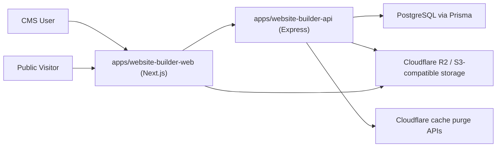

# CLAUDE.md — Comprehensive Agent + Technical Architecture Handbook
# Project Aurora Monorepo

This file is the primary technical source-of-truth for AI agents and contributors working in this repository.

If this file and code ever disagree, code is authoritative for the current runtime, and this file must be updated in the same change.

---

## 0) How to Use This File

Use this document in two modes.

- Mode A: Understand system behavior (architecture, flows, responsibilities, constraints)
- Mode B: Execute safe changes (playbooks, checklists, extension patterns)

All agents must read:

1. `## 2) Non-Negotiables`
2. `## 3) Mandatory Documentation Rule`
3. `## 7) Auth and Password Back-and-Forth`
4. `## 8) Tenant and Instance Isolation`
5. `## 19) Change Playbooks`

before editing code.

---

## 1) Project Mission

This platform is a multi-tenant SaaS booking + website-builder system.

At runtime, users:

- register and authenticate
- create organizations (tenants)
- create websites (instances)
- design website pages with reusable theme sections
- publish static manifests to object storage
- route domains/subdomains to live sites
- accept public bookings and inquiries

---

## 2) Non-Negotiables

Every change must preserve all five pillars.

1. Data isolation: no cross-tenant or cross-instance leakage.
2. Auth safety: no regressions in password/token/security behavior.
3. Route boundary integrity: `/auth`, `/cms`, `/web`, `/api/device-check` must remain semantically separate.
4. Publish correctness: builder -> manifest -> artifact storage -> routing index must remain coherent.
5. Backward compatibility: legacy aliases still in active use must not be removed accidentally.

---

## 3) Mandatory Documentation Rule

This is enforced for all agent and human changes.

If you modify behavior, contracts, architecture, migrations, environment configuration, security logic, or workflows, you must update this file in the same task/PR.

Minimum required doc update:

1. Update the relevant section(s) in this file.
2. Add a dated entry to `## 23) Change Log` with:
   - what changed
   - impacted modules/files
   - migration/rollout implications

A code change without required doc updates is incomplete.

---

## 4) High-Level Runtime Topology



Core idea:

1. CMS controls draft state and authoring UX.
2. API owns business rules, auth, permissions, tenant/instance enforcement.
3. DB stores source-of-truth records.
4. Publish generates immutable website artifacts in R2.
5. Routing index maps hostnames to active website manifests.

---

## 5) Runtime Component Map

### 5.1 Active apps

- `apps/website-builder-api`: primary Express API runtime.
- `apps/website-builder-web`: primary Next.js CMS app + API/web/published proxy layer.

### 5.2 Core packages

- `packages/database`: Prisma schema/client + scoping utilities.
- `packages/auth`: JWT/password/auth service layer.
- `packages/core`: shared constants, logger, types, error codes.
- `packages/themes`: theme React components and registry.
- `packages/types`, `packages/ui`, `packages/config`: shared workspace libs.

### 5.3 Auxiliary/legacy

- (Removed) `packages/api` (`@project-aurora/api-legacy`), `packages/booking`, `packages/auth-ui`, `mock-builder/`, `apps/themes/theme-default`, and `apps/super-admin` were deleted as obsolete/legacy scaffolding. The live API/booking/auth/theme logic lives in `apps/website-builder-api`, `packages/themes`, and `packages/auth`.

Do not shift runtime behavior into legacy modules unless explicitly planned.

---

## 6) Request Lifecycle by Namespace

### 6.1 `/auth/*`

Used for registration/login/session lifecycle.

- Public: register/login/refresh/forgot-password/reset-password
- Authenticated: logout/me/switch-tenant

### 6.2 `/cms/*`

Authenticated operational APIs for tenants/staff/superadmin.

Middleware chain baseline:

1. `requireAuth`
2. tenant-level routes: `requireTenant`
3. instance-level routes: `requireInstance`
4. permission and/or superadmin guards where needed

### 6.3 `/web/*`

Public website APIs for published/preview traffic.

- Host-based resolution via `resolvePublicWebContext`
- Then `requireTenant` and `requireInstance`
- Exposes public services/products lists + booking/inquiry creation

### 6.4 `/api/device-check`

Public anti-fraud endpoint with IP-based rate limiting.

---

## 7) Auth and Password Back-and-Forth

This section documents exact credential/token data flow.

### 7.1 Register flow (`POST /auth/register`)

1. CMS sends `email`, `password`, `fullName`, `whatsappNumber`.
2. API validates password policy.
3. API hashes password via bcrypt (`SALT_ROUNDS = 12`).
4. DB persists `users.password_hash` (never plaintext).
5. API returns access token and sets refresh token cookie.
6. Initial token may be session-level (no tenant context yet).

### 7.2 Login flow (`POST /auth/login`)

1. API loads user by email.
2. Compares plaintext password with bcrypt hash.
3. Loads active tenant memberships + permissions.
4. Issues token pair:
   - tenant-scoped token if exactly one tenant
   - session-level token otherwise
5. Stores hashed refresh token in DB (`refresh_tokens.token_hash`).

### 7.3 Refresh flow (`POST /auth/refresh`)

1. Reads refresh token from request body or `refreshToken` HttpOnly cookie.
2. Verifies JWT refresh signature/expiry.
3. Finds hashed token in DB and ensures not revoked.
4. Revokes old refresh token record.
5. Issues new access+refresh tokens.
6. Persists new hashed refresh token.

### 7.4 Logout flow (`POST /auth/logout`)

- Revokes all active refresh tokens for user.
- Clears `refreshToken` cookie.

### 7.5 Forgot/reset password

- `POST /auth/forgot-password`
  - creates reset token row with 1-hour expiry
  - response does not reveal whether account exists
  - reset link currently logged in development (email provider pending)
- `POST /auth/reset-password`
  - validates token (exists, not used, not expired)
  - validates new password rules
  - writes new bcrypt hash and marks token used

### 7.6 Token storage boundaries

- Access token:
  - in response body
  - CMS stores in browser cookie `accessToken` (JS-readable)
  - sent as Bearer token in `Authorization`
- Refresh token:
  - stored as HttpOnly cookie `refreshToken`
  - DB stores hash only (SHA-256)

### 7.7 Security invariants

1. Never log plaintext passwords.
2. Never persist plaintext passwords.
3. Preserve refresh rotation + revocation semantics.
4. Keep forgot-password response generic.
5. Treat reset-token logic as high-risk; require regression tests for changes.

---

## 8) Tenant and Instance Isolation

### 8.1 Context objects on request

`apps/website-builder-api` augments request with:

- `req.auth`: user/role/permission context
- `req.tenant`: resolved tenant
- `req.instance`: resolved instance
- `req.user`: raw JWT payload

### 8.2 Context sources

- `X-Tenant-ID` header
- `X-Instance-ID` header
- routed-host resolution for `/web` traffic

### 8.3 Important implementation detail

`packages/database` includes AsyncLocalStorage scoping helpers (`setTenantContext`), but active `apps/website-builder-api` runtime currently relies heavily on explicit `where: { tenantId, instanceId }` clauses in controllers/services.

Until active middleware wraps all requests with tenant context, explicit scoping in queries remains mandatory.

### 8.4 Isolation rules

1. Never trust tenant/instance IDs from request body.
2. Always derive tenant/instance from middleware context.
3. Every read/write for scoped models must include tenant and/or instance guards.
4. Every update/delete must verify scoped existence before mutation.

---

## 9) Functional Capability Map (Big Picture)

### 9.1 Identity and onboarding

- register, login, refresh, logout, forgot/reset password
- create tenant workspace
- create initial website instance
- switch active tenant context

### 9.2 Tenant and staff operations

- roles and role-permission mapping
- staff invitation/update/removal
- tenant profile and deactivation
- permission-based route enforcement

### 9.3 Website builder and content authoring

- page CRUD + sort ordering
- section CRUD + order + schema-driven content editing
- per-section appearance overrides (`styles_jsonb`) for local background/text color control
- CMS product catalog CRUD (name/description/image/price/currency/active/sort)
- product section themes (`product/v1`..`product/v6`) with public catalog auto-fill
- CMS image uploads use a same-origin proxy fallback (`/api/uploads/proxy`) when direct browser PUT to presigned R2 URLs is blocked by CORS
- theme catalog browsing and selection
- template preview and apply
- website settings (tokens/features/header/footer)
- shared layout synchronization (`header/v1`, `footer/v1`)

### 9.4 Website publishing

- publish readiness checks
- versioned publish records
- manifest generation + artifact upload
- publish history and rollback
- manual cache purge

### 9.5 Domain routing and delivery

- primary full domain from subdomain + site domain
- provider-agnostic `domain_routes` mapping
- legacy custom-domain endpoints (compatibility)
- custom domain connection checks via nameserver validation
- routing-index rebuild and host lookup
- CMS middleware host rewrite for preview/live serving

### 9.6 Booking operations

- CMS-side booking management and stats
- public booking creation via `/web/bookings`
- customer auto-upsert from booking/inquiry payloads

### 9.7 Catalog and plans

- global industries/features/themes/page templates
- plan-based limits (pages/domains/services/bookings/themes/templates)
- billing requests and superadmin charge approval

### 9.8 Fraud, referrals, and risk

- device fingerprint risk scoring
- referral proof and claim evaluation
- referral rewards/points workflows
- superadmin referral review endpoints

---

## 10) API Endpoint Map (Operational)

### 10.1 Auth namespace (`/auth`)

- `POST /register`
- `POST /login`
- `POST /refresh`
- `POST /forgot-password`
- `POST /reset-password`
- `POST /logout`
- `GET /me`
- `POST /switch-tenant`

### 10.2 CMS namespace (`/cms`)

Base auth required for all CMS routes.

Tenant-level:

- tenant CRUD
- superadmin dashboard/custom-domains/runtime logs/routing-index rebuild
- superadmin billing and referrals workflows
- catalog read + superadmin writes
- referrals routes

Tenant-scoped:

- instance CRUD
- domain-route upsert/remove
- legacy custom-domain aliases
- billing summary/usage and owner actions
- roles/permissions/staff
- feedback endpoints

Instance-scoped:

- customers/services/products/bookings/inquiries
- pages + sections + apply-template
- feature toggles
- media upload presign/complete
- builder settings/publish/readiness/history/rollback/cache purge

### 10.3 Web namespace (`/web`)

- `GET /sites/:subdomain`
- `GET /services`
- `GET /services/:id`
- `GET /products`
- `GET /products/:id`
- `POST /bookings`
- `POST /inquiries`

### 10.4 Device check

- `POST /api/device-check`

---

## 11) Controller Function Index

This section is a direct map of core function entry points.

### 11.1 Auth and tenancy

- `AuthController`: `register`, `login`, `switchTenant`, `refresh`, `me`, `logout`, `forgotPassword`, `resetPassword`
- `TenantsController`: `list`, `create`, `getById`, `update`, `deactivate`
- `InstancesController`: `list`, `create`, `getById`, `update`, `upsertDomainRoute`, `updateCustomDomainLegacy`, `removeDomainRoute`, `removeCustomDomainLegacy`, `getCustomDomainStatusLegacy`, `getCustomDomainSetupLegacy`, `checkCustomDomainConnection`, `deactivate`

### 11.2 Access control and team

- `RolesController`: `list`, `create`, `getById`, `update`, `delete`
- `PermissionsController`: `list`
- `StaffController`: `list`, `create`, `getById`, `update`, `remove`

### 11.3 Core operational modules

- `CustomersController`: `list`, `getById`, `create`, `update`, `delete`, `search`
- `ServicesController`: `listCms`, `listPublic`, `getById`, `create`, `update`, `delete`, `reorder`
- `ProductsController`: `listCms`, `listPublic`, `getById`, `create`, `update`, `delete`, `reorder`
- `BookingsController`: `list`, `getById`, `create`, `confirm`, `cancel`, `complete`, `calendar`, `getStats`
- `InquiriesController`: `list`, `getById`, `create`, `update`, `updateStatus`, `delete`
- `FeedbackController`: `listRatings`, `createRating`, `listSuggestions`, `createSuggestion`, `listSuperAdmin`

### 11.4 Builder and catalog

- `PagesController`: `list`, `create`, `getById`, `update`, `delete`, `reorder`, `applyTemplate`
- `SectionsController`: `listByPage`, `create`, `update`, `delete`, `reorder`
- `BuilderController`: `getPageManifest`, `getSettings`, `updateSettings`, `publishReadiness`, `publish`, `purgeCache`, `publishHistory`, `rollback`
- `FeatureTogglesController`: `list`, `upsert`, `bulkUpdate`, `delete`
- `MediaController`: `presign`, `complete`
- `CatalogController`: `list/create/update/delete` for industries/features/themes + `assignFeatures`, `getIndustryFeatures`, `getIndustryThemes`
- `PageTemplatesController`: `list`

### 11.5 Superadmin and platform ops

- `SuperAdminController`: `dashboardSummary`, `listTenants`, `getTenantDetails`, `listTenantStaff`, `updateTenantStatus`, `listCustomDomainRequests`, `markCustomDomainRequestConnected`
- `SuperAdminBillingController`: `listCharges`, `confirmCharge`, `rejectCharge`
- `SuperAdminReferralsController`: `listClaims`, `approveClaim`, `blockClaim`, `approveEnterpriseReward`, `rejectEnterpriseReward`
- `SuperAdminLogsController`: `runtimeLogs`
- `RoutingIndexController`: `rebuild`

### 11.6 Public and anti-fraud

- `PublicSitesController`: `getPublishedBySubdomain`
- `DeviceCheckController`: `check`
- `ReferralsController`: `getMyReferral`, `claim`

---

## 12) Builder, Theme, and Template Architecture

### 12.1 Theme component system

Code-level theme components are React modules in:

- `packages/themes/src/components/<feature>/vN.tsx`

Registry mapping is in:

- `packages/themes/src/registry.ts`
- Registry runtime now includes version-key fallback behavior: unknown `feature/vN` keys resolve to the latest registered component for that feature.
- Registry lookup now normalizes incoming keys (trim/case/slash-spacing), strips hidden/control characters, normalizes slash variants, and supports common feature aliases (for example `products/v6` -> `product/v6`) before resolution.

Database theme records (`themes`) store:

- `component_key` (e.g., `hero/v3`)
- `schema_jsonb` for dynamic editor forms
- `default_styles_jsonb` baseline style payload
- `access_rank` for plan restrictions

### 12.2 Page template model

`page_templates.sections_jsonb` is an ordered list of:

- `themeComponentKey`
- `defaultContent`
- `defaultStyles`

Current templates are inserted through migrations (not baseline seed script):

- `packages/database/prisma/migrations/20260331113000_add_five_templates/migration.sql`
- `packages/database/prisma/migrations/20260407120000_add_five_new_page_templates/migration.sql`
- `packages/database/prisma/migrations/20260407133000_seed_theme_pack_versions_and_backfill_templates/migration.sql`
- `packages/database/prisma/migrations/20260407190000_rebuild_template_catalog_with_12_section_variants/migration.sql`
- `packages/database/prisma/migrations/20260407201000_compensate_template_catalog_rebuild/migration.sql`
- `packages/database/prisma/migrations/20260407214500_redesign_acquisition_shop_template/migration.sql`

Theme/feature catalog bootstrap is migration-driven:

- `packages/database/prisma/migrations/20260331120000_seed_builder_feature_theme_catalog/migration.sql`
- `packages/database/prisma/migrations/20260406190000_add_product_feature_section_themes/migration.sql`
- `packages/database/prisma/migrations/20260407202000_seed_section_theme_versions_to_v12/migration.sql`

Product theme components now include:

- `product/v1` through `product/v6`
- shared fallback+catalog mapping utility in `packages/themes/src/components/product/shared.ts`
- public product fetch hook in `packages/themes/src/components/shared/public-web.ts`

### 12.3 Template apply algorithm (`PagesController.applyTemplate`)

1. Load page + selected template.
2. Parse template `sections_jsonb`.
3. Resolve `themeComponentKey` -> active `themes` rows.
4. Attempt feature-level fallback if exact component key missing.
5. Preserve existing page header/footer content when present.
6. Delete existing page sections.
7. Recreate ordered sections.

### 12.4 Shared layout synchronization

Current global layout sync logic targets:

- `header/v1`
- `footer/v1`

When these sections are changed, sync propagates across instance pages and removes duplicates.

### 12.5 Builder UI flow

`apps/website-builder-web/app/dashboard/builder/page.tsx` orchestrates:

- page list selection
- section selection and editor panel
- schema-driven form editing with autosave
- theme picker and template picker modals
- publish/readiness/history actions

---

## 13) Publish, Artifact, and Rollback Pipeline

### 13.1 Publish (`POST /cms/builder/publish`)

1. Validate instance existence and plan readiness.
2. Load pages + enabled sections + settings.
3. Compute next publish version.
4. Write `publish_records` row (`status: published`).
5. Mark pages as published.
6. Upload artifacts to object storage.
7. Rebuild routing index (fail-open).
8. Purge cache (fail-open).

### 13.2 Artifact keys (R2/S3-compatible)

- Versioned manifest:
  - `sites/{instanceId}/v{version}/manifest.json`
- Current pointer:
  - `sites/{instanceId}/current.json`
- Routing index pointer:
  - `routing-index/current.json`
- Routing index version file:
  - `routing-index/v-<timestamp>.json`

### 13.3 Rollback (`POST /cms/builder/rollback`)

1. Find target version in `publish_records`.
2. Mark current published rows as `draft`.
3. Mark target as `published`.
4. Re-upload target manifest to current pointer.
5. Rebuild routing index and purge caches (fail-open).

### 13.4 Manual purge (`POST /cms/builder/purge-cache`)

- Computes host targets from subdomain/fullDomain/customDomain.
- Calls Cloudflare host purge with fail-closed behavior for manual endpoint.

---

## 14) Domain, Subdomain, and Custom Domain Architecture

### 14.1 Domain fields in `instances`

- `subdomain`: unique tenant website slug
- `fullDomain`: `{subdomain}.{SITE_DOMAIN}` primary host
- `customDomain`: optional primary custom host
- hostname/SSL status and activation timestamps for custom-domain lifecycle

### 14.2 Domain routes

`domain_routes` table supports provider-agnostic host mapping:

- `host` (unique)
- `instance_id`
- `active`
- `is_primary`

### 14.3 Custom domain flow

1. Upsert route with `host` via `/cms/instances/:id/domain-route`.
2. `PlanPolicyService.assertCanAttachCustomDomain` enforces limits.
3. If primary route, instance custom-domain fields are updated.
4. Optional connection check endpoint validates nameservers.
5. Status fields updated to `active`/`pending` accordingly.

### 14.4 Nameserver checks

`checkCustomDomainNameservers()` compares live DNS NS records with required list (`CUSTOM_DOMAIN_REQUIRED_NAMESERVERS`), with timeout controls.

### 14.5 Routing index rebuild

`RoutingIndexService.rebuildAndPublish()`:

- scans active instances + active domain routes
- applies source precedence (`domainRoute` > `legacyCustomDomain` > `fullDomain`)
- publishes versioned index and pointer
- optionally purges Cloudflare caches

### 14.6 Request-time host resolution

For public `/web` traffic:

1. CMS proxy injects `X-Routed-Host` and optional `X-Web-Proxy-Secret`.
2. API `resolvePublicWebContext` validates trust model.
3. Routing index lookup resolves tenant/instance.
4. Middleware injects headers for downstream tenant/instance resolvers.

For CMS host rewrites:

- CMS middleware can rewrite non-platform hosts to `/preview/{subdomain}` based on routing index.

---

## 15) Public Rendering and Preview Model

### 15.1 Preview runtime

`/preview/[subdomain]` loads routing pointer/index and then published manifest through same-origin `/published/*` proxy paths.

### 15.2 Public APIs

Published pages call `/web/*` through CMS web proxy route handlers.

### 15.3 Section rendering

`SectionRenderer` resolves `componentKey` using theme registry, applies defensive key normalization + feature-version fallback at render time, and evaluates optional SDUI conditions for non-editor contexts.

---

## 16) Data Model (Critical Tables)

### 16.1 Identity and access

- `users`
- `tenants`
- `user_tenants`
- `roles`, `permissions`, `role_permissions`
- `refresh_tokens`, `password_reset_tokens`

### 16.2 Website and content

- `instances`
- `domain_routes`
- `pages`
- `page_sections`
- `products`
- `themes`
- `page_templates`
- `publish_records`
- `media_assets`
- `feature_toggles`

### 16.3 Commercial and growth

- `plan_catalogs`, `tenant_subscriptions`, `billing_charges`, credit ledgers
- referral/fraud/device fingerprint tables

---

## 17) Environment Variables Reference (Operational)

### 17.1 Core runtime

- `NODE_ENV`, `PORT`, `API_BASE_URL`, `CMS_URL`
- `CORS_ORIGIN`, `SITE_DOMAIN`, `NEXT_PUBLIC_SITE_DOMAIN`

### 17.2 Auth and cookies

- `JWT_SECRET`, `JWT_REFRESH_SECRET`
- `JWT_ACCESS_TOKEN_EXPIRY`, `JWT_REFRESH_TOKEN_EXPIRY`
- `COOKIE_DOMAIN`

### 17.3 Storage and routing index

- `R2_ENDPOINT`, `R2_ACCOUNT_ID`, `R2_ACCESS_KEY_ID`, `R2_SECRET_ACCESS_KEY`, `R2_BUCKET_NAME`
- `R2_PUBLIC_URL`, `PUBLISHED_SITES_BASE_URL`
- `ROUTING_INDEX_CURRENT_URL`, `ROUTING_INDEX_CACHE_TTL_MS`, `ROUTING_INDEX_REBUILD_TIMEOUT_MS`
- `NEXT_PUBLIC_PUBLISHED_SITES_BASE_URL`, `NEXT_PUBLIC_ROUTING_INDEX_CURRENT_URL`, `NEXT_PUBLIC_ROUTING_INDEX_CACHE_TTL_MS`, `NEXT_PUBLIC_MANIFEST_CACHE_TTL_MS`

### 17.4 Domain and proxy trust

- `WEB_PROXY_SHARED_SECRET`
- `CUSTOM_DOMAIN_REQUIRED_NAMESERVERS`
- `CUSTOM_DOMAIN_DNS_LOOKUP_TIMEOUT_MS`

### 17.5 Cloudflare and notifications

- `CLOUDFLARE_API_TOKEN`, `CLOUDFLARE_ZONE_ID`, `CLOUDFLARE_API_TIMEOUT_MS`
- `DISCORD_WEBHOOK_URL` and aliases (`DISCORD_WEBHOOK_ENDPOINT`, `DISCORD_WEBHOOK`, `WEBHOOK_URL`, `WEBHOOK_ENDPOINT`)
- `DISCORD_WEBHOOK_TIMEOUT_MS`

### 17.6 Fraud/referrals

- `NEXT_PUBLIC_FINGERPRINT_ENABLED`, `FINGERPRINT_ENABLED`, `FINGERPRINT_MODE`
- `DEVICE_CHECK_RATE_LIMIT_PER_MIN`, `IPINFO_TOKEN`
- `REFERRAL_PROOF_TTL_MINUTES`

---

## 18) Validation, Error Model, and Security Surfaces

### 18.1 Validation

- Zod schemas in `apps/website-builder-api/src/validators/*`
- Request validation via `validate` middleware

### 18.2 Error model

Unified error shape:

```json
{
  "success": false,
  "error": {
    "code": "SOME_CODE",
    "message": "Human readable message",
    "field": "optionalField",
    "details": [{ "field": "x", "message": "y" }]
  }
}
```

### 18.3 Security surfaces to treat as high-risk

1. Auth/password/reset flows
2. Tenant/instance scoping logic
3. Public `/web` routed-host trust model
4. Publish artifact and routing-index generation
5. Billing, referral, and superadmin mutation routes

---

## 19) Change Playbooks (How To Add Functionality Safely)

### 19.1 Add a new theme component

1. Create component file: `packages/themes/src/components/<feature>/vN.tsx`
2. Register key in `packages/themes/src/registry.ts`
3. Add/ensure DB `themes` record with matching `component_key`, schema, styles
4. Optionally add preview mapping in `ThemePicker`
5. Validate builder add-section and published rendering
6. Update this file + change log

### 19.2 Add a new page template

1. Insert template row in migration into `page_templates` (`sections_jsonb` ordered)
2. Ensure each `themeComponentKey` maps to active theme catalog entries
3. Verify full-screen preview via `/builder-preview/{templateId}`
4. Verify `PagesController.applyTemplate` creates expected sections
5. Update this file + change log

### 19.3 Add new builder capability

1. Add route + validator + controller logic in `apps/website-builder-api`
2. Integrate into `apps/website-builder-web/app/dashboard/builder/page.tsx`
3. Preserve tenant/instance header behavior from API client
4. Add tests for permission and scoped data behavior
5. Update this file + change log

### 19.4 Add custom-domain/domain-routing behavior

1. Update `InstancesController` domain-route methods
2. Update domain utilities (`utils/domain*`) and/or nameserver checks
3. Update routing-index service if host mapping semantics change
4. Verify CMS middleware preview rewrite and API web context resolution
5. Add route/controller tests + docs updates

### 19.5 Add new public `/web` endpoint

1. Add route under `apps/website-builder-api/src/routes/web/index.ts`
2. Keep endpoint public-safe and instance-scoped
3. Ensure host-based context resolution still applies
4. Do not introduce CMS auth requirements to public endpoints
5. Add tests for host/header context correctness

---

## 20) Testing and Verification Checklist

### 20.1 Baseline commands

- `pnpm build`
- `pnpm lint`
- `pnpm --filter @project-aurora/website-builder-api test`
- `pnpm --filter @project-aurora/website-builder-web test`

### 20.2 Scope-specific verification

- Auth changes: register/login/refresh/logout/reset lifecycle checks
- Tenant/instance changes: cross-tenant denial tests
- Builder/template changes: apply template + section CRUD + preview checks
- Publish/domain changes: publish -> routing index -> preview/custom host checks
- Billing/referral changes: permission and status transition tests

If tests are skipped, explicitly record why and residual risk.

---

## 21) Agent Execution Protocol

### 21.1 Before coding

1. Read affected sections of this file.
2. Identify which boundaries are impacted: auth, tenant scope, publish, domains.
3. Identify migration and environment implications.

### 21.2 During coding

1. Keep changes surgical and scoped.
2. Preserve existing API error shape and validation style.
3. Preserve compatibility endpoints unless removal is explicitly planned.

### 21.3 After coding

1. Run targeted verification/tests.
2. Update this handbook for changed behavior.
3. Add dated change-log entry.

---

## 22) Future Architecture Roadmap

1. Fully wire active API request handling into `setTenantContext` to reduce reliance on manual scoping clauses.
2. Consider hashing password-reset tokens at rest (parity with refresh token storage model).
3. Revisit access-token browser storage strategy for stronger XSS resilience.
4. Gradually retire legacy custom-domain aliases after client migration is complete.
5. Expand observability around superadmin/billing/domain actions (structured logs + audit metadata).
6. Add deeper automated integration tests around routing-index rebuild and host-resolution edge cases.

---

## 23) Change Log

### 2026-04-07 (CMS Deployment Build Unblock: `noUnusedLocals` Override + Generated Theme Cleanup)

- Unblocked Coolify/Docker CMS builds that were failing during Next.js type-check with `TS6133` unused-local errors in generated v7-v12 theme component files.
- Added a CMS-local TypeScript override so strict unused-local checks no longer fail CMS production builds:
  - `apps/website-builder-web/tsconfig.json`: `compilerOptions.noUnusedLocals = false`
- Applied targeted cleanup to remove known dead local declarations in affected theme files that surfaced during initial failure triage (including `about/*` and lane-specific `laneText` declarations).
- Impacted modules/files:
  - `apps/website-builder-web/tsconfig.json`
  - `packages/themes/src/components/about/v7.tsx`
  - `packages/themes/src/components/about/v8.tsx`
  - `packages/themes/src/components/about/v9.tsx`
  - `packages/themes/src/components/about/v10.tsx`
  - `packages/themes/src/components/about/v11.tsx`
  - `packages/themes/src/components/about/v12.tsx`
  - `packages/themes/src/components/booking-widget/v5.tsx`
  - `packages/themes/src/components/booking-widget/v7.tsx`
  - `packages/themes/src/components/booking-widget/v9.tsx`
  - `packages/themes/src/components/booking-widget/v10.tsx`
  - `packages/themes/src/components/booking-widget/v11.tsx`
  - `packages/themes/src/components/booking-widget/v12.tsx`
  - `packages/themes/src/components/footer/v7.tsx`
  - `packages/themes/src/components/footer/v8.tsx`
  - `packages/themes/src/components/footer/v9.tsx`
  - `packages/themes/src/components/footer/v10.tsx`
  - `packages/themes/src/components/footer/v11.tsx`
  - `packages/themes/src/components/header/v8.tsx`
  - `packages/themes/src/components/header/v10.tsx`
  - `packages/themes/src/components/header/v11.tsx`
  - `packages/themes/src/components/header/v12.tsx`
  - `packages/themes/src/components/hero/v7.tsx`
  - `packages/themes/src/components/hero/v8.tsx`
  - `packages/themes/src/components/hero/v10.tsx`
  - `packages/themes/src/components/hero/v12.tsx`
  - `CLAUDE.md`
- Verification:
  - `pnpm turbo build --filter=@project-aurora/website-builder-web... --concurrency=1`
- Migration/rollout implications:
  - No database migration required.
  - Runtime behavior is unchanged; this is a build-time type-checking policy adjustment for CMS compilation scope.
  - Redeploy CMS after pulling this change.

### 2026-04-07 (Acquisition Shop Template Redesign: v6 Lane Visual Overhaul + Data Refresh)

- Redesigned the full `template-2026-acquisition-shop` visual direction by overhauling the v6 lane section components used by this template.
- Updated v6 components for a stronger conversion-first layout system across the full template flow:
  - `header/v6`, `hero/v6`, `logos/v6`, `product/v6`, `services/v6`, `team/v6`, `testimonials/v6`, `pricing/v6`, `faq/v6`, `booking-widget/v6`, `contact/v6`, `footer/v6`
- Updated static template metadata defaults for Acquisition Shop in `packages/themes/src/templates.ts`:
  - refreshed token palette
  - updated typography default to `Space Grotesk`
  - improved template description
- Added a data migration to refresh existing `page_templates.sections_jsonb` content/style defaults for `template-2026-acquisition-shop` in deployed environments.
- Impacted modules/files:
  - `packages/themes/src/components/header/v6.tsx`
  - `packages/themes/src/components/hero/v6.tsx`
  - `packages/themes/src/components/logos/v6.tsx`
  - `packages/themes/src/components/product/v6.tsx`
  - `packages/themes/src/components/services/v6.tsx`
  - `packages/themes/src/components/team/v6.tsx`
  - `packages/themes/src/components/testimonials/v6.tsx`
  - `packages/themes/src/components/pricing/v6.tsx`
  - `packages/themes/src/components/faq/v6.tsx`
  - `packages/themes/src/components/booking-widget/v6.tsx`
  - `packages/themes/src/components/contact/v6.tsx`
  - `packages/themes/src/components/footer/v6.tsx`
  - `packages/themes/src/templates.ts`
  - `packages/database/prisma/migrations/20260407214500_redesign_acquisition_shop_template/migration.sql`
  - `CLAUDE.md`
- Verification:
  - `pnpm --filter @project-aurora/themes exec tsc -p tsconfig.json --noEmit`
  - `pnpm --filter @project-aurora/website-builder-web test -- app/__tests__/theme-components.smoke.test.ts app/__tests__/section-renderer.integration.test.ts`
- Migration/rollout implications:
  - Requires running Prisma migrations in target environments to update existing Acquisition Shop template defaults in `page_templates`.
  - No schema changes; migration is data-only for one template row.
  - Restart CMS runtime so builder/template previews load updated v6 component implementations.

### 2026-04-07 (Template Catalog Lane Alignment: Single-Version Packs v1..v12)

- Added a data migration that rewires seeded template section keys so each template now resolves to one internal version lane only.
- The migration maps the 12 active seeded templates to lane versions `v1`..`v12` and rewrites each section `themeComponentKey` from `<feature>/vX` to `<feature>/v{lane}` while preserving section order and content payloads.
- This enforces the template-level consistency contract required for predictable preview/apply/publish behavior when using version packs.
- Impacted modules/files:
  - `packages/database/prisma/migrations/20260407203000_align_templates_to_single_version_lanes/migration.sql`
  - `CLAUDE.md`
- Verification:
  - Migration file added for deployment in Prisma migration chain (data-only rewrite).
  - `pnpm --filter @project-aurora/database exec prisma migrate deploy`
  - Theme compile + CMS render tests validated against explicit v6-v12 lane component implementations:
    - `pnpm --filter @project-aurora/themes exec tsc -p tsconfig.json --noEmit`
    - `pnpm --filter @project-aurora/website-builder-web test -- app/__tests__/theme-components.smoke.test.ts app/__tests__/section-renderer.integration.test.ts`
- Migration/rollout implications:
  - Requires running Prisma migrations in target environments to rewrite existing seeded template rows.
  - No schema shape changes; this migration updates `page_templates.sections_jsonb` data only.

### 2026-04-07 (Version Lane Expansion Wave B/C: Explicit v6-v12 Packs for Remaining Families)

- Expanded the version-lane implementation pattern beyond the initial Wave A families so additional section families now use explicit per-version (`v6`..`v12`) modules with lane-specific defaults and rendering config.
- Added family-level shared lane renderers (`pack-shared.tsx`) and rewired `v6`..`v12` entrypoints to pass explicit lane config (tone/layout/card/badge/border/button variants) instead of keeping cloned carry-forward implementations.
- Covered additional families in this wave:
  - `services`
  - `product`
  - `contact`
  - `booking-widget`
  - `logos`
  - `gallery`
  - `testimonials`
  - `pricing`
- This keeps runtime component keys stable while making each lane version intentionally distinct and template-pack ready for consistent cross-section lane composition.
- Impacted modules/files:
  - `packages/themes/src/components/services/pack-shared.tsx`
  - `packages/themes/src/components/services/v6.tsx` .. `packages/themes/src/components/services/v12.tsx`
  - `packages/themes/src/components/product/pack-shared.tsx`
  - `packages/themes/src/components/product/v6.tsx` .. `packages/themes/src/components/product/v12.tsx`
  - `packages/themes/src/components/contact/pack-shared.tsx`
  - `packages/themes/src/components/contact/v6.tsx` .. `packages/themes/src/components/contact/v12.tsx`
  - `packages/themes/src/components/booking-widget/pack-shared.tsx`
  - `packages/themes/src/components/booking-widget/v6.tsx` .. `packages/themes/src/components/booking-widget/v12.tsx`
  - `packages/themes/src/components/logos/pack-shared.tsx`
  - `packages/themes/src/components/logos/v6.tsx` .. `packages/themes/src/components/logos/v12.tsx`
  - `packages/themes/src/components/gallery/pack-shared.tsx`
  - `packages/themes/src/components/gallery/v6.tsx` .. `packages/themes/src/components/gallery/v12.tsx`
  - `packages/themes/src/components/testimonials/pack-shared.tsx`
  - `packages/themes/src/components/testimonials/v6.tsx` .. `packages/themes/src/components/testimonials/v12.tsx`
  - `packages/themes/src/components/pricing/pack-shared.tsx`
  - `packages/themes/src/components/pricing/v6.tsx` .. `packages/themes/src/components/pricing/v12.tsx`
  - `CLAUDE.md`
- Verification:
  - `pnpm --filter @project-aurora/themes exec tsc -p tsconfig.json --noEmit`
  - `pnpm --filter @project-aurora/website-builder-web test -- app/__tests__/theme-components.smoke.test.ts app/__tests__/section-renderer.integration.test.ts`
- Migration/rollout implications:
  - No database migration required for this renderer/component implementation wave.
  - Restart CMS runtime to ensure builder preview and published rendering load updated lane implementations.

### 2026-04-07 (Template Apply + Global Layout Sync Guardrails for Versioned Packs)

- Implemented phase-1 guardrails to unblock same-version template packs (v1..v12) by removing hardcoded `header/v1` + `footer/v1` assumptions in active API runtime.
- Updated template apply flow in `PagesController.applyTemplate` to treat shared layout sections by feature (`header/*`, `footer/*`) instead of exact component keys.
- Updated template token extraction logic so template token overrides are sourced intentionally from the template header section rather than first-match scanning across all sections.
- Updated apply-template shared-layout behavior when existing page header/footer already exists:
  - preserves existing header/footer content/styles/conditions
  - applies template-selected shared layout theme version when provided (`header/vN`, `footer/vN`)
  - keeps body sections template-driven and shared-layout-excluded by feature match.
- Updated new-page shared layout clone behavior to copy whichever existing `header/*` and `footer/*` sections exist in instance pages, not only `header/v1` and `footer/v1`.
- Generalized section-level global layout sync in `SectionsController` from exact keys to feature-level behavior:
  - duplicate-blocking now applies across versions per feature (cannot add `header/v2` if any `header/*` exists on page)
  - sync propagation now keyed by shared layout feature (`header` or `footer`) rather than a single component key.
- Added focused controller tests covering these guardrails:
  - `apps/website-builder-api/src/__tests__/controllers/pages.controller.apply-template.test.ts`
  - `apps/website-builder-api/src/__tests__/controllers/sections.controller.shared-layout.test.ts`
- Impacted modules/files:
  - `apps/website-builder-api/src/controllers/pages.controller.ts`
  - `apps/website-builder-api/src/controllers/sections.controller.ts`
  - `apps/website-builder-api/src/__tests__/controllers/pages.controller.apply-template.test.ts`
  - `apps/website-builder-api/src/__tests__/controllers/sections.controller.shared-layout.test.ts`
  - `CLAUDE.md`
- Verification:
  - `pnpm --filter @project-aurora/website-builder-api test -- src/__tests__/controllers/pages.controller.apply-template.test.ts src/__tests__/controllers/sections.controller.shared-layout.test.ts`
  - `pnpm --filter @project-aurora/website-builder-api exec tsc -p tsconfig.json --noEmit`
- Migration/rollout implications:
  - No database schema migration required for this phase.
  - Restart API runtime so updated apply-template/shared-layout sync behavior is active.

### 2026-04-07 (Section Version File Restoration: Replace Wrapper Stubs With Concrete Legacy Implementations)

- Restored concrete section implementation files for versioned theme components where v6-v12 files had become thin wrapper stubs that delegated to shared variant files.
- Recovered full legacy code for downgraded source versions from repository HEAD and used those as stable bases for version backfills:
  - restored from HEAD: `about/v5`, `services/v5`, `product/v5`, `product/v6`, `logos/v5`, `testimonials/v5`
- Replaced wrapper-style v6-v12 files with full concrete component code by family using stable legacy sources:
  - based on v5: `about`, `services`, `logos`, `testimonials`, `header`, `hero`, `footer`, `faq`
  - based on v6: `product` (`v7`..`v12`)
  - based on v4: `contact`, `booking-widget`, `pricing`, `gallery` (`v6`..`v12`)
- Also replaced wrapper placeholders in `v5` for families that previously had no concrete v5 implementation source in this branch by backfilling from stable v4 code:
  - `contact/v5`, `booking-widget/v5`, `pricing/v5`, `gallery/v5`
- This change keeps registry/version keys intact while ensuring each section version file is independently complete and publish-safe without relying on wrapper indirection.
- Impacted modules/files:
  - `packages/themes/src/components/about/v5.tsx`, `v6.tsx`..`v12.tsx`
  - `packages/themes/src/components/services/v5.tsx`, `v6.tsx`..`v12.tsx`
  - `packages/themes/src/components/product/v5.tsx`, `v6.tsx`..`v12.tsx`
  - `packages/themes/src/components/logos/v5.tsx`, `v6.tsx`..`v12.tsx`
  - `packages/themes/src/components/testimonials/v5.tsx`, `v6.tsx`..`v12.tsx`
  - `packages/themes/src/components/header/v6.tsx`..`v12.tsx`
  - `packages/themes/src/components/hero/v6.tsx`..`v12.tsx`
  - `packages/themes/src/components/footer/v6.tsx`..`v12.tsx`
  - `packages/themes/src/components/faq/v6.tsx`..`v12.tsx`
  - `packages/themes/src/components/contact/v5.tsx`..`v12.tsx`
  - `packages/themes/src/components/booking-widget/v5.tsx`..`v12.tsx`
  - `packages/themes/src/components/pricing/v5.tsx`..`v12.tsx`
  - `packages/themes/src/components/gallery/v5.tsx`..`v12.tsx`
  - `CLAUDE.md`
- Verification:
  - `pnpm --filter @project-aurora/themes exec tsc -p tsconfig.json --noEmit`
  - `pnpm --filter @project-aurora/website-builder-web test -- app/__tests__/theme-components.smoke.test.ts app/__tests__/section-renderer.integration.test.ts`
- Migration/rollout implications:
  - No database migration required.
  - Restart CMS runtime to ensure preview/builder surfaces load updated section version modules.

### 2026-04-07 (Full Section Variant Wave: v12 Unique Implementations + Explicit Registry Hardening)

- Completed the requested broad section wave by implementing explicit per-version components across the remaining section families and wiring runtime resolution directly in the registry.
- Replaced wrapper/alias-only version files with concrete version entrypoints for:
  - `about/v5`..`about/v12`
  - `services/v5`..`services/v12`
  - `product/v5`..`product/v12`
  - `header/v6`..`header/v12`
  - `hero/v6`..`hero/v12`
  - `footer/v6`..`footer/v12`
  - `contact/v5`..`contact/v12`
  - `booking-widget/v5`..`booking-widget/v12`
  - `faq/v6`..`faq/v12`
  - `pricing/v5`..`pricing/v12`
  - `testimonials/v5`..`testimonials/v12`
  - `gallery/v5`..`gallery/v12`
  - `logos/v5`..`logos/v12`
- Added reusable family-level variant implementations for newly expanded families to keep version behavior intentionally distinct while preserving CMS-driven content pathways and public data integration.
- Preserved public catalog integrations in generated section families:
  - services variants continue using public services hooks/formatters
  - product variants continue using public products hooks and shared catalog mapping/fallback utilities
- Hardened `packages/themes/src/registry.ts` with explicit imports and concrete registry entries for all active versions through `v12` across targeted families, preventing cyclic alias expansion from bypassing explicit version files.
- Standardized max-version metadata in registry to `12` for active feature families so future alias generation does not override explicit version mappings.
- Impacted modules/files:
  - `packages/themes/src/registry.ts`
  - `packages/themes/src/components/about/variant.tsx`
  - `packages/themes/src/components/services/variant.tsx`
  - `packages/themes/src/components/product/variant.tsx`
  - `packages/themes/src/components/header/variant.tsx`
  - `packages/themes/src/components/hero/variant.tsx`
  - `packages/themes/src/components/footer/variant.tsx`
  - `packages/themes/src/components/contact/variant.tsx`
  - `packages/themes/src/components/booking-widget/variant.tsx`
  - `packages/themes/src/components/faq/variant.tsx`
  - `packages/themes/src/components/pricing/variant.tsx`
  - `packages/themes/src/components/testimonials/variant.tsx`
  - `packages/themes/src/components/gallery/variant.tsx`
  - `packages/themes/src/components/logos/variant.tsx`
  - `packages/themes/src/components/*/v5..v12.tsx` (family/version-specific entrypoints as listed above)
  - `CLAUDE.md`
- Verification:
  - `pnpm --filter @project-aurora/themes exec tsc -p tsconfig.json --noEmit`
  - `pnpm --filter @project-aurora/website-builder-web test -- app/__tests__/theme-components.smoke.test.ts app/__tests__/section-renderer.integration.test.ts`
- Migration/rollout implications:
  - No database migration required for this rendering/registry implementation wave.
  - Restart CMS runtime to ensure builder preview and published rendering load explicit v12 section mappings.

### 2026-04-07 (Team Section v5-v12: Unique Layout Implementations + Explicit Registry Mapping)

- Replaced `team/v5` through `team/v12` wrapper aliases with real, distinct Team section implementations so each version now renders unique structure/styling instead of re-exporting earlier variants.
- Added shared Team helpers for safer content parsing and fallback member normalization:
  - `resolveTeamMembers`
  - `getText`
- Updated theme registry to import and register explicit Team component keys `team/v5`..`team/v12`.
- Updated Team max-version metadata in registry from `4` to `12` so cyclic alias expansion no longer overrides Team v5+ keys.
- Impacted modules/files:
  - `packages/themes/src/components/team/shared.ts`
  - `packages/themes/src/components/team/v5.tsx`
  - `packages/themes/src/components/team/v6.tsx`
  - `packages/themes/src/components/team/v7.tsx`
  - `packages/themes/src/components/team/v8.tsx`
  - `packages/themes/src/components/team/v9.tsx`
  - `packages/themes/src/components/team/v10.tsx`
  - `packages/themes/src/components/team/v11.tsx`
  - `packages/themes/src/components/team/v12.tsx`
  - `packages/themes/src/registry.ts`
  - `CLAUDE.md`
- Verification:
  - `pnpm --filter @project-aurora/themes exec tsc -p tsconfig.json --noEmit`
  - `pnpm --filter @project-aurora/website-builder-web test -- app/__tests__/theme-components.smoke.test.ts app/__tests__/section-renderer.integration.test.ts`
- Migration/rollout implications:
  - No database migration required for this Team-only rendering update.
  - Restart CMS runtime to ensure builder preview and published rendering load updated Team v5-v12 components.

### 2026-04-07 (Template Compensation Rollback + Section Theme Versions Through v12)

- Added a compensating migration to undo the previous full-template rewrite behavior by replaying the canonical pre-rebuild template/theme migration chain, preserving migration history while restoring expected seeded template semantics.
- Added section theme component version files through `v12` across active component families so each section catalog can reference versioned keys up to `v12`:
  - `about`, `booking-widget`, `contact`, `faq`, `footer`, `gallery`, `header`, `hero`, `logos`, `pricing`, `product`, `services`, `team`, `testimonials`
- Extended registry behavior to expose explicit `feature/vN` keys up to `v12` via cyclic alias expansion (with explicit `logos/v6`..`logos/v12` mapping to `logos/v5`).
- Added a theme-catalog migration that seeds missing DB rows through `v12` for active section slugs using the latest existing schema/style payload per feature.
- This entry supersedes the temporary template-only rebuild direction recorded below by applying an explicit compensation migration.
- Impacted modules/files:
  - `packages/database/prisma/migrations/20260407201000_compensate_template_catalog_rebuild/migration.sql`
  - `packages/database/prisma/migrations/20260407202000_seed_section_theme_versions_to_v12/migration.sql`
  - `packages/themes/src/registry.ts`
  - `packages/themes/src/components/*/v*.tsx` (new v5/v6..v12 wrapper files depending on feature family)
  - `CLAUDE.md`
- Verification:
  - `pnpm --filter @project-aurora/themes exec tsc -p tsconfig.json --noEmit`
  - `pnpm --filter @project-aurora/database exec prisma migrate deploy`
  - Prisma query verification confirms section theme coverage through `v12` for all targeted features and compensated template section-count profile (no longer forced to all 12).
- Migration/rollout implications:
  - Requires running Prisma migrations to apply compensation + v12 catalog rows in existing environments.
  - Restart API/CMS runtimes after migration so builder/template/theme lookups use updated catalog and registry mappings.

### 2026-04-07 (Template Catalog Rebuild: 12 Templates x 12 Sections with Distinct Composition)

- Rebuilt all 12 seeded page templates so each template now has exactly 12 sections in `page_templates.sections_jsonb`.
- Added a dedicated migration that updates existing template rows by stable IDs (no template ID removals), ensuring changes apply safely to already-provisioned databases.
- Increased cross-template differentiation by assigning distinct section compositions/orders and visual token sets per template instead of near-duplicate layouts.
- Expanded under-filled templates (notably `template-2026-signal-horizon`) to full 12-section structures while preserving compatibility with existing feature/version component keys.
- Impacted modules/files:
  - `packages/database/prisma/migrations/20260407190000_rebuild_template_catalog_with_12_section_variants/migration.sql`
  - `CLAUDE.md`
- Verification:
  - Structural count validation via Node script confirms each updated template block includes exactly 12 `themeComponentKey` entries.
- Migration/rollout implications:
  - Requires running Prisma migrations to apply the template catalog rewrite to existing databases.
  - No schema/table shape changes; this is data-only template payload normalization.
  - Restart API/CMS runtimes after migration so builder/template listings and apply-template flows use updated section payloads.

### 2026-04-07 (Unified Mobile Hamburger Behavior Across Header v1-v4)

- Standardized mobile navigation interaction for header theme components `header/v1` through `header/v4` to match the same collapsed-by-default hamburger pattern already used in `header/v5`.
- Added consistent mobile menu toggle behavior for all active header packs:
  - navigation and CTA hidden by default on small screens
  - hamburger icon toggles open/close state
  - mobile menu renders links in a vertical stack with CTA exposed only when opened
- Kept existing desktop visual language and per-pack styling intact while only normalizing the mobile interaction model.
- Impacted modules/files:
  - `packages/themes/src/components/header/v1.tsx`
  - `packages/themes/src/components/header/v2.tsx`
  - `packages/themes/src/components/header/v3.tsx`
  - `packages/themes/src/components/header/v4.tsx`
  - `CLAUDE.md`
- Verification:
  - `pnpm --filter @project-aurora/website-builder-web test -- app/__tests__/theme-components.smoke.test.ts app/__tests__/section-renderer.integration.test.ts`
  - `pnpm --filter @project-aurora/website-builder-web build` (currently fails in workspace due to unrelated Next.js `PageNotFoundError: Cannot find module for page: /_document` during page data collection)
- Migration/rollout implications:
  - No database migration required.
  - Restart CMS runtime to pick up updated header component behavior in builder preview and published preview surfaces.

### 2026-04-07 (Signal Horizon v5 Mobile Header Collapse + Pill CTA Consistency)

- Fixed Signal Horizon (`v5` pack) mobile header behavior so navigation links and header CTA remain collapsed by default on small screens and only expand through the hamburger toggle.
- Reworked `header/v5` mobile open-state styling to class-based CSS (`.theme-v5-open`) instead of escaped template interpolation in style rules, preventing broken mobile hide/show behavior.
- Standardized key Signal Horizon CTA surfaces to pill-rounded styling for visual consistency:
  - header top CTA
  - hero primary CTA
  - services primary bottom CTA
- Impacted modules/files:
  - `packages/themes/src/components/header/v5.tsx`
  - `packages/themes/src/components/hero/v5.tsx`
  - `packages/themes/src/components/services/v5.tsx`
  - `CLAUDE.md`
- Verification:
  - `pnpm --filter @project-aurora/website-builder-web test -- app/__tests__/theme-components.smoke.test.ts app/__tests__/section-renderer.integration.test.ts`
  - `pnpm --filter @project-aurora/website-builder-web build` (currently fails in workspace due to unrelated Next.js page data collection errors for `/api/uploads/proxy`, `/robots.txt`, and `/routing-index/current.json`)
- Migration/rollout implications:
  - No database migration required.
  - Restart CMS runtime to pick up updated Signal Horizon `v5` header/CTA rendering behavior in preview/builder surfaces.

### 2026-04-07 (Direct Theme Component Mobile Optimization for v2/v4 Packs)

- Implemented native mobile responsiveness directly inside v2/v4 theme components (beyond the shared global mobile safety layer) so templates remain structurally usable on small screens without relying on wrapper-only behavior.
- Applied responsive hardening patterns across the v2/v4 section families:
  - replaced rigid fixed paddings/margins/font sizes with `clamp(...)` scales
  - reduced overly large grid minimums and card widths to avoid mobile overflow
  - tightened form/control spacing and action button sizing for dense mobile layouts
  - normalized image/media heights for smaller viewport ranges
- Impacted modules/files:
  - `packages/themes/src/components/about/v2.tsx`
  - `packages/themes/src/components/about/v4.tsx`
  - `packages/themes/src/components/booking-widget/v2.tsx`
  - `packages/themes/src/components/booking-widget/v4.tsx`
  - `packages/themes/src/components/contact/v2.tsx`
  - `packages/themes/src/components/contact/v4.tsx`
  - `packages/themes/src/components/footer/v2.tsx`
  - `packages/themes/src/components/footer/v4.tsx`
  - `packages/themes/src/components/header/v2.tsx`
  - `packages/themes/src/components/header/v4.tsx`
  - `packages/themes/src/components/hero/v2.tsx`
  - `packages/themes/src/components/hero/v4.tsx`
  - `packages/themes/src/components/pricing/v2.tsx`
  - `packages/themes/src/components/pricing/v4.tsx`
  - `packages/themes/src/components/product/v2.tsx`
  - `packages/themes/src/components/product/v4.tsx`
  - `packages/themes/src/components/faq/v2.tsx`
  - `packages/themes/src/components/faq/v4.tsx`
  - `packages/themes/src/components/team/v2.tsx`
  - `packages/themes/src/components/team/v4.tsx`
  - `packages/themes/src/components/testimonials/v2.tsx`
  - `packages/themes/src/components/testimonials/v4.tsx`
  - `CLAUDE.md`
- Verification:
  - `pnpm --filter @project-aurora/website-builder-web test -- app/__tests__/theme-components.smoke.test.ts app/__tests__/section-renderer.integration.test.ts`
  - `pnpm --filter @project-aurora/website-builder-web build`
- Migration/rollout implications:
  - No database migration required.
  - Restart CMS runtime to pick up updated theme component render behavior in preview/builder surfaces.

### 2026-04-07 (Global Mobile Optimization Pass for Templates/Themes)

- Added a shared mobile-safety runtime layer for all rendered theme sections through `SectionRenderer` by wrapping output with a dedicated class hook.
- Added global responsive CSS safeguards in `apps/website-builder-web/app/globals.css` for `.be-theme-mobile-safe` to improve small-screen behavior across all template/theme sections:
  - force media elements (`img/video/iframe/svg/canvas`) to remain within viewport width
  - avoid horizontal overflow via box sizing + wrapping rules
  - enforce mobile flex wrapping and single-column fallback for inline grid layouts
  - clamp heading/body/form control typography on small screens
  - normalize section horizontal padding on mobile widths
- Updated builder template/theme picker preview panes to be more usable on smaller screens by lowering hard minimum preview heights under mobile breakpoints.
- Impacted modules/files:
  - `apps/website-builder-web/components/builder/section-renderer.tsx`
  - `apps/website-builder-web/app/globals.css`
  - `apps/website-builder-web/components/builder/template-picker.tsx`
  - `apps/website-builder-web/components/builder/theme-picker.tsx`
  - `CLAUDE.md`
- Migration/rollout implications:
  - No database migration required.
  - Restart CMS runtime to ensure updated global CSS and section wrapper behavior are applied.

### 2026-04-07 (Template Theme Consistency + Contrast Hardening + Token Sync on Apply)

- Addressed cross-template consistency issues that produced font/palette drift between template preview and applied builder state.
- Added shared contrast utility in `packages/themes/src/components/shared/color-contrast.ts` and applied it to high-risk section variants to prevent white-on-white and low-contrast text states under custom token palettes.
- Updated multiple section implementations to prefer token-aware readable text/border/button colors on white or dynamic surfaces:
  - `packages/themes/src/components/booking-widget/v1.tsx`
  - `packages/themes/src/components/booking-widget/v3.tsx`
  - `packages/themes/src/components/contact/v1.tsx`
  - `packages/themes/src/components/contact/v3.tsx`
  - `packages/themes/src/components/gallery/v3.tsx`
  - `packages/themes/src/components/pricing/v3.tsx`
  - `packages/themes/src/components/product/v1.tsx`
  - `packages/themes/src/components/team/v3.tsx`
- Removed hardcoded serif overrides in modern variants so typography remains token-driven and consistent with selected template fonts:
  - `packages/themes/src/components/pricing/v4.tsx`
  - `packages/themes/src/components/testimonials/v4.tsx`
- Updated Builder Preview font loading to use hosted font resolution rather than a limited hardcoded import set:
  - `apps/website-builder-web/app/builder-preview/[name]/page.tsx`
- Updated template apply flow so template token overrides are persisted into instance settings during apply (transactional update), fixing post-apply font/color mismatches:
  - `apps/website-builder-api/src/controllers/pages.controller.ts`
- Updated Builder page to refresh settings after template apply so newly-synced tokens are reflected immediately in editor UI:
  - `apps/website-builder-web/app/dashboard/builder/page.tsx`
- Added migration to normalize mixed section pack versions and backfill missing `themeTokens` for affected templates:
  - `packages/database/prisma/migrations/20260407153000_normalize_template_tokens_and_section_packs/migration.sql`
- Standardized selected conversion templates to single-version section packs so layout style is consistent within each template (not color-only variation):
  - `Salesforce Pipeline` -> full `v1` pack
  - `Velocity VSL` -> full `v2` pack
  - `Fusion Growth` -> full `v3` pack
  - `Acquisition Shop` -> full `v4` pack
- Migration/rollout implications:
  - Apply the new migration in sequence after existing 2026-04-07 template catalog migrations.
  - For databases where these template rows already exist, execute the normalization migration SQL to update existing `page_templates.sections_jsonb` rows in place.
  - Restart API/CMS runtimes after migration so apply-template token syncing and preview font loading behavior are active in current processes.

### 2026-04-07 (Product Theme Key Resolution Hardening for Builder/Preview)

- Hardened theme component-key resolution to prevent false unknown-component states for malformed version keys (spacing/case/pluralized feature slugs).
- Added normalization at registry level in `packages/themes/src/registry.ts`:
  - trim and lowercase incoming keys
  - normalize slash spacing (`feature / vN` -> `feature/vN`)
  - normalize slash variants + strip hidden/control characters to avoid visually-correct-but-unresolvable keys
  - map common aliases (`products` -> `product`, etc.)
  - preserve feature-level fallback to latest registered `feature/vN` when requested version is unavailable
- Added direct compatibility aliases for product catalog keys `product/v7`..`product/v9` to current product renderer implementation so catalog drift does not produce unknown-component blocks.
- Added CMS-side defensive resolution in `apps/website-builder-web/components/builder/section-renderer.tsx` so Builder and template preview remain resilient even when incoming component keys are slightly malformed.
- Added regression coverage for normalized product key variants and unknown-version fallback behavior in:
  - `apps/website-builder-web/app/__tests__/section-renderer.integration.test.ts`
  - `apps/website-builder-web/app/__tests__/theme-components.smoke.test.ts`
- Impacted modules/files:
  - `packages/themes/src/registry.ts`
  - `apps/website-builder-web/components/builder/section-renderer.tsx`
  - `apps/website-builder-web/app/__tests__/section-renderer.integration.test.ts`
  - `apps/website-builder-web/app/__tests__/theme-components.smoke.test.ts`
  - `CLAUDE.md`
- Migration/rollout implications:
  - No database migration required.
  - Restarting CMS dev runtime picks up resolver changes immediately; existing template/page data remains compatible.

### 2026-04-07 (Template Catalog 12-Pack Completion + Theme Rendering Fallback + Responsive Consistency Pass)

- Completed the template catalog expansion to 12 seeded templates by adding two migration files:
  - `20260407120000_add_five_new_page_templates`
  - `20260407133000_seed_theme_pack_versions_and_backfill_templates`
- Added/standardized template entries for:
  - `Acquisition Shop`
  - `Prism Grid Conversion`
  - `Salesforce Pipeline`
  - `Velocity VSL`
  - `Aurora Atelier`
  - `Spectrum Prime`
- Added registry-level component-key fallback in `packages/themes/src/registry.ts` so unknown versioned keys (for example `hero/v8`) resolve to the latest registered implementation for that feature instead of rendering as unknown components.
- Applied responsive and consistency refinements across core section themes (header/hero/services/contact/team/footer) with:
  - mobile-safe spacing and sizing (`clamp(...)` + reduced fixed paddings)
  - normalized CTA/button sizing and border radii
  - better mobile stacking behavior for contact form rows
- Impacted modules/files:
  - `packages/database/prisma/migrations/20260407120000_add_five_new_page_templates/migration.sql`
  - `packages/database/prisma/migrations/20260407133000_seed_theme_pack_versions_and_backfill_templates/migration.sql`
  - `packages/themes/src/registry.ts`
  - `packages/themes/src/components/header/v1.tsx`
  - `packages/themes/src/components/header/v3.tsx`
  - `packages/themes/src/components/hero/v1.tsx`
  - `packages/themes/src/components/services/v1.tsx`
  - `packages/themes/src/components/services/v2.tsx`
  - `packages/themes/src/components/services/v3.tsx`
  - `packages/themes/src/components/services/v4.tsx`
  - `packages/themes/src/components/contact/v1.tsx`
  - `packages/themes/src/components/team/v1.tsx`
  - `packages/themes/src/components/footer/v1.tsx`
  - `CLAUDE.md`
- Migration/rollout implications:
  - Requires running Prisma migrations to seed the 6 additional templates introduced by the two new migration folders.
  - Template rendering is safer for future versioned keys because unresolved `feature/vN` keys now fallback to the latest registered component implementation.
  - No API contract changes; this is catalog/theme-rendering and UI-consistency behavior only.

### 2026-04-06 (CMS Upload CORS Proxy Fallback)

- Added a CMS-side upload proxy route (`POST /api/uploads/proxy`) to relay presigned R2 uploads from the server runtime when browser-origin CORS blocks direct PUT requests.
- Updated shared CMS media upload helper to:
  - prefer proxy upload first
  - fallback to direct presigned upload if proxy path is unavailable
  - preserve existing `/cms/uploads/presign` -> `/cms/uploads/complete` metadata lifecycle
- Updated builder schema image upload field to reuse shared media upload helper so product forms and builder image fields behave consistently.
- Impacted modules/files:
  - `apps/website-builder-web/app/api/uploads/proxy/route.ts`
  - `apps/website-builder-web/lib/media-upload.ts`
  - `apps/website-builder-web/components/builder/schema-form.tsx`
  - `CLAUDE.md`
- Migration/rollout implications:
  - No database migration required.
  - Existing R2 credentials remain in API runtime; CMS runtime no longer requires duplicated R2 endpoint config solely for upload success.

### 2026-04-06 (Product Catalog + Product Section Themes + Template Backfill)

- Added a dedicated instance-scoped `products` domain model with image URL, price/currency, active flag, and sort order.
- Added CMS product management APIs and permissions:
  - `GET/POST /cms/products`
  - `PUT /cms/products/reorder`
  - `GET/PUT/DELETE /cms/products/:id`
- Added public product endpoints:
  - `GET /web/products`
  - `GET /web/products/:id`
- Added CMS dashboard product management UI:
  - products list/create/edit/reorder/status toggles
  - product details page
  - image upload via media presign/complete flow
- Added product feature/theme catalog entries and runtime component registry support:
  - `product/v1` through `product/v6`
  - builder theme preview support for product sections
  - product data hooks and fallback mapping helpers for theme rendering
- Added template backfill migration that appends a matching product section after existing services sections for built-in templates that do not yet include products.
- Impacted modules/files:
  - `packages/database/prisma/schema.prisma`
  - `packages/database/prisma/migrations/20260406231500_add_product_catalog_fields/migration.sql`
  - `packages/database/prisma/migrations/20260406190000_add_product_feature_section_themes/migration.sql`
  - `packages/database/prisma/migrations/20260407001000_add_product_permissions/migration.sql`
  - `packages/database/prisma/seed.ts`
  - `packages/database/src/client.ts`
  - `packages/database/src/index.ts`
  - `packages/database/src/seed-roles.ts`
  - `apps/website-builder-api/src/controllers/products.controller.ts`
  - `apps/website-builder-api/src/validators/products.validators.ts`
  - `apps/website-builder-api/src/routes/cms/index.ts`
  - `apps/website-builder-api/src/routes/web/index.ts`
  - `apps/website-builder-api/src/swagger.ts`
  - `apps/website-builder-web/app/dashboard/products/page.tsx`
  - `apps/website-builder-web/app/dashboard/products/[id]/page.tsx`
  - `apps/website-builder-web/components/sidebar.tsx`
  - `apps/website-builder-web/components/builder/theme-picker.tsx`
  - `apps/website-builder-web/lib/media-upload.ts`
  - `packages/themes/src/components/shared/public-web.ts`
  - `packages/themes/src/components/product/shared.ts`
  - `packages/themes/src/components/product/v1.tsx`
  - `packages/themes/src/components/product/v2.tsx`
  - `packages/themes/src/components/product/v3.tsx`
  - `packages/themes/src/components/product/v4.tsx`
  - `packages/themes/src/components/product/v5.tsx`
  - `packages/themes/src/components/product/v6.tsx`
  - `packages/themes/src/registry.ts`
  - `CLAUDE.md`
- Migration/rollout implications:
  - Requires running Prisma migrations to create `products`, add product permissions, and seed product feature/theme catalog updates.
  - Existing templates are updated in DB at migration time to include one product section after the first services section when missing.
  - No changes to existing services endpoints or services theme behavior; products are additive and independent.

### 2026-04-03 (Section-Level Theme Contrast + Appearance Overrides)

- Added section-level appearance controls in Builder inspector for background and text color overrides.
- Extended section autosave flow to persist both `contentJsonb` and `stylesJsonb` together so section appearance changes save seamlessly with content edits.
- Updated section rendering to support style-driven token overrides:
  - `styles.themeTokens` partial token merge
  - section color aliases for background/text
  - auto-contrast text fallback when only background override is set
- Added integration coverage for section-level color override and auto-contrast rendering.
- Impacted modules/files:
  - `apps/website-builder-web/components/builder/section-renderer.tsx`
  - `apps/website-builder-web/app/dashboard/builder/page.tsx`
  - `apps/website-builder-web/app/__tests__/section-renderer.integration.test.ts`
  - `docs/CLAUDE.md`
- Migration/rollout implications:
  - No database migration required.
  - Existing section payloads remain compatible; new style keys are additive in `styles_jsonb`.

### 2026-04-03 (CMS Docker pnpm Bootstrap Hardening)

- Hardened `apps/website-builder-web/Dockerfile` pnpm activation in the base stage to reduce transient deployment failures from `corepack prepare` network socket interruptions.
- Added retry logic for `corepack prepare pnpm@10.30.3 --activate` and a fallback path to `npm install -g pnpm@10.30.3` after repeated failures.
- Added explicit `pnpm --version` verification after activation.
- Impacted modules/files:
  - `apps/website-builder-web/Dockerfile`
  - `docs/CLAUDE.md`
- Migration/rollout implications:
  - No database migration required.
  - Deployment behavior is more resilient to temporary registry/network instability during image build.

### 2026-04-03 (Published Root Resolution Centralization: `defaultPageSlug`)

- Replaced name-variant root fallback logic (`home`/`homepage` style checks) with a centralized manifest-based strategy.
- Publish manifest now includes `defaultPageSlug` derived from publish order.
- Root (`/`) resolution now uses:
  - exact `/` match first
  - then `defaultPageSlug`
  - then first page fallback
- Removed dependency on hardcoded page-name variants for published root routing.
- Added and updated resolver tests for `defaultPageSlug` behavior.
- Impacted modules/files:
  - `apps/website-builder-api/src/controllers/builder.controller.ts`
  - `apps/website-builder-web/lib/published-site.ts`
  - `apps/website-builder-web/lib/__tests__/published-site.seo.test.ts`
  - `docs/CLAUDE.md`
- Migration/rollout implications:
  - No database migration required.
  - New publishes include `defaultPageSlug`; older manifests still work via first-page fallback.

### 2026-04-03 (Published Root 404 Guard: Home Fallback Resolution)

- Fixed published-site root-path 404s caused by strict slug-only resolution when no explicit `/` page existed in manifest.
- Updated published page resolver fallback for root requests:
  - exact `/` match first
  - fallback to `home` slug
  - fallback to page titled `Home`
  - fallback to first page in manifest
- Added resolver tests for root fallback scenarios.
- Impacted modules/files:
  - `apps/website-builder-web/lib/published-site.ts`
  - `apps/website-builder-web/lib/__tests__/published-site.seo.test.ts`
  - `docs/CLAUDE.md`
- Migration/rollout implications:
  - No database migration required.
  - Runtime behavior change only for published root URL resolution.

### 2026-04-03 (Builder No-Page Quick Start: Create Home + Template)

- Improved Builder behavior when an instance has zero pages.
- Added explicit no-page guidance and CTA actions across Builder panels:
  - create `Home` page (`slug: "/"`)
  - create custom page
  - one-click "Create Home + Template" flow from template buttons when no page is selected
- Updated no-selection/no-sections messaging so users are guided to create/select a page first before adding sections.
- Impacted modules/files:
  - `apps/website-builder-web/app/dashboard/builder/page.tsx`
  - `docs/CLAUDE.md`
- Migration/rollout implications:
  - No database migration required.
  - UI/UX behavior change only.

### 2026-04-03 (Activity-Aware Session Expiry + Idle Countdown Warning)

- Updated CMS auth client behavior to avoid logging out users while they are actively interacting with the app.
- Added activity-aware idle handling in `AuthProvider`:
  - keep session refresh for active users
  - begin idle warning countdown after inactivity timeout
  - show global warning with "Stay signed in" and "Sign out" actions
  - auto-logout only when countdown expires without activity
- Impacted modules/files:
  - `apps/website-builder-web/contexts/auth-context.tsx`
  - `docs/CLAUDE.md`
- Migration/rollout implications:
  - No database migration required.
  - Frontend session UX behavior change only.

### 2026-04-03 (Registration Business Type Pre-Step + Product Redirect)

- Updated CMS register page UX to ask business type before showing the registration form.
- Added pre-step options:
  - `Service-based business` -> continue with existing in-app registration form
  - `Product-based business` -> redirect to external registration URL (`https://easyonlineweb.com/user/admin/auth/view/register.php`)
- Existing register API contract (`POST /auth/register`) is unchanged; this is a frontend flow gate.
- Impacted modules/files:
  - `apps/website-builder-web/app/register/page.tsx`
  - `docs/CLAUDE.md`
- Migration/rollout implications:
  - No database migration required.
  - UI-only behavior change.

### 2026-04-03 (Dashboard Domain Support Simplification)

- Simplified dashboard custom-domain support area by removing the separate "Domain connection status" check panel.
- Dashboard now shows only the shared support contact block (WhatsApp + QR + contact tagline) when a custom domain is pending.
- Impacted modules/files:
  - `apps/website-builder-web/app/dashboard/page.tsx`
  - `docs/CLAUDE.md`
- Migration/rollout implications:
  - No database migration required.
  - UI-only behavior change.

### 2026-04-03 (Custom Domain UI: Remove Hardcoded NS List + Add Support Contact Block)

- Removed hardcoded Cloudflare nameserver lists from CMS custom-domain UI surfaces.
- Added reusable domain-support contact component with:
  - tagline guidance ("Need to connect your domain? Contact support.")
  - WhatsApp deep link populated with the selected domain
  - QR code for mobile handoff + copy-link action
- Updated domain connection check messaging from nameserver-specific copy to generic connected/pending status copy.
- Applied the same support block across onboarding and dashboard instance/domain screens for consistency.
- Impacted modules/files:
  - `apps/website-builder-web/components/domain-support-contact.tsx`
  - `apps/website-builder-web/app/dashboard/page.tsx`
  - `apps/website-builder-web/app/onboarding/custom-domain/setup/page.tsx`
  - `apps/website-builder-web/app/dashboard/instances/new/page.tsx`
  - `apps/website-builder-web/app/dashboard/instances/page.tsx`
  - `docs/CLAUDE.md`
- Migration/rollout implications:
  - No database migration required.
  - UI-only change; backend domain check endpoint remains unchanged.

### 2026-04-03 (Builder Empty-State Create Website CTA)

- Updated Builder page empty state (when no `currentInstance` is selected) to include a direct CTA:
  - `Create Website` -> `/dashboard/instances/new` when tenant context exists
  - `Create Organization` -> onboarding route when tenant context is missing
- This removes the dead-end state in Builder and makes instance creation discoverable from the exact blocked screen.
- Impacted modules/files:
  - `apps/website-builder-web/app/dashboard/builder/page.tsx`
  - `docs/CLAUDE.md`
- Migration/rollout implications:
  - No database migration required.
  - UI-only behavior change.

### 2026-04-03 (Instance Hard Delete With Storage Cleanup)

- Updated `DELETE /cms/instances/:id` flow to perform storage cleanup before DB deletion:
  - remove published artifacts under `sites/{instanceId}/`
  - remove media artifacts under `uploads/{tenantId}/{instanceId}/`
  - remove explicit media object keys from DB rows for compatibility
- Kept DB hard delete behavior (`db.instance.delete`) so all instance-scoped tables are removed by FK cascades.
- Added delete-response storage cleanup summary and OpenAPI documentation for 502 storage failure behavior.
- Added controller tests for successful storage-first deletion and failure when storage is unavailable.
- Impacted modules/files:
  - `apps/website-builder-api/src/controllers/instances.controller.ts`
  - `apps/website-builder-api/src/services/s3.service.ts`
  - `apps/website-builder-api/src/swagger.ts`
  - `apps/website-builder-api/src/__tests__/controllers/instances.controller.full-domain.test.ts`
  - `apps/website-builder-api/src/__tests__/services/s3.service.test.ts`
  - `docs/CLAUDE.md`
- Migration/rollout implications:
  - No database migration required.
  - Deleting an instance now requires valid R2 configuration in API runtime.
  - Existing publish/media artifacts are removed from object storage before DB row deletion.

### 2026-04-03 (Published Font Family Loading Fix)

- Added shared hosted-font utilities for safe font-family normalization and Google Fonts URL generation.
- Updated published preview rendering to inject Google Fonts links from `manifest.tokens.font`, fixing cases where selected typography appeared in CMS but not on published pages.
- Updated builder template preview to use hosted-font loading logic instead of a fixed hardcoded font import list.
- Added focused utility tests for hosted font request resolution and input validation.
- Impacted modules/files:
  - `apps/website-builder-web/lib/hosted-font-utils.ts`
  - `apps/website-builder-web/lib/use-hosted-font.ts`
  - `apps/website-builder-web/app/preview/[subdomain]/[[...slug]]/page.tsx`
  - `apps/website-builder-web/app/builder-preview/[name]/page.tsx`
  - `apps/website-builder-web/lib/__tests__/hosted-font-utils.test.ts`
  - `docs/CLAUDE.md`
- Migration/rollout implications:
  - No database migration required.
  - Existing manifests continue to work; runtime deploy/restart is required for published pages to load selected hosted fonts.

### 2026-04-03 (Published Artifact Retention Pruning)

- Updated publish artifact handling to prune previous `sites/{instanceId}/v*/manifest.json` files after each successful publish/rollback upload by default.
- Added `PUBLISHED_SITES_PRUNE_OLD_VERSIONS` environment toggle (`true` by default) for retention behavior control.
- Added service-level tests for prune-on-publish behavior and toggle/override behavior.
- Impacted modules/files:
  - `apps/website-builder-api/src/services/s3.service.ts`
  - `apps/website-builder-api/src/__tests__/services/s3.service.test.ts`
  - `.env.example`
  - `apps/website-builder-api/.env.example`
  - `docs/CLAUDE.md`
- Migration/rollout implications:
  - No database migration required.
  - `publish_records` history in PostgreSQL remains intact.
  - Older R2 versioned manifest artifacts are deleted unless pruning is disabled.

### 2026-04-03 (Home Page Lifecycle Simplification)

- Removed Home-first page creation constraints from `PagesController.create`.
- Allowed Home page deletion in `PagesController.delete`.
- Removed Home-only slug mutation guards in `PagesController.update` so slug updates follow normal uniqueness rules.
- Added automatic Home page bootstrap on instance creation in `InstancesController.create`.
- Simplified builder page creation UX to a single generic "Add Page" flow and removed the "Create Home first" requirement from the UI.
- Hardened page deletion by removing page sections in a transaction before deleting the page row.
- Impacted modules/files:
  - `apps/website-builder-api/src/controllers/pages.controller.ts`
  - `apps/website-builder-api/src/controllers/instances.controller.ts`
  - `apps/website-builder-web/app/dashboard/builder/page.tsx`
  - `apps/website-builder-api/src/__tests__/controllers/instances.controller.full-domain.test.ts`
  - `docs/CLAUDE.md`
  - `docs/website-builder-template-domain-technical-architecture.md`
- Migration/rollout implications:
  - No database migration required.
  - Existing websites are unchanged unless users delete/recreate pages.
  - Newly created websites now include a default Home page automatically.

### 2026-04-03 (Template Header/Footer Switching + Global Layout Sync Generalization)

- Updated template apply behavior so header/footer themes now follow the selected template when provided, while reusing existing header/footer content payloads when available.
- Generalized shared layout synchronization from exact `header/v1` and `footer/v1` keys to all `header/*` and `footer/*` theme variants.
- Updated builder-side header schema normalization and global-layout duplicate blocking to work across all header/footer component versions.
- Impacted modules/files:
  - `apps/website-builder-api/src/controllers/pages.controller.ts`
  - `apps/website-builder-api/src/controllers/sections.controller.ts`
  - `apps/website-builder-web/app/dashboard/builder/page.tsx`
  - `apps/website-builder-web/components/builder/theme-picker.tsx`
  - `docs/CLAUDE.md`
- Migration/rollout implications:
  - No database migration required.
  - Existing pages retain content; template re-apply now updates header/footer component theme when template includes those sections.

### 2026-04-02 (Deep Technical Expansion)

- Expanded this file from a short rules document into a full technical handbook.
- Added comprehensive big-picture architecture and module/function index.
- Added detailed sections for template creation/application and theme catalog mechanics.
- Added detailed publish pipeline, rollback, artifact key, and cache invalidation behavior.
- Added full domain/subdomain/custom-domain routing and routing-index flow documentation.
- Added environment-variable reference and concrete extension playbooks.
- Reaffirmed mandatory rule: every behavior/architecture change must update this file in the same task.

### 2026-04-02 (Initial handbook rewrite)

- Rewrote handbook to align with actual runtime architecture.
- Replaced outdated assumptions with current JWT + refresh-cookie auth model.
- Added password/token back-and-forth flow and baseline guardrails.


**ASICOP – Adaptive Smart Irrigation and Crop Optimization Platform** | 2025–2026
**Tech Stack:** Python, FastAPI, LightGBM, scikit-learn, TensorFlow/Keras, Fuzzy-TOPSIS, PuLP, PostgreSQL, Redis, Next.js, React, TypeScript, Docker

* Co-developed an integrated agricultural decision-support platform combining IoT irrigation control, satellite-based crop-health monitoring, rainfall and reservoir forecasting, and water-constrained crop planning.
* Led the Adaptive Crop and Area Optimization research stream, combining crop suitability, market-price signals, water quotas, field stress, and agricultural policy constraints to generate practical cultivation recommendations.
* Implemented a five-criterion Fuzzy-TOPSIS crop-ranking model and price-prediction workflows using 71,737 Sri Lankan retail-price observations to support market-aware crop selection.
* Designed constrained crop-area allocation and dynamic “Plan B” workflows that consume water availability, crop-stress penalties, and P10/P50/P90 forecast scenarios to produce Top-3 crop plans under changing seasonal conditions.
