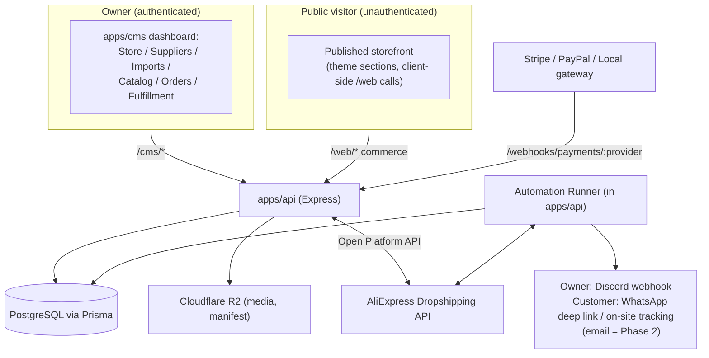
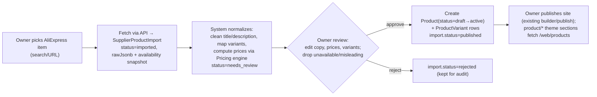
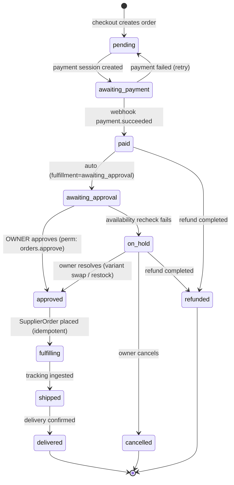

# E-Commerce Dropshipping Automation System — Architecture & Design

Status: **Phase 1 foundation IMPLEMENTED (2026-05-17).** Backend (data model, migrations, pricing engine, order state machine + approval gate, payments abstraction, supplier/import, cart/checkout, orders/fulfillment, webhooks boundary, automation runner) + owner dashboard pages are merged and verified (API `tsc` clean, 158/158 API tests across 40 files, CMS `tsc` clean). See `CLAUDE.md` §23 (2026-05-17).
Owner deliverable date: 2026-05-16 (design) / 2026-05-17 (Phase-1 build)
Scope decision: extend this monorepo (do not build standalone), official AliExpress API, payment providers = **Stripe + PayPal + a local gateway**.

Implementation deltas vs. this design (code is authoritative):
- §19 migration sequence consolidated from 9 → **5 cohesive migrations** (`2026051609000{0..4}_*`); all additive/nullable, behaviour-preserving.
- Storefront theme section components (`product-detail`/`cart`/`checkout`/`order-tracking`/`policy`) are deliberately **not yet registered** in the theme registry to protect the existing 150+ component builder (Non-Negotiables #4/#5); public `/web` commerce APIs they will call are live. Next UI increment.
- Live Stripe/PayPal/local gateways, AliExpress official API, and customer email remain scaffolded/blocked pending §22 decisions & credentials. Assisted-manual import is fully working in the meantime.

This document is the source-of-truth design for adding a controlled, automation-first dropshipping commerce capability on top of the existing multi-tenant website-builder runtime. It is written to be implementable section-by-section and to satisfy the mandatory documentation rule in the root `CLAUDE.md` (every implementation phase must additionally update `CLAUDE.md` + its Change Log).

---

## 1. Table of Contents

1. Table of Contents
2. Goals, Non-Goals, and Constraints
3. How This Maps Onto the Existing System
4. Domain Glossary
5. Architecture Overview
6. Data Model (Prisma)
7. AliExpress Integration (Official API)
8. Pricing & Margin Engine
9. Product Import & Review Pipeline
10. Storefront, Cart & Checkout
11. Payments (Stripe + PayPal + Local Gateway)
12. Order Lifecycle & Fulfillment State Machine
13. Edge Cases & Failure Handling
14. Automation Runner (Background Jobs)
15. Customer Communications
16. API Surface
17. Permissions, Roles & Plan Limits
18. Multi-Tenant Isolation & Security
19. Migrations & Backward Compatibility
20. Testing Strategy
21. Phased Roadmap
22. Open Decisions & Assumptions
23. Environment Variables (New)
24. Documentation Obligations

---

## 2. Goals, Non-Goals, and Constraints

### 2.1 Goals

- Let one owner create a niche store, brand it, publish curated products, and accept customer orders through a trustworthy checkout.
- Source products from AliExpress via the official API while keeping the owner in full control of what is published (review-before-publish, never auto-publish unavailable/misleading items).
- Capture every order with customer, payment status, address, variant, supplier reference, and fulfillment status in one place.
- Automation-first but **controlled**: an owner-approval gate before any supplier purchase is placed (mandatory in v1).
- Handle the messy reality: failed payments, out-of-stock, wrong variants, delayed shipping, refunds, cancellations, support requests.
- First version proves the full loop on **one test store with a small curated catalog**, then becomes repeatable.

### 2.2 Non-Goals (v1)

- Many stores at once, store templates/cloning, performance dashboards, ad experiments — these are Phase 3, intentionally deferred.
- Full tax engine, multi-warehouse, multi-supplier arbitration, automated repricing bots.
- Replacing the booking engine. Bookings/services remain untouched and fully functional.

### 2.3 Hard Constraints (inherited from `CLAUDE.md` Non-Negotiables)

1. **Data isolation** — no cross-tenant/cross-instance leakage. Every new commerce table is `tenantId` + `instanceId` scoped with explicit `where` clauses (per `CLAUDE.md` §8.3, AsyncLocalStorage scoping is not yet universal — explicit scoping stays mandatory).
2. **Auth safety** — no regression to password/token flows. Commerce reuses existing `requireAuth/requireTenant/requireInstance` for owner APIs; storefront/checkout is public and unauthenticated by design.
3. **Route boundary integrity** — `/auth`, `/cms`, `/web`, `/api/device-check` stay semantically separate. Commerce adds: owner endpoints under `/cms/*`, public endpoints under `/web/*`, and a **new** `/webhooks/*` namespace for payment/supplier callbacks (documented as a new boundary).
4. **Publish correctness** — the builder → manifest → R2 → routing-index pipeline stays coherent. Commerce does **not** make publishing dynamic; storefront commerce data is fetched client-side from `/web/*` exactly like the existing `product/*` theme components already do.
5. **Backward compatibility** — booking-only instances are unaffected. All schema changes are additive/nullable. Commerce is gated per-instance by a feature toggle (`ecommerce_enabled`) reusing the existing `FeatureToggle` model.

---

## 3. How This Maps Onto the Existing System

The repo is already ~70% of a storefront. Investigation confirmed **zero** existing commerce primitives (no cart/order/payment/supplier/fulfillment), but a strong reusable base:

| Need | Reuse what exists | Build new |
|---|---|---|
| A "store" | `Instance` (subdomain, custom domain, settings, publish, themes) + new `StoreCommerceProfile` | Commerce config + policy content |
| Catalog | `Product` (extend additively) | `ProductVariant`, supplier linkage, status |
| Customers | `Customer` + `upsertCustomerByEmail` service | reuse as-is |
| Storefront render | Theme registry + `product/*` components + client `usePublicProducts` pattern + publish/R2 pipeline | new `cart/`, `checkout/`, `order-tracking/`, `policy/`, `product-detail/` theme sections |
| Owner UI | `apps/cms/app/dashboard/*` patterns + `ApiClient` (X-Tenant-ID/X-Instance-ID) | new dashboard pages: Suppliers, Imports, Orders, Fulfillment, Store Settings |
| API plumbing | middleware chain, unified response shape, Zod `validate`, Vitest | new controllers/routes/validators |
| Auth/roles | `packages/auth`, `seed-roles.ts` permission system | new commerce permission keys |
| Storage | `S3Service` (R2) | reuse for product media + supplier-order artifact snapshots |
| Owner alerts | existing Discord webhook | reuse for owner approval/fulfillment alerts |
| Plan gating | `PlanPolicyService` pattern (e.g. `assertCanCreateBooking`) | `assertCanCreateOrder`, store/product limits |

**Bookings vs Orders** are deliberately separate models. A `Booking` is a time-slotted service appointment; an `Order` is a paid, fulfilled physical-goods purchase with supplier and shipping lifecycle. They share `Customer` and `Instance` only.

---

## 4. Domain Glossary

- **Store** — a commerce-enabled `Instance` (its niche, branding, domain, policies). One tenant may eventually own many stores; v1 = one test store.
- **Supplier** — an external source (v1: AliExpress) with credentials/config, scoped to an instance.
- **Supplier Product Import** — a staged, raw-then-normalized draft of an AliExpress item awaiting owner review. Never directly visible to customers.
- **Product / ProductVariant** — the published, owner-curated catalog item and its purchasable variants (color/size/etc.), each with cost, price, supplier reference, availability.
- **Cart** — a guest, token-keyed basket on the storefront.
- **Order** — captured purchase. Carries three orthogonal status axes: `status` (lifecycle), `paymentStatus`, `fulfillmentStatus`.
- **Supplier Order** — the dropship purchase placed (after owner approval) against the supplier for an order’s items, with its own ref, cost, and tracking.
- **Shipment** — carrier + tracking number + tracking events for delivered goods.
- **Automation Task** — a queued background job (availability sync, tracking poll, payment reconcile, notification).

---

## 5. Architecture Overview



Key architectural positions:

- **Storefront stays static-published; commerce is dynamic-by-fetch.** The published manifest on R2 does not change. New theme section components (`cart/v1`, `checkout/v1`, `order-tracking/v1`, `product-detail/v1`, `policy/v1`) render shells and call new public `/web/*` endpoints client-side — identical to how `product/v*` already calls `usePublicProducts`. This preserves Non-Negotiable #4 with no publish-pipeline changes.
- **A new `/webhooks/*` route boundary** is introduced (payment provider callbacks, optional supplier callbacks). It is public but signature-verified and idempotent. This is an explicit, documented boundary addition (Non-Negotiable #3).
- **A new in-process automation runner** is added to `apps/api` because the repo has no job queue/Redis. v1 uses a DB-backed task table + interval worker; BullMQ/Redis is a Phase 3 option.
- **Owner-approval gate is structural, not optional.** No supplier purchase can be placed without an `OrderApproval`/`SupplierOrder.status=approved` transition triggered by an owner action with the right permission.

---

## 6. Data Model (Prisma)

All models follow existing conventions verified in `packages/database/prisma/schema.prisma`: `String @id @default(uuid())`, `@map("snake_case")`, plural `@@map`, `Decimal @db.Decimal(10,2)` for money, `currency String @default("USD")`, `createdAt/updatedAt` with `@map`, lowercase enum values, `onDelete: Cascade` on instance ownership, `@@index([tenantId])` + `@@index([instanceId])` + composite indexes. All new tables are instance-scoped unless noted. New columns on existing tables are **nullable or defaulted** (backward compatible).

### 6.1 Store commerce profile (1:1 with Instance)

```prisma
model StoreCommerceProfile {
  id                String   @id @default(uuid())
  tenantId          String   @map("tenant_id")
  instanceId        String   @unique @map("instance_id")
  niche             String?
  storeCurrency     String   @default("USD") @map("store_currency")
  legalBusinessName String?  @map("legal_business_name")
  businessAddress   String?  @map("business_address")
  supportEmail      String?  @map("support_email")
  supportPhone      String?  @map("support_phone")
  supportWhatsapp   String?  @map("support_whatsapp")
  shippingPolicy    String?  @map("shipping_policy")        // markdown/HTML body
  returnsPolicy     String?  @map("returns_policy")
  refundPolicy      String?  @map("refund_policy")
  privacyPolicy     String?  @map("privacy_policy")
  termsPolicy       String?  @map("terms_policy")
  shippingLeadDays  Int?     @map("shipping_lead_days")     // displayed estimate
  defaultFxRate     Decimal? @db.Decimal(12,6) @map("default_fx_rate") // supplier→store
  orderNumberPrefix String?  @map("order_number_prefix")
  nextOrderSeq      Int      @default(1) @map("next_order_seq")
  createdAt         DateTime @default(now()) @map("created_at")
  updatedAt         DateTime @updatedAt @map("updated_at")

  instance Instance @relation(fields: [instanceId], references: [id], onDelete: Cascade)

  @@index([tenantId])
  @@map("store_commerce_profiles")
}
```

Commerce activation reuses the existing `FeatureToggle` model with `toggleKey = "ecommerce_enabled"`. Booking-only instances simply never enable it.

### 6.2 Supplier & credentials

```prisma
model Supplier {
  id            String         @id @default(uuid())
  tenantId      String         @map("tenant_id")
  instanceId    String         @map("instance_id")
  type          SupplierType   @default(aliexpress)
  displayName   String         @map("display_name")
  status        SupplierStatus @default(disconnected)
  // OAuth/app tokens stored ENCRYPTED at rest (app-level key, see §18)
  credentialEnc String?        @map("credential_enc")
  tokenExpiresAt DateTime?     @map("token_expires_at")
  createdAt     DateTime       @default(now()) @map("created_at")
  updatedAt     DateTime       @updatedAt @map("updated_at")

  instance Instance @relation(fields: [instanceId], references: [id], onDelete: Cascade)

  @@index([tenantId])
  @@index([instanceId])
  @@map("suppliers")
}

enum SupplierType { aliexpress }
enum SupplierStatus { disconnected connected expired error }
```

### 6.3 Product import staging (review-before-publish)

```prisma
model SupplierProductImport {
  id              String       @id @default(uuid())
  tenantId        String       @map("tenant_id")
  instanceId      String       @map("instance_id")
  supplierId      String       @map("supplier_id")
  supplierItemRef String       @map("supplier_item_ref")  // AliExpress product id
  sourceUrl       String?      @map("source_url")
  rawJsonb        Json         @map("raw_jsonb")           // unmodified supplier payload
  normalizedJsonb Json?        @map("normalized_jsonb")    // cleaned draft (title/desc/variants/images)
  availabilityJsonb Json?      @map("availability_jsonb")  // snapshot at import
  status          ImportStatus @default(imported)
  reviewNote      String?      @map("review_note")
  publishedProductId String?   @map("published_product_id")
  createdAt       DateTime     @default(now()) @map("created_at")
  updatedAt       DateTime     @updatedAt @map("updated_at")

  instance Instance @relation(fields: [instanceId], references: [id], onDelete: Cascade)

  @@unique([instanceId, supplierItemRef])
  @@index([tenantId])
  @@index([instanceId, status])
  @@map("supplier_product_imports")
}

enum ImportStatus { imported needs_review approved rejected published }
```

### 6.4 Product extensions + variants

Existing `Product` gets **additive nullable** columns (no behavior change for booking-engine consumers):

```prisma
// Added to existing model Product:
status            ProductStatus @default(draft)
supplierId        String?       @map("supplier_id")
supplierItemRef   String?       @map("supplier_item_ref")
sourceUrl         String?       @map("source_url")
costPrice         Decimal?      @db.Decimal(10,2) @map("cost_price")
compareAtPrice    Decimal?      @db.Decimal(10,2) @map("compare_at_price")
slug              String?
galleryJsonb      Json?         @map("gallery_jsonb")
shippingInfo      String?       @map("shipping_info")
// new relation: variants ProductVariant[]
// new index: @@index([instanceId, status])

enum ProductStatus { draft active archived }
```

> Note: existing `Product.isActive` is retained; new `status` is the richer lifecycle field. Storefront commerce queries use `status = active`; legacy product theme code keeps using `isActive` until migrated. The Phase-1 migration backfills `status = active where isActive = true`.

```prisma
model ProductVariant {
  id              String             @id @default(uuid())
  tenantId        String             @map("tenant_id")
  instanceId      String             @map("instance_id")
  productId       String             @map("product_id")
  sku             String?
  optionsJsonb    Json?              @map("options_jsonb")     // {color:"Red", size:"M"}
  supplierVariantRef String?         @map("supplier_variant_ref")
  supplierSkuId   String?            @map("supplier_sku_id")
  costPrice       Decimal?           @db.Decimal(10,2) @map("cost_price")
  price           Decimal            @db.Decimal(10,2)
  compareAtPrice  Decimal?           @db.Decimal(10,2) @map("compare_at_price")
  currency        String             @default("USD")
  availability    VariantAvailability @default(unknown)
  stockQty        Int?               @map("stock_qty")
  imageUrl        String?            @map("image_url")
  isActive        Boolean            @default(true) @map("is_active")
  createdAt       DateTime           @default(now()) @map("created_at")
  updatedAt       DateTime           @updatedAt @map("updated_at")

  product Product @relation(fields: [productId], references: [id], onDelete: Cascade)

  @@unique([productId, sku])
  @@index([tenantId])
  @@index([instanceId])
  @@index([productId])
  @@map("product_variants")
}

enum VariantAvailability { in_stock low_stock out_of_stock discontinued unknown }
```

### 6.5 Pricing rule

```prisma
model PricingRule {
  id            String     @id @default(uuid())
  tenantId      String     @map("tenant_id")
  instanceId    String     @map("instance_id")
  marginType    MarginType @default(percent)
  marginValue   Decimal    @db.Decimal(10,2) @map("margin_value")
  roundingMode  String     @default("end_99") @map("rounding_mode") // none|end_99|nearest_int
  minMargin     Decimal?   @db.Decimal(10,2) @map("min_margin")
  fxRate        Decimal?   @db.Decimal(12,6) @map("fx_rate")
  createdAt     DateTime   @default(now()) @map("created_at")
  updatedAt     DateTime   @updatedAt @map("updated_at")

  @@unique([instanceId])
  @@index([tenantId])
  @@map("pricing_rules")
}

enum MarginType { percent fixed }
```

### 6.6 Cart

```prisma
model Cart {
  id          String     @id @default(uuid())
  tenantId    String     @map("tenant_id")
  instanceId  String     @map("instance_id")
  token       String     @unique               // opaque cookie value
  status      CartStatus @default(active)
  currency    String     @default("USD")
  email       String?
  createdAt   DateTime   @default(now()) @map("created_at")
  updatedAt   DateTime   @updatedAt @map("updated_at")

  items CartItem[]

  @@index([instanceId, status])
  @@map("carts")
}

model CartItem {
  id               String  @id @default(uuid())
  cartId           String  @map("cart_id")
  productId        String  @map("product_id")
  productVariantId String  @map("product_variant_id")
  quantity         Int     @default(1)
  unitPriceSnapshot Decimal @db.Decimal(10,2) @map("unit_price_snapshot")
  createdAt        DateTime @default(now()) @map("created_at")
  updatedAt        DateTime @updatedAt @map("updated_at")

  cart Cart @relation(fields: [cartId], references: [id], onDelete: Cascade)

  @@index([cartId])
  @@map("cart_items")
}

enum CartStatus { active converted abandoned }
```

### 6.7 Order, items, addresses, timeline

```prisma
model Order {
  id                String            @id @default(uuid())
  tenantId          String            @map("tenant_id")
  instanceId        String            @map("instance_id")
  orderNumber       String            @map("order_number")  // e.g. TS-1042
  customerId        String?           @map("customer_id")
  email             String
  phone             String?
  currency          String            @default("USD")
  subtotal          Decimal           @db.Decimal(10,2)
  shippingTotal     Decimal           @default(0) @db.Decimal(10,2) @map("shipping_total")
  discountTotal     Decimal           @default(0) @db.Decimal(10,2) @map("discount_total")
  taxTotal          Decimal           @default(0) @db.Decimal(10,2) @map("tax_total")
  grandTotal        Decimal           @db.Decimal(10,2) @map("grand_total")
  estimatedCost     Decimal?          @db.Decimal(10,2) @map("estimated_cost") // supplier cost snapshot
  status            OrderStatus       @default(pending)
  paymentStatus     PaymentStatus     @default(unpaid) @map("payment_status")
  fulfillmentStatus FulfillmentStatus @default(unfulfilled) @map("fulfillment_status")
  customerNote      String?           @map("customer_note")
  internalNote      String?           @map("internal_note")
  accessToken       String            @unique @map("access_token") // public tracking, non-enumerable
  riskJsonb         Json?             @map("risk_jsonb")
  placedAt          DateTime?         @map("placed_at")
  createdAt         DateTime          @default(now()) @map("created_at")
  updatedAt         DateTime          @updatedAt @map("updated_at")

  instance      Instance       @relation(fields: [instanceId], references: [id], onDelete: Cascade)
  items         OrderItem[]
  addresses     OrderAddress[]
  events        OrderEvent[]
  payments      Payment[]
  refunds       Refund[]
  supplierOrders SupplierOrder[]
  shipments     Shipment[]

  @@unique([instanceId, orderNumber])
  @@index([tenantId])
  @@index([instanceId, status])
  @@index([instanceId, paymentStatus])
  @@index([instanceId, fulfillmentStatus])
  @@index([instanceId, createdAt])
  @@map("orders")
}

model OrderItem {
  id                 String  @id @default(uuid())
  orderId            String  @map("order_id")
  productId          String  @map("product_id")
  productVariantId   String  @map("product_variant_id")
  nameSnapshot       String  @map("name_snapshot")
  optionsSnapshot    Json?   @map("options_snapshot")
  skuSnapshot        String? @map("sku_snapshot")
  supplierItemRef    String? @map("supplier_item_ref")
  supplierVariantRef String? @map("supplier_variant_ref")
  quantity           Int
  unitPrice          Decimal @db.Decimal(10,2) @map("unit_price")
  unitCost           Decimal? @db.Decimal(10,2) @map("unit_cost")
  lineTotal          Decimal @db.Decimal(10,2) @map("line_total")

  order Order @relation(fields: [orderId], references: [id], onDelete: Cascade)

  @@index([orderId])
  @@map("order_items")
}

model OrderAddress {
  id          String      @id @default(uuid())
  orderId     String      @map("order_id")
  type        AddressType
  fullName    String      @map("full_name")
  line1       String
  line2       String?
  city        String
  region      String?
  postalCode  String?     @map("postal_code")
  countryCode String      @map("country_code")
  phone       String?

  order Order @relation(fields: [orderId], references: [id], onDelete: Cascade)

  @@index([orderId])
  @@map("order_addresses")
}

model OrderEvent {
  id        String   @id @default(uuid())
  orderId   String   @map("order_id")
  type      String                       // e.g. payment.paid, approval.granted, supplier.placed
  actor     String   @default("system")  // system|owner|customer|provider:stripe
  message   String?
  dataJsonb Json?    @map("data_jsonb")
  createdAt DateTime @default(now()) @map("created_at")

  order Order @relation(fields: [orderId], references: [id], onDelete: Cascade)

  @@index([orderId, createdAt])
  @@map("order_events")
}

enum AddressType { shipping billing }

enum OrderStatus {
  pending           // created, not yet paid
  awaiting_payment  // payment attempted, not confirmed
  paid              // payment confirmed
  awaiting_approval // owner must approve supplier purchase
  approved          // owner approved; supplier order pending placement
  fulfilling        // supplier order placed
  shipped
  delivered
  cancelled
  refunded
  on_hold           // edge case: OOS / wrong variant / manual hold
}

enum PaymentStatus { unpaid authorized paid partially_refunded refunded failed }

enum FulfillmentStatus {
  unfulfilled
  awaiting_approval
  approved
  supplier_ordered
  in_transit
  delivered
  failed
  cancelled
}
```

> **Three orthogonal status axes** (Shopify-style) are intentional: a single enum cannot represent "paid but on hold for out-of-stock with a partial refund pending." `status` is the headline lifecycle; `paymentStatus` and `fulfillmentStatus` are independent. The state machine in §12 defines legal transitions.

### 6.8 Payments, webhooks, refunds

```prisma
model Payment {
  id          String        @id @default(uuid())
  tenantId    String        @map("tenant_id")
  instanceId  String        @map("instance_id")
  orderId     String        @map("order_id")
  provider    PaymentProvider
  providerRef String?       @map("provider_ref")  // PaymentIntent / capture id
  amount      Decimal       @db.Decimal(10,2)
  currency    String        @default("USD")
  status      PaymentStatus @default(unpaid)
  methodJsonb Json?         @map("method_jsonb")
  capturedAt  DateTime?     @map("captured_at")
  createdAt   DateTime      @default(now()) @map("created_at")
  updatedAt   DateTime      @updatedAt @map("updated_at")

  order Order @relation(fields: [orderId], references: [id], onDelete: Cascade)

  @@index([instanceId])
  @@index([orderId])
  @@map("payments")
}

model PaymentWebhookEvent {
  id          String   @id @default(uuid())
  provider    PaymentProvider
  eventId     String   @map("event_id")        // provider event id (idempotency)
  payloadJsonb Json    @map("payload_jsonb")
  processedAt DateTime? @map("processed_at")
  createdAt   DateTime @default(now()) @map("created_at")

  @@unique([provider, eventId])
  @@map("payment_webhook_events")
}

model Refund {
  id          String       @id @default(uuid())
  tenantId    String       @map("tenant_id")
  instanceId  String       @map("instance_id")
  orderId     String       @map("order_id")
  paymentId   String?      @map("payment_id")
  provider    PaymentProvider
  providerRef String?      @map("provider_ref")
  amount      Decimal      @db.Decimal(10,2)
  reason      String?
  status      RefundStatus @default(pending)
  createdBy   String?      @map("created_by")
  createdAt   DateTime     @default(now()) @map("created_at")
  updatedAt   DateTime     @updatedAt @map("updated_at")

  order Order @relation(fields: [orderId], references: [id], onDelete: Cascade)

  @@index([instanceId])
  @@index([orderId])
  @@map("refunds")
}

enum PaymentProvider { stripe paypal local }
enum RefundStatus { pending processing succeeded failed }
```

### 6.9 Supplier order & shipment (fulfillment)

```prisma
model SupplierOrder {
  id              String             @id @default(uuid())
  tenantId        String             @map("tenant_id")
  instanceId      String             @map("instance_id")
  orderId         String             @map("order_id")
  supplierId      String             @map("supplier_id")
  status          SupplierOrderStatus @default(awaiting_approval)
  supplierOrderRef String?           @map("supplier_order_ref")
  placedCost      Decimal?           @db.Decimal(10,2) @map("placed_cost")
  currency        String             @default("USD")
  approvedBy      String?            @map("approved_by")
  approvedAt      DateTime?          @map("approved_at")
  placedAt        DateTime?          @map("placed_at")
  idempotencyKey  String             @unique @map("idempotency_key")
  requestJsonb    Json?              @map("request_jsonb")
  responseJsonb   Json?              @map("response_jsonb")
  errorMessage    String?            @map("error_message")
  createdAt       DateTime           @default(now()) @map("created_at")
  updatedAt       DateTime           @updatedAt @map("updated_at")

  order Order @relation(fields: [orderId], references: [id], onDelete: Cascade)

  @@index([instanceId, status])
  @@index([orderId])
  @@map("supplier_orders")
}

model Shipment {
  id              String         @id @default(uuid())
  tenantId        String         @map("tenant_id")
  instanceId      String         @map("instance_id")
  orderId         String         @map("order_id")
  supplierOrderId String?        @map("supplier_order_id")
  carrier         String?
  trackingNumber  String?        @map("tracking_number")
  trackingUrl     String?        @map("tracking_url")
  status          ShipmentStatus @default(pending)
  shippedAt       DateTime?      @map("shipped_at")
  estimatedDeliveryAt DateTime?  @map("estimated_delivery_at")
  deliveredAt     DateTime?      @map("delivered_at")
  eventsJsonb     Json?          @map("events_jsonb")  // carrier event timeline
  createdAt       DateTime       @default(now()) @map("created_at")
  updatedAt       DateTime       @updatedAt @map("updated_at")

  order Order @relation(fields: [orderId], references: [id], onDelete: Cascade)

  @@index([instanceId])
  @@index([orderId])
  @@map("shipments")
}

enum SupplierOrderStatus { awaiting_approval approved placing placed failed cancelled }
enum ShipmentStatus { pending in_transit out_for_delivery delivered exception cancelled }
```

### 6.10 Automation task queue

```prisma
model AutomationTask {
  id          String   @id @default(uuid())
  tenantId    String?  @map("tenant_id")
  instanceId  String?  @map("instance_id")
  type        String                        // availability.sync | tracking.poll | payment.reconcile | notify.customer
  payloadJsonb Json    @map("payload_jsonb")
  runAt       DateTime @default(now()) @map("run_at")
  attempts    Int      @default(0)
  maxAttempts Int      @default(5) @map("max_attempts")
  status      String   @default("queued")   // queued|running|done|failed|dead
  lockedAt    DateTime? @map("locked_at")
  lastError   String?  @map("last_error")
  createdAt   DateTime @default(now()) @map("created_at")
  updatedAt   DateTime @updatedAt @map("updated_at")

  @@index([status, runAt])
  @@index([instanceId])
  @@map("automation_tasks")
}
```

Customer support in v1 reuses the existing `Inquiry` model with an added nullable `orderId` column (`@map("order_id")`) so support requests can be linked to an order without a new ticketing system. A dedicated ticketing model is Phase 3.

---

## 7. AliExpress Integration (Official API)

Decision: **official AliExpress API** (AliExpress Open Platform / Dropshipping API — `aliexpress.ds.*` and product/affiliate endpoints), not scraping.

### 7.1 Capabilities used

| Flow | API area | Used by |
|---|---|---|
| Connect supplier | OAuth2 authorization-code → access/refresh token | `Supplier` connect |
| Product detail | product detail / freight calc | Import & review, pricing |
| Availability/stock | product detail / SKU stock | Availability sync job, pre-approval recheck |
| Place order | dropship order create | `SupplierOrder` placement (post-approval) |
| Order status / logistics | order get / tracking | Tracking poll job, `Shipment` |

### 7.2 Auth & credential handling

- OAuth2 authorization-code flow. App key/secret are platform-level env (`ALIEXPRESS_APP_KEY/SECRET`); per-store access+refresh tokens are stored **encrypted** in `Supplier.credentialEnc` (§18). A scheduled `token.refresh` automation task refreshes before `tokenExpiresAt`.
- Request signing per AliExpress system parameters (HMAC signature, timestamp, sign method). Centralize in `apps/api/src/services/aliexpress/client.ts` with strict timeout (reuse the repo’s timeout-env convention) and typed responses.

### 7.3 Reliability

- All AliExpress calls go through a single client with: timeout, retry-with-backoff for transient errors, structured error mapping into the unified error shape, and a rate-limit guard. Order placement is **idempotent** via `SupplierOrder.idempotencyKey` so a retry can never place two purchases.
- **Degraded mode (important):** official API access requires an approved Open Platform/Dropshipping app, which has real lead time. Until approved, the same import/review UI works in *assisted manual mode*: owner pastes a product URL, the system stores `sourceUrl` + a manually completed normalized draft. The data model and review pipeline are identical; only the fetch source differs. Start the app-approval application during Phase 0.

---

## 8. Pricing & Margin Engine

`PricingService.computeSellPrice({ cost, currency, rule, fxRate })`:

1. Convert supplier cost → store currency using `PricingRule.fxRate` (fallback `StoreCommerceProfile.defaultFxRate`).
2. Apply margin: `percent` → `cost * (1 + value/100)`; `fixed` → `cost + value`.
3. Enforce `minMargin` floor.
4. Apply rounding (`end_99` → charm pricing; `nearest_int`; `none`).
5. Return `{ price, costAtPricing, marginApplied }` — persisted on `ProductVariant` and **snapshotted on `OrderItem.unitCost`/`unitPrice`** at checkout so later cost/FX drift never rewrites historical orders or profit math.

Profit per order = `Σ(unitPrice·qty) − Σ(unitCost·qty) − shipping/fees`, computed from order snapshots (basis for the Phase-3 profit dashboard).

---

## 9. Product Import & Review Pipeline



Guarantees the spec demands: nothing is customer-visible until the owner approves; unavailable/discontinued variants are flagged at import and **blocked from approval** unless the owner explicitly overrides; description cleaning is a normalization step (strip supplier boilerplate/HTML, length-limit, profanity/again-spam scrub) the owner can further edit.

---

## 10. Storefront, Cart & Checkout

The storefront remains a published static manifest. Commerce is delivered via **new theme section components** that hydrate client-side against new public `/web/*` endpoints (same pattern as the existing `usePublicProducts` hook in `packages/themes/src/components/product/shared.ts`):

- `product-detail/v1` — variant selector, gallery, price, shipping-lead-time, availability, add-to-cart.
- `cart/v1` — line items, quantities, totals.
- `checkout/v1` — customer + shipping address, payment-provider selection, place order.
- `order-tracking/v1` — public lookup by `orderNumber` + email (or `accessToken` link) → timeline + shipment.
- `policy/v1` — renders shipping/returns/refund/privacy/terms from `StoreCommerceProfile`.
- Trust block — business name/address, support contact (reuses existing WhatsApp/QR support component pattern), policy links in footer.

Cart is guest/token-based (cookie); no storefront auth. Server is authoritative for prices (client-sent prices ignored; recomputed from `ProductVariant`). Checkout creates the `Order` (`status=pending`) then a provider payment session; the order is confirmed by webhook, never by client callback alone.

---

## 11. Payments (Stripe + PayPal + Local Gateway)

Decision: support **Stripe and PayPal and a local gateway** from the start, behind one abstraction.

### 11.1 Provider abstraction

```
interface PaymentProvider {
  createCheckoutSession(order, opts): { redirectUrl | clientSecret, providerRef }
  verifyWebhook(rawBody, signature): WebhookEvent      // signature-verified
  parsePaymentResult(event): { orderRef, status, amount, currency, providerRef }
  refund({ paymentRef, amount }): RefundResult
}
```

Implementations: `StripeProvider` (PaymentIntents/Checkout + webhook signature), `PayPalProvider` (Orders v2 + webhook verification), `LocalProvider` (the named local gateway). Selected per-store via config; storefront shows enabled providers.

### 11.2 Flow & integrity

- Webhooks land at the new boundary `POST /webhooks/payments/:provider`, are signature-verified, deduplicated via `PaymentWebhookEvent.@@unique([provider, eventId])` (idempotent), then transition `Order.paymentStatus` and append an `OrderEvent`.
- Never trust client-side success redirects for state changes; the redirect only navigates the buyer to the confirmation/tracking page.
- No card data stored — hosted/redirect or tokenized client flows only (PCI SAQ-A posture).
- Refunds go through the same provider abstraction and write a `Refund` row + `OrderEvent` + adjust `paymentStatus`.

### 11.3 Open item

The **local gateway is not yet named**. Sri-Lanka signals in the repo (WhatsApp-first UX, `easyonlineweb.com`) make **PayHere** the working assumption; alternatives (Webxpay, Onepay, PayPal-only) are viable. Confirm before Phase 1 payment work (see §22). The abstraction makes this a contained, swappable decision.

---

## 12. Order Lifecycle & Fulfillment State Machine



**The approval gate is mandatory and structural.** Transition `awaiting_approval → approved` requires an owner action carrying the `orders.approve` permission; it writes `SupplierOrder.approvedBy/approvedAt` and an `OrderEvent`. No code path places a supplier order without an `approved` `SupplierOrder`. After approval, automation prepares and places the supplier order, ingests tracking, updates the customer, and keeps the three status axes accurate until delivery.

A single `OrderStateService` owns all transitions, validates legality against the matrix, writes the `OrderEvent` audit row, and is the only writer of order status fields (prevents inconsistent ad-hoc updates across controllers — aligns with `CLAUDE.md` §18.3 high-risk surfaces).

---

## 13. Edge Cases & Failure Handling

| Edge case | Handling |
|---|---|
| Failed payment | `paymentStatus=failed`, `status=awaiting_payment`; customer can retry; no supplier action; owner sees it in dashboard. |
| Out of stock at approval | Pre-approval availability recheck via AliExpress; if unavailable → `status=on_hold`; owner: swap variant, partial-refund, or cancel+refund. Never auto-place. |
| Wrong variant | Owner edits order item before approval; post-placement → cancel/refund path + corrective supplier order. |
| Delayed shipping | `tracking.poll` job + SLA timer on `Shipment.estimatedDeliveryAt`; breach → owner alert + customer comms; policy lead time shown pre-purchase to set expectations. |
| Refund | `Refund` via provider abstraction; supports partial; updates `paymentStatus` (`partially_refunded`/`refunded`) + timeline. |
| Cancellation | Pre-supplier-order: instant cancel + refund. Post: attempt supplier cancel; if shipped, route to returns policy. |
| Supplier order failure | `SupplierOrder.status=failed` + `errorMessage`; retried with backoff up to `maxAttempts`; then owner-actionable, order `on_hold`. |
| Duplicate webhook / double click | Idempotency via `PaymentWebhookEvent` unique key and `SupplierOrder.idempotencyKey`. |
| Support request | `Inquiry` with `orderId` link; surfaced in order timeline and dashboard. |

---

## 14. Automation Runner (Background Jobs)

The repo has **no job queue/Redis**. v1 introduces a DB-backed runner inside `apps/api`:

- `AutomationTask` table + a single interval worker (`startAutomationRunner()` on API boot, env-guarded so tests/CI can disable). Claims due tasks with row-locking (`status=queued, runAt<=now` → `running` + `lockedAt`), backoff on failure, dead-letter after `maxAttempts`.
- Task types v1: `aliexpress.token.refresh`, `availability.sync`, `tracking.poll`, `payment.reconcile`, `notify.customer`, `supplier.place_order` (only enqueued *after* approval).
- Concurrency safety for single-instance API; multi-node scale-out (advisory locks or BullMQ/Redis) is a Phase-3 decision documented as future work in `CLAUDE.md` §22 roadmap.

---

## 15. Customer Communications

The repo currently has **no customer email provider** (password-reset emails are logged, not sent — see `CLAUDE.md` §7.5). To avoid blocking v1:

- v1 customer comms = **on-site order-tracking page** (tokenized link) + **WhatsApp deep links** (reuses the repo’s existing WhatsApp-first support pattern). Owner alerts reuse the existing **Discord webhook**.
- An `EmailProvider` abstraction is specified now but its concrete implementation (and wiring of order/shipping notification emails) is **Phase 2**, listed as a dependency in §22. This also finally unblocks `CLAUDE.md` roadmap item for transactional email.

---

## 16. API Surface

All owner routes: `requireAuth → requireTenant → requireInstance → requirePermission(...)`, unified response shape, Zod validators in `apps/api/src/validators/`. Public routes resolve host context via existing `resolvePublicWebContext`. New `/webhooks/*` boundary is public + signature-verified.

### 16.1 Owner (`/cms`)

```
GET/PUT  /cms/store/commerce-settings           store profile + policies
GET/POST /cms/suppliers   GET /cms/suppliers/:id/connect (OAuth start)  POST /callback
POST     /cms/suppliers/:id/import               { url | itemRef }
GET      /cms/imports     GET /cms/imports/:id
POST     /cms/imports/:id/approve | /reject
GET/PUT  /cms/pricing-rule
GET/POST/PUT/DELETE /cms/products (extended)     + /cms/products/:id/variants
GET      /cms/orders   GET /cms/orders/:id
POST     /cms/orders/:id/approve                 (perm: orders.approve)  -> approval gate
POST     /cms/orders/:id/hold | /cancel | /note
POST     /cms/orders/:id/refunds
POST     /cms/orders/:id/fulfillment/place       (post-approval; idempotent)
PUT      /cms/orders/:id/shipment                manual tracking entry (v1)
```

### 16.2 Public (`/web`)

```
GET  /web/products  /web/products/:slug         (extended: variants, availability)
POST /web/cart  GET /web/cart/:token  PUT/DELETE /web/cart/:token/items
POST /web/checkout                                creates Order + payment session
GET  /web/orders/track                            { orderNumber, email } | { accessToken }
```

### 16.3 Webhooks (new boundary)

```
POST /webhooks/payments/stripe
POST /webhooks/payments/paypal
POST /webhooks/payments/local
POST /webhooks/suppliers/aliexpress              (if push callbacks available; else poll)
```

---

## 17. Permissions, Roles & Plan Limits

Add to `ALL_PERMISSION_KEYS` in `packages/database/src/seed-roles.ts` (seeded via migration like existing permission migrations):

- `store.settings`, `suppliers.view`, `suppliers.manage`, `imports.view`, `imports.manage`,
  `orders.view`, `orders.manage`, `orders.approve`, `orders.fulfill`, `refunds.create`, `pricing.manage`.

Default role mapping: **Owner** all; **Admin** all except none-specific; **Staff** `*.view` + `orders.manage` + `imports.manage` but **not** `orders.approve`/`refunds.create` (approval/refund stays owner-controlled by default); **Read Only** `*.view`. Plan limits reuse the `PlanPolicyService` pattern: `assertCanCreateOrder`, store/product caps per plan (mirrors `assertCanCreateBooking`).

---

## 18. Multi-Tenant Isolation & Security

- Every commerce table carries `tenantId`+`instanceId`; every query/mutation uses explicit `where:{ tenantId, instanceId }` (per `CLAUDE.md` §8.3). Update/delete verifies scoped existence before mutation.
- **Never trust client-supplied prices, tenant/instance ids, or order ids.** Storefront context derives from host resolution; prices recompute server-side.
- **Money:** always `Decimal(10,2)`; arithmetic in a `Money` helper, never floats.
- **Webhooks:** mandatory signature verification per provider + replay protection via unique event id. Fail-closed.
- **Idempotency:** payment events and `SupplierOrder` placement are idempotent so retries never double-charge or double-purchase.
- **Public order tracking:** by non-enumerable `accessToken` or `orderNumber`+email match only; no sequential id exposure; rate-limited (reuse device-check rate-limit pattern).
- **Supplier credentials:** AliExpress tokens encrypted at rest with an app key (`COMMERCE_ENCRYPTION_KEY`, AES-GCM); never logged; never returned to the browser.
- High-risk surfaces (payments, refunds, approval gate, supplier placement) get mandatory regression tests (per `CLAUDE.md` §18.3 / §20.2).

---

## 19. Migrations & Backward Compatibility

Additive only; timestamps after the current latest (`20260421153000`), e.g. `20260516xxxxxx_*`. Proposed sequence:

1. `add_store_commerce_profile_and_supplier`
2. `add_product_status_variants_pricing` (additive nullable columns on `products` + new `product_variants`, `pricing_rules`; backfill `status=active where is_active=true`)
3. `add_supplier_product_imports`
4. `add_cart_order_models`
5. `add_payment_refund_models`
6. `add_supplier_order_shipment_models`
7. `add_automation_tasks`
8. `add_inquiry_order_link` (nullable `order_id` on `inquiries`)
9. `seed_commerce_permissions`

Backward compatibility: booking engine untouched; commerce gated by `FeatureToggle ecommerce_enabled`; legacy `product/*` theme code keeps using `Product.isActive`. Each migration follows the repo SQL conventions (inline `CREATE TYPE` enums, `TIMESTAMP(3) DEFAULT CURRENT_TIMESTAMP`, FK `ON DELETE CASCADE`).

---

## 20. Testing Strategy

Vitest (existing). Required coverage:

- **State machine:** every legal/illegal `OrderStateService` transition, especially the approval gate ("cannot place supplier order without approved status").
- **Isolation:** cross-tenant/cross-instance denial on every commerce controller.
- **Money:** pricing/margin/rounding/FX and order-total math.
- **Webhooks:** signature verify (valid/invalid), idempotent replay, out-of-order events.
- **Idempotency:** double webhook + double approval + retry never double-places/charges.
- **Providers/AliExpress:** mocked clients; degraded manual-import path.
- **Edge cases (§13):** OOS-at-approval, refund, cancellation, supplier failure retry/dead-letter.

Per `CLAUDE.md` §20: if any scope is skipped, record why and residual risk in the PR + Change Log.

---

## 21. Phased Roadmap

### Phase 0 — Sign-off & unblock (now)
- Approve this design. Decide local gateway (§22). **Submit the AliExpress Open Platform / Dropshipping app application immediately** (longest lead time).
- No code.

### Phase 1 — One-store vertical slice (prove the loop)
- Migrations 1–9 (§19). `StoreCommerceProfile` + policies + commerce feature toggle.
- Product import & review pipeline (API mode if approved, else assisted manual mode — identical UX/data).
- Pricing/margin engine; `Product` extensions + `ProductVariant`.
- Storefront: `product-detail`, `cart`, `checkout`, `policy`, trust block; new public `/web` commerce endpoints.
- **Stripe** live (fastest reliable provider); PayPal/local scaffolded behind abstraction.
- Order capture; owner Orders dashboard; **manual approval gate**; manual supplier-order + manual tracking entry; on-site tracking page + WhatsApp comms; automation runner skeleton (token refresh + tracking poll structure).
- Outcome: choose niche → publish products → receive order → approve → fulfill → update customer → measure profit, end-to-end on the test store.

### Phase 2 — Automation depth
- AliExpress automated availability sync, automated order placement post-approval, automated tracking ingestion, automated customer notifications.
- PayPal + local gateway live; `EmailProvider` implemented (transactional emails, also unblocks password-reset email).
- Full refund/cancellation/OOS/edge automation; SLA timers + alerts.

### Phase 3 — Scale
- Repeatable store templates/cloning, bulk import, multiple niche stores.
- Profit & performance dashboards (from order snapshots), ad-channel attribution (UTM/conversion), A/B.
- Job infra hardening (Redis/BullMQ), audit/observability expansion.

---

## 22. Open Decisions & Assumptions

| # | Item | Default assumption | Needs confirmation |
|---|---|---|---|
| 1 | Local payment gateway not named | **PayHere** (Sri-Lanka signals) | Confirm gateway before Phase 1 payments |
| 2 | AliExpress official API needs approved app (lead time) | Build degraded assisted-manual import meanwhile | Start app approval in Phase 0 |
| 3 | No customer email provider in repo | v1 = on-site tracking + WhatsApp; email = Phase 2 | OK to defer email? |
| 4 | No job queue/Redis | DB-backed runner v1 | OK for single-node v1? |
| 5 | Static publish + client-side commerce fetch | Matches existing product/booking pattern | Confirm acceptable |
| 6 | Currency/FX (supplier USD/CNY vs store currency) | Manual `fxRate` on PricingRule v1, FX API later | Confirm manual FX acceptable v1 |
| 7 | Tax | None/flat configurable v1; tax engine later | Confirm minimal tax v1 |
| 8 | Stripe-first ordering of provider work | Stripe live first, PayPal/local next | Confirm priority |

---

## 23. Environment Variables (New)

```
# AliExpress Open Platform / Dropshipping
ALIEXPRESS_APP_KEY, ALIEXPRESS_APP_SECRET, ALIEXPRESS_OAUTH_REDIRECT_URL, ALIEXPRESS_API_TIMEOUT_MS

# Payments
STRIPE_SECRET_KEY, STRIPE_WEBHOOK_SECRET
PAYPAL_CLIENT_ID, PAYPAL_CLIENT_SECRET, PAYPAL_WEBHOOK_ID, PAYPAL_ENV
LOCAL_GATEWAY_* (depends on chosen gateway)

# Commerce
COMMERCE_ENCRYPTION_KEY            # AES-GCM key for supplier credentials at rest
AUTOMATION_RUNNER_ENABLED          # gate worker in tests/CI
COMMERCE_ORDER_TOKEN_SECRET        # signing for public tracking access tokens
```

Add to `.env.example`, `apps/api/.env.example`, and document in `CLAUDE.md` §17 during Phase 1.

---

## 24. Documentation Obligations

Per the **Mandatory Documentation Rule** in root `CLAUDE.md` §3, every implementation phase of this system must, in the same PR:

1. Update the relevant `CLAUDE.md` sections (new namespaces, models, env vars, security surfaces, playbooks, the §10 endpoint map, §11 controller index, §16 data model, §22 roadmap items it closes).
2. Add a dated entry to `CLAUDE.md` §23 Change Log (what changed, impacted files, migration/rollout implications).
3. Keep this design document updated as the detailed companion when decisions in §22 are resolved or the model evolves (code is authoritative; this doc must not silently diverge).

This design document itself introduces **no runtime/behavior change** and therefore does not require a `CLAUDE.md` Change Log entry on its own; the obligation begins at Phase 1 implementation.
