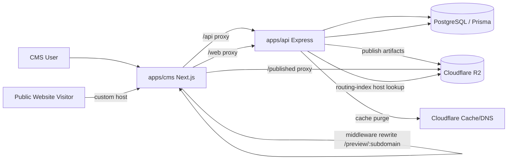
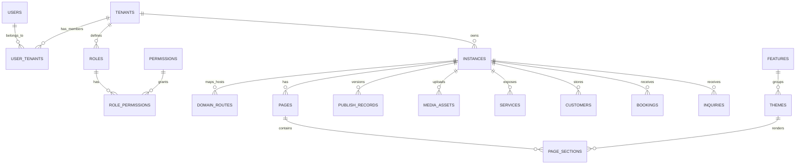
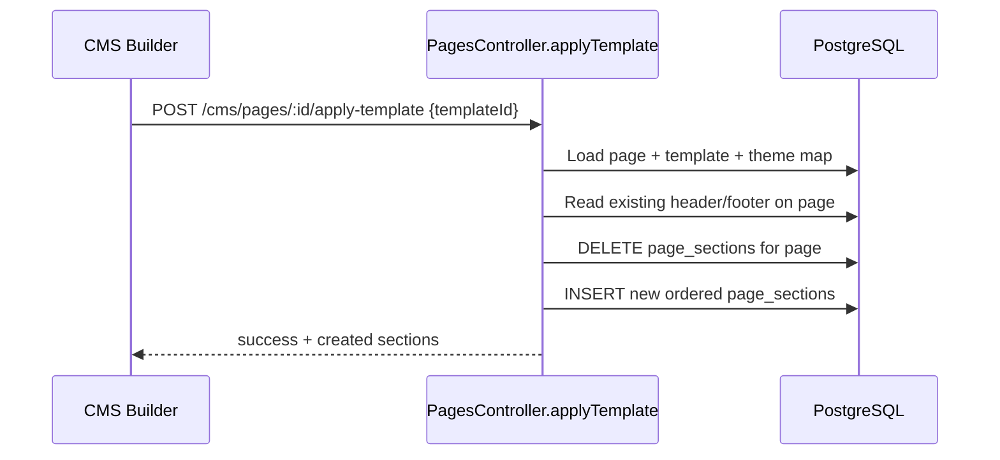
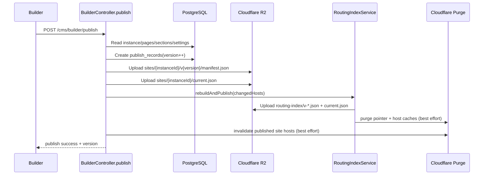
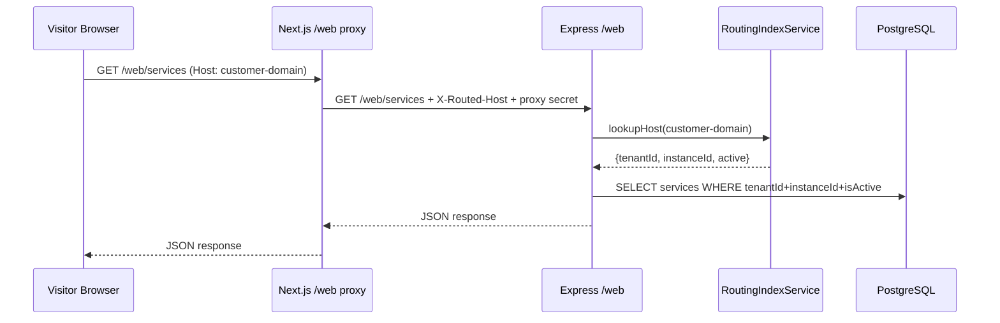

# Booking Engine CMS Website Builder Technical Architecture

## 1. Purpose and Scope

This document explains, end-to-end, how this project handles:

- template creation and storage
- section/theme component architecture
- builder save flows
- publish and preview flows
- custom domain mapping and domain-based website loading
- company/team/website linking
- database tables, keys, and relationships

This is based on the current implementation in:

- `apps/api`
- `apps/cms`
- `packages/database`
- `packages/themes`

---

## 2. System Architecture (High Level)

Core runtime idea:

1. Draft content is edited in DB via CMS Builder.
2. Publish serializes pages/sections/settings into a manifest and uploads to R2.
3. Routing index in R2 maps hostnames to instance manifests.
4. Public/custom-domain traffic resolves by hostname through routing index.

---

## 3. Core Domain Model (Company, Team, Website)

### 3.1 Business concepts

- **Company** = `Tenant`
- **Team member** = `User` linked to tenant through `UserTenant` + `Role`
- **Website** = `Instance` under a tenant
- **Website page** = `Page`
- **Section on a page** = `PageSection` bound to a `Theme`

### 3.2 Identity and ownership flow

1. User registers (`auth/register`) as global user.
2. Tenant is created (`cms/tenants`), default system roles are seeded.
3. Owner linkage is stored in `user_tenants` (`is_owner=true`).
4. One or more `instances` (websites) are created under that tenant.
5. CMS stores `currentTenantId` and `currentInstanceId` in browser storage and sends them as headers.

---

## 4. Database Schema: Website Builder and Domain Routing Tables

Prisma source: `packages/database/prisma/schema.prisma`

### 4.1 Core tenancy and website tables

| Table | Purpose | Important Fields | Key Relations |
|---|---|---|---|
| `users` | global user accounts | `id`, `email`, `password_hash`, `is_super_admin` | 1:N with `user_tenants` |
| `tenants` | company/workspace | `id`, `business_name`, `owner_id`, `plan` | owner -> `users`; 1:N with `instances` |
| `user_tenants` | team membership | `user_id`, `tenant_id`, `role_id`, `is_owner`, `status` | joins `users`, `tenants`, `roles` |
| `roles` | tenant roles | `tenant_id`, `name`, `is_system_role` | 1:N with `user_tenants` |
| `permissions` | system permission catalog | `key`, `module` | M:N via `role_permissions` |
| `role_permissions` | role-permission links | `role_id`, `permission_id` | joins `roles`, `permissions` |
| `instances` | website instance | `tenant_id`, `subdomain`, `full_domain`, `custom_domain`, `settings_jsonb` | N:1 tenant, 1:N pages/sections |
| `domain_routes` | host -> instance mapping | `host`, `instance_id`, `active`, `is_primary` | N:1 `instances`, N:1 `tenants` |

### 4.2 Builder catalog tables

| Table | Purpose | Important Fields |
|---|---|---|
| `features` | section feature families | `id`, `slug` (`hero`, `services`, etc.) |
| `themes` | versioned section components | `feature_id`, `component_key`, `schema_jsonb`, `default_styles_jsonb`, `version`, `access_rank` |
| `page_templates` | predefined page compositions | `name`, `sections_jsonb`, `preview_image_url`, `is_premium`, `is_active` |

### 4.3 Website content and publish tables

| Table | Purpose | Important Fields | Notes |
|---|---|---|---|
| `pages` | pages per website | `instance_id`, `slug`, `title`, `sort_order`, `is_published` | unique `(instance_id, slug)` |
| `page_sections` | page section instances | `page_id`, `theme_id`, `position`, `content_jsonb`, `styles_jsonb`, `conditions_jsonb` | ordered by `position` |
| `publish_records` | publish history/versioning | `instance_id`, `version`, `status`, `manifest_jsonb`, `published_at` | unique `(instance_id, version)` |
| `media_assets` | uploaded media metadata | `instance_id`, `object_key`, `public_url`, `status` | used by schema image fields |

### 4.4 Domain and Cloudflare support tables

| Table | Purpose |
|---|---|
| `cloudflare_accounts` | multi-account support metadata (zone/account/token references) |
| `custom_domain_account_history` | audit history for domain-account attach/reassign events |

### 4.5 Public booking-related tables (rendered by website components)

| Table | Purpose |
|---|---|
| `services` | service catalog shown on public site |
| `customers` | customer records created/upserted from bookings/inquiries |
| `bookings` | booking submissions from public widget |
| `inquiries` | contact/inquiry submissions from public forms |

---

## 5. Entity Relationship Diagram (Key Website Scope)

---

## 6. Template and Theme System

## 6.1 Where themes are defined

Theme components are React modules in:

- `packages/themes/src/components/<feature>/vN.tsx`
- registry in `packages/themes/src/registry.ts`

`component_key` format in DB matches registry keys, for example:

- `hero/v3`
- `services/v2`
- `team/v4`

`themes.schema_jsonb` defines dynamic field schema used by builder forms.
`themes.default_styles_jsonb` defines baseline style config merged at render time.

## 6.2 Where page templates are stored

Page templates live in DB table `page_templates.sections_jsonb`, each entry shaped like:

- `themeComponentKey`
- `defaultContent`
- `defaultStyles`

Templates are managed through Prisma migrations under `packages/database/prisma/migrations`.
Current production catalog uses 12 stable `template-2026-*` IDs mapped to single version lanes (`v1`..`v12`) with template-specific section mixes.

## 6.3 Template preview path in CMS

1. Template picker calls `GET /cms/catalog/page-templates`.
2. Full-screen preview iframe loads `/builder-preview/{templateId}`.
3. Builder-preview page fetches templates and renders sections with `SectionRenderer`.

---

## 7. Page and Section Lifecycle

## 7.1 Page rules

From `PagesController`:

- First page must be Home (`slug="/"`).
- Home page cannot be deleted.
- Additional pages are blocked until Home has at least one section.
- New pages clone shared layout sections (header/footer) from existing pages if present.

## 7.2 Section lifecycle

- Add section: `POST /cms/pages/:pageId/sections` with `themeId`
- Update section: `PUT /cms/sections/:id` (`content_jsonb`, `styles_jsonb`, etc.)
- Reorder sections: `PUT /cms/pages/:pageId/sections/reorder`
- Delete section: `DELETE /cms/sections/:id`

Builder UI behavior:

- section edits are autosaved with debounce
- unsaved edits are flushed on page switch
- schema form fields are generated from `theme.schema_jsonb`

## 7.3 Global layout synchronization

Special handling currently exists for:

- `header/*`
- `footer/*`

When these are created/updated, the system syncs the content/styles to all pages in the same instance and removes duplicates per page.

---

## 8. Applying a Template to a Page

Endpoint: `POST /cms/pages/:id/apply-template`

Flow:

1. Load target page and template.
2. Parse template `sections_jsonb`.
3. Resolve each `themeComponentKey` to active `themes` row.
4. Preserve existing page header/footer section content (if present).
5. Delete existing sections on that page.
6. Recreate ordered sections from final set.

---

## 9. Theme and Website Settings Persistence

Global website style settings are stored in:

- `instances.settings_jsonb`

Shape:

- `tokens` (`primary`, `secondary`, `accent`, `text`, `background`, `font`)
- `features` toggle map
- `header` settings
- `footer` settings

Update endpoint:

- `PUT /cms/builder/settings`

Update strategy:

- deep merge existing settings + incoming partial payload
- persisted as JSONB

Important distinction:

- **theme catalog** = global section component definitions (`themes`)
- **instance website theme settings** = per website tokens/features/header/footer (`instances.settings_jsonb`)
- **section-specific style/content overrides** = per section row (`page_sections.styles_jsonb`, `page_sections.content_jsonb`)

---

## 10. Publish Pipeline

Endpoint: `POST /cms/builder/publish`

Publish does the following:

1. Loads instance, pages, sections, and settings.
2. Builds full manifest:
   - tenant/instance metadata
   - tokens/features/header/footer
   - all pages with ordered sections
3. Creates `publish_records` row with incremented version.
4. Marks pages as published.
5. Uploads artifacts to R2:
   - immutable manifest: `sites/{instanceId}/v{version}/manifest.json`
   - current pointer: `sites/{instanceId}/current.json`
6. Rebuilds and publishes routing index:
   - `routing-index/v-{timestamp}.json`
   - `routing-index/current.json`
7. Attempts Cloudflare cache invalidation (fail-open).

Rollback endpoint (`POST /cms/builder/rollback`) re-publishes an older manifest version to current pointer and reruns routing-index rebuild and cache invalidation.

---

## 11. Preview vs Published Rendering

## 11.1 Draft editing (builder canvas)

Builder page loads DB data directly:

- pages: `/cms/pages`
- sections: `/cms/pages/:pageId/sections`
- settings: `/cms/builder/settings`

Canvas uses `SectionRenderer` directly with current draft state.

## 11.2 Published preview runtime

Route: `/preview/{subdomain}`

Preview page runtime:

1. Fetch routing pointer from same-origin route `/routing-index/current.json`.
2. Load full routing index document.
3. Resolve host or subdomain to routing entry.
4. Fetch site pointer (`sites/{instanceId}/current.json`) via `/published/...` proxy.
5. Fetch immutable manifest URL from pointer.
6. Render sections through `SectionRenderer` + theme registry.

Key point:

- Preview/public route renders **published artifacts**, not draft DB edits.

---

## 12. Public Website Request and Web Widget API Flow

Public section components (booking/contact/services) call same-origin endpoints:

- `/web/services`
- `/web/bookings`
- `/web/inquiries`

Flow:

1. Browser calls CMS `/web/*`.
2. CMS `web-proxy` forwards to API `/web/*`, adding:
   - `X-Routed-Host` (incoming host)
   - `X-Web-Proxy-Secret` (shared secret)
3. API middleware `resolvePublicWebContext` validates secret and resolves host through routing index.
4. Middleware injects `X-Tenant-ID` + `X-Instance-ID`.
5. Standard `requireTenant` and `requireInstance` middlewares load context.
6. Public controllers execute scoped DB reads/writes.

---

## 13. Custom Domain and Host Routing Model

## 13.1 Instance primary domain

On instance creation:

- `subdomain` is sanitized/validated
- `full_domain` is persisted as `{subdomain}.{SITE_DOMAIN}` via `buildPrimaryFullDomain`

## 13.2 Domain route mapping API

Primary endpoints:

- `PUT /cms/instances/:id/domain-route`
- `DELETE /cms/instances/:id/domain-route/:host`

Legacy aliases for compatibility:

- `/custom-domain` variants map to same behavior

Upsert behavior:

- normalize host
- prevent host mapping collision across instances
- support active/primary flags
- when primary+active, sync `instances.custom_domain` and status fields
- trigger routing-index refresh (fail-open)

## 13.3 Domain verification status

Endpoint:

- `POST /cms/instances/:id/custom-domain/check`

Behavior:

- DNS NS lookup
- compare against required nameserver list
- update instance fields:
  - `custom_domain_hostname_status`
  - `custom_domain_ssl_status`
  - `custom_domain_last_checked_at`
  - `custom_domain_activated_at` (when connected)

Default required nameservers are Cloudflare values, overridable by env:

- `CUSTOM_DOMAIN_REQUIRED_NAMESERVERS`

## 13.4 Host resolution priority in routing index

When rebuilding routing index, host entries can come from:

1. `domain_routes` (highest priority)
2. `instances.custom_domain` legacy field
3. `instances.full_domain`

This allows gradual migration while preserving legacy compatibility.

---

## 14. How a Particular Website is Loaded

There are two modes:

### 14.1 Inside authenticated CMS (team member editing)

Website is selected by `currentInstanceId` in browser storage.
API client sends:

- `X-Tenant-ID`
- `X-Instance-ID`

API middlewares load exact tenant/instance context for all CMS actions.

### 14.2 Public/custom-domain visitor

Website is selected by host header via routing index:

- host -> `routing-index` entry -> `instanceId`
- manifest pointer -> versioned manifest
- rendered by preview/public runtime

No tenant/instance selection UI is needed for visitors.

---

## 15. Environment and Infrastructure Parameters

Main runtime parameters:

| Category | Variables |
|---|---|
| Database | `DATABASE_URL` |
| Core domains | `SITE_DOMAIN`, `NEXT_PUBLIC_SITE_DOMAIN`, `CMS_URL`, `API_BASE_URL`, `NEXT_PUBLIC_API_URL` |
| R2 artifacts/media | `R2_ENDPOINT` or `R2_ACCOUNT_ID`, `R2_ACCESS_KEY_ID`, `R2_SECRET_ACCESS_KEY`, `R2_BUCKET_NAME`, `R2_PUBLIC_URL` |
| Published site base | `PUBLISHED_SITES_BASE_URL`, `NEXT_PUBLIC_PUBLISHED_SITES_BASE_URL` |
| Routing index | `ROUTING_INDEX_CURRENT_URL`, `NEXT_PUBLIC_ROUTING_INDEX_CURRENT_URL`, `ROUTING_INDEX_CACHE_TTL_MS`, `NEXT_PUBLIC_ROUTING_INDEX_CACHE_TTL_MS`, `NEXT_PUBLIC_MANIFEST_CACHE_TTL_MS` |
| Web proxy trust | `WEB_PROXY_SHARED_SECRET` (must match in CMS and API) |
| Cache purge | `CLOUDFLARE_API_TOKEN`, `CLOUDFLARE_ZONE_ID` |
| Domain verification | `CUSTOM_DOMAIN_REQUIRED_NAMESERVERS`, `CUSTOM_DOMAIN_DNS_LOOKUP_TIMEOUT_MS` |

---

## 16. Current Implementation Notes and Constraints

1. Page template management is read-only in API/CMS right now; creation/update is currently done through seed scripts and DB operations.
2. Shared layout auto-sync logic is feature-based for all `header/*` and `footer/*` versions.
3. Plan-policy helper methods for create-page/theme/template checks exist, but current enforcement is mostly through catalog filtering and publish-readiness checks.
4. Public `/web` host resolution is strongest when `WEB_PROXY_SHARED_SECRET` is configured in both runtimes.
5. Domain TLS onboarding is handled by hosting/domain provider; this app focuses on host mapping, routing index, and DNS-check status.

---

## 17. End-to-End Reference Flow (Custom Domain Website)

1. User registers.
2. Tenant (company workspace) is created; owner role assigned.
3. Instance (website) is created with subdomain and persisted `full_domain`.
4. Optional custom domain host is attached using `domain-route`.
5. Builder edits pages, sections, and settings in DB.
6. Publish writes manifest artifacts to R2 and updates pointers.
7. Routing index maps host -> instance manifest.
8. Visitor opens custom domain:
   - CMS middleware resolves host to subdomain and rewrites to preview runtime.
   - preview runtime loads manifest via routing index + published pointer.
   - interactive components call `/web/*`, which resolves tenant/instance from routed host and serves/creates data in scoped tables.
